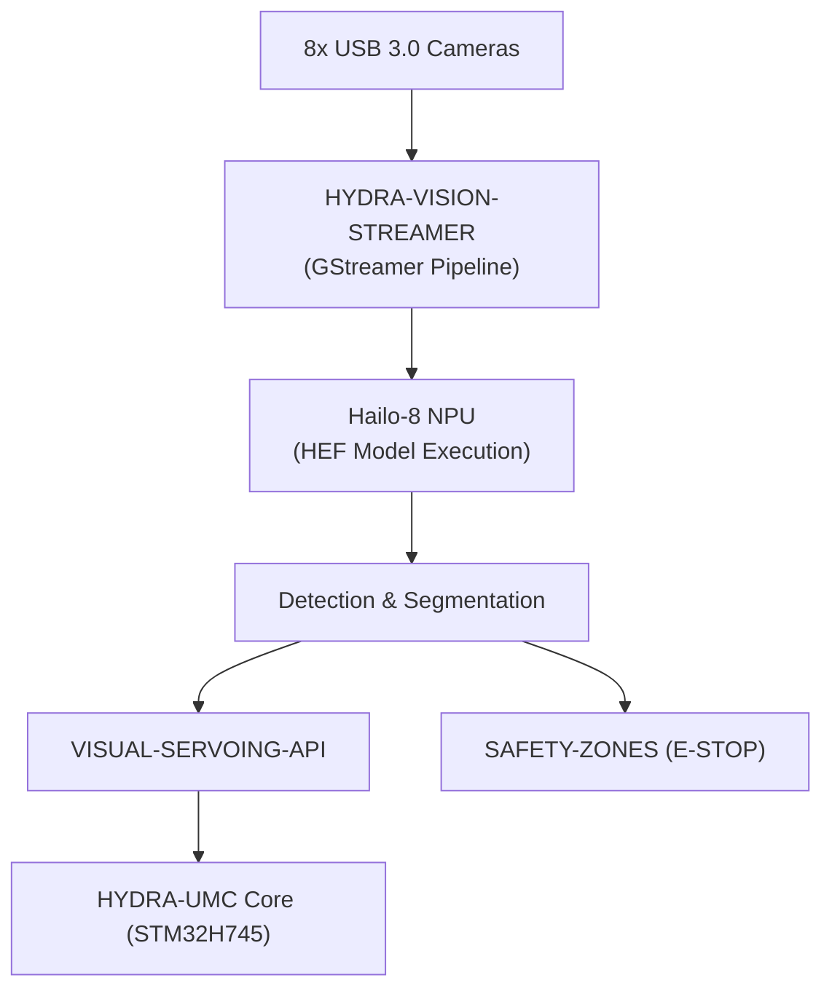

<p align="center">
  
</p>

# 👁️ HYDRA-UMC-VISION-NODE

<p align="center">🇺🇸 <b>English</b> | <a href="README_spa.md">🇪🇸 Español</a> | <a href="README_fra.md">🇫🇷 Français</a> | <a href="README_ita.md">🇮🇹 Italiano</a> | <a href="README_deu.md">🇩🇪 Deutsch</a> | <a href="README_zho.md">🇨🇳 简体中文</a> | <a href="README_jpn.md">🇯🇵 日本語</a></p>

### 🧠 High-Speed Perception Edge AI Node (Hailo-8 + Raspberry Pi CM5)

<p align="left">
  
  
  
  
  
</p>

---

## 1. 🛠️ TECHNICAL OVERVIEW

**HYDRA-UMC-VISION-NODE** is the dedicated perception engine of the HYDRA-UMC ecosystem. Designed to run on the Raspberry Pi Compute Module 5 paired with a Hailo-8 M.2 AI accelerator, its intended job is to handle massive video streams from up to 8x USB 3.0 cameras simultaneously.

It is meant to act as the "reflexes" of the system, performing sub-millimetric object tracking, defect inspection, and real-time safety monitoring without overloading the central orchestrator.

This project is the **integration parent** of the Vision AI Node family: it does not do all of that work itself, it is the node that the 4 specialized children below plug into, each one owning a single responsibility:

* **[HYDRA-UMC-VISION-STREAMER](https://github.com/JuanenRac/HYDRA-UMC-VISION-STREAMER)** — captures and pre-processes the camera feeds this node consumes.
* **[HYDRA-UMC-DETECTION-HEF](https://github.com/JuanenRac/HYDRA-UMC-DETECTION-HEF)** — compiles and versions the `.hef` models this node loads onto its Hailo-8 NPU.
* **[HYDRA-UMC-SAFETY-ZONES](https://github.com/JuanenRac/HYDRA-UMC-SAFETY-ZONES)** — turns this node's perception into intrusion detection and E-STOP triggers.
* **[HYDRA-UMC-VISUAL-SERVOING-API](https://github.com/JuanenRac/HYDRA-UMC-VISUAL-SERVOING-API)** — turns this node's perception into kinematic pose corrections.

### Key Points

* 🧩 **Family Readiness Check (v0):** the real `family-status` subcommand reads each of the 4 real children's own `hydra-umc.project.json` and reports presence/version/maturity/role - honest for an integration parent that runs no Hailo-8 runtime or camera pipeline itself yet. See "Honesty check" below.
* 🩺 **Pipeline Manifest, Frame Validation & Degraded Mode (v0):** a real, inspectable manifest of this node's perception pipeline shape (which stages need a camera, an accelerator, or neither), real structural corruption checking of a raw frame buffer, and real degraded-mode detection that honestly probes for actual camera/Hailo-8 hardware and reports exactly which stages can run right now - via the new `pipeline-status` and `validate-frame` subcommands.
* 🚀 **Hardware Acceleration (planned):** the design targets native execution of HEF models on Hailo-8 (26 TOPS) - the toolchain that compiles those models is a separate project ([HYDRA-UMC-DETECTION-HEF](https://github.com/JuanenRac/HYDRA-UMC-DETECTION-HEF)), not something this node builds itself.
* 📷 **Multi-Stream Processing (planned):** simultaneous analysis of up to 8 high-resolution camera feeds, captured upstream by [HYDRA-UMC-VISION-STREAMER](https://github.com/JuanenRac/HYDRA-UMC-VISION-STREAMER).
* 🎯 **Precision Perception (planned):** designed around YOLO-family architectures for industrial component detection.
* 🛡️ **Active Safety (planned):** real-time occupancy mapping feeding [HYDRA-UMC-SAFETY-ZONES](https://github.com/JuanenRac/HYDRA-UMC-SAFETY-ZONES) for human-intrusion detection.
* 🧩 **Why it exists:** without a dedicated node, perception work would either overload the STM32H745 real-time core inside [HYDRA-UMC](https://github.com/JuanenRac/HYDRA-UMC) (which has no spare cycles for it) or force every camera frame over the wire to a remote GPU, adding latency the safety loop cannot afford. Running it on CM5 + Hailo-8, physically next to the robot, keeps the detect → correct → (if needed) E-STOP loop local and fast.

**Honesty check - what actually runs today:** bare invocation still prints identity/version/role, but there is now a real `family-status [--workspace PATH]` subcommand: it reads `HYDRA-UMC-VISION-STREAMER`/`HYDRA-UMC-DETECTION-HEF`/`HYDRA-UMC-SAFETY-ZONES`/`HYDRA-UMC-VISUAL-SERVOING-API`'s own real manifests from a local checkout and reports what it honestly finds. None of the Hailo-8 runtime, the gRPC control API, or real child supervision exists yet - they are the reason this project exists, not something it currently does. See [`CHANGELOG.md`](CHANGELOG.md) for exactly what has shipped so far, and the "Current Status & Next Steps" section below for what is still open.

---

## 2. 🔄 INTENDED SYSTEM FLOW

The diagram below is the target data flow this skeleton is being built towards - it documents the architecture decision, not a pipeline that runs today.



---

## 3. 🧠 ADVANCED TECHNICAL INFORMATION

### Why this project is the integration parent (and what that means concretely)

Of the 5 projects in the Vision AI Node family, this is the only one that:

* Carries an **`os/`** folder — the shared HydraOS system image configuration for the CM5 host. The 4 children run as processes/containers *on top of* that one shared OS image; there is no reason for each of them to carry its own copy.
* Carries a **`models/`** folder — the compiled `.hef` models actually loaded onto the Hailo-8 NPU at runtime. [HYDRA-UMC-DETECTION-HEF](https://github.com/JuanenRac/HYDRA-UMC-DETECTION-HEF) is where those models are *compiled and versioned*; this node is where the *served, running copy* lives, because it is the process that owns the Hailo-8 device handle.
* Carries **`docker-compose.yml`** — see below.

None of the 5 projects carries a `hardware/` or `firmware/` folder: CM5 + Hailo-8 is off-the-shelf hardware with no board of its own to design, unlike (for example) the custom STM32H745/STM32G474 boards inside [HYDRA-UMC](https://github.com/JuanenRac/HYDRA-UMC).

### `docker-compose.yml`: a documented integration map, not (yet) a working stack

`docker-compose.yml` at the project root defines this node's own service plus all 4 children, wired together with the devices/volumes/ports they are each expected to need (the Hailo-8 device node, per-camera V4L2 devices, the gRPC ports towards the HYDRA-UMC core). It is heavily commented explaining *why* each piece is there. It is **not functional today** - none of the 4 children ship a `Dockerfile` yet, so `docker compose up` would fail. It exists now, ahead of that code, so the integration shape is decided and documented once rather than improvised separately by each child later.

### Design decisions already made in this skeleton

* **Version read from installed package metadata, not hardcoded.** `main.py` calls `importlib.metadata.version("hydra-umc-vision-node")` instead of keeping a second `__version__` string somewhere in the package. This means `bump_version.py` only ever has one place to edit (`pyproject.toml`), and the printed version can never silently drift out of sync with it.
* **The odometer bump only ever touches `PATCH`/`MINOR` automatically.** `bump_version.py` increments `PATCH` on every real build, carrying into `MINOR` past 9, and `MINOR` into `MAJOR` past 9 - but it never bumps `MAJOR` itself. `MAJOR` is a deliberate, human, semantic decision (a real architecture milestone), not something a build script should decide on its own. This is the same convention already used across the ecosystem (see `HYDRA-UMC-EDITOR-URDF/bump_version.py` and `HYDRA-UMC-SUITE/bump_version.py`).
* **gRPC/Protobuf, not REST, for the planned control API** (see badge above) - chosen because the perception → correction → firmware loop this node sits in is latency-sensitive and talks to other Python/embedded services within the same LAN, where gRPC's binary framing and streaming support are a better fit than JSON-over-HTTP. Not implemented yet; documented here so the direction is clear before the code lands.
* **`family-status` reads each child's own manifest instead of a hand-maintained list.** `hydra-umc.project.json` is already the single source of truth the ecosystem's dashboard/updater trust - a second list here would drift the moment a child's real maturity changed and nobody remembered to update it.
* **A missing sibling checkout is a real, honest "not found" rather than a crash.** An integration parent genuinely cannot know whether a developer has all 4 children checked out locally - `manifest.py` returns `None` for every real failure mode (missing repo, missing file, malformed JSON) so `family-status` can report it clearly instead of raising.
* **Why degraded-mode detection is split into a probe and a pure decision function.** `hardware.py`'s `camera_available()`/`accelerator_available()` are the only parts that ever touch real hardware (a Linux device node); `determine_mode()`/`active_stages()` take plain booleans and contain the actual decision logic. That split is what lets every real hardware combination (full, no camera, no accelerator, no hardware at all) be tested directly and deterministically, without mocking a filesystem or needing real CM5+Hailo-8 hardware to prove the logic correct.
* **Why frame validation only checks structure, not pixel content.** Detecting a truncated/oversized buffer or a suspiciously uniform one (a frozen sensor, a blank capture) is real, useful, hardware-independent validation that needs no reference image and no camera to test honestly. Deciding whether a frame's actual CONTENT looks wrong (blur, exposure, a real vision-quality metric) is a fundamentally different, much harder problem that would need real captured frames to calibrate against - explicitly out of scope for this v0.

---

## 📂 DIRECTORY STRUCTURE

```text
HYDRA-UMC-VISION-NODE/
├── src/hydra_umc_vision_node/
│   ├── manifest.py       # Real, defensive reader for a sibling's own manifest
│   ├── family.py          # Real family-readiness check over the 4 real children
│   ├── pipeline.py          # Real perception pipeline manifest (stages + hardware needs)
│   ├── frame.py               # Real hardware-independent frame corruption validation
│   ├── hardware.py              # Real camera/accelerator probes + degraded-mode logic
│   ├── api.py                     # Plain JSON/HTTP surface (stdlib http.server) over the 3 real subcommands
│   └── main.py                    # Entry point + `family-status`/`pipeline-status`/`validate-frame`
├── tests/               # Real tests: manifest reading, family status, pipeline, frame, hardware, api, CLI
├── docs/                # Documentation and API reference
├── os/                  # HydraOS system image configuration (CM5) - parent-only, deploy-time populated (not in git)
├── models/              # Compiled .hef models served to the Hailo-8 NPU - parent-only, deploy-time populated (not in git)
├── build/               # Build output (local .venv lives here too)
├── images/              # Media and diagrams
├── systemd/
│   └── hydra-umc-vision-node.service # Local CM5 perception API systemd unit
├── tools/
│   ├── build_test.py    # Non-versioning build/compile check
│   └── ci_validate.py   # Manifest/CHANGELOG/docs validation used by CI
├── pyproject.toml       # Package metadata, dependencies, odometer version
├── bump_version.py      # Odometer-style native version bump (run by build.sh/.bat)
├── bump_manifest_version.py # Syncs hydra-umc.project.json's version to the native one (--sync)
├── build.sh / build.bat # venv + editable install (dev extras) + compile-check + tests
├── run.sh / run.bat     # Runs the entry point from the local venv (forwards arguments)
├── docker-compose.yml   # Integration map of the 4 Vision AI Node children (not functional yet)
└── CHANGELOG.md         # Version-by-version history (odometer scheme, no dates)
```

`hardware/` and `firmware/` do not exist in this repository (see "Advanced Technical Information" above for why). `os/` and `models/` exist only in this project among the 5 - the 4 children do not carry their own copies.

---

## 🏗️ BUILD & RUN GUIDE

### Prerequisites

* **Python 3.10 or newer** on your `PATH` (checked via `python3`/`python` - the scripts try both).
* No system-level Hailo SDK, GStreamer, or other native dependency is required yet - **zero third-party runtime dependencies** (`dependencies = []` in `pyproject.toml`); `pytest` is a dev-only extra used solely for the real test suite. Those runtime dependencies get added once the corresponding real logic lands.
* Enough disk space for a local virtual environment (created under `.venv/`, a few tens of MB at this stage).

### Step by step - what each command actually does

```bash
# Linux / macOS
./build.sh
```

1. **Odometer version bump** — runs `bump_version.py`, which increments `PATCH` in `pyproject.toml` (carrying into `MINOR`/`MAJOR` per the odometer rule above). This happens on *every* build, including this one you are about to run, so expect the version to go up by 1.
2. **Virtual environment** — creates `.venv/` if it does not already exist (safe to re-run; an existing `.venv/` is reused, not recreated).
3. **Editable install (with dev extras)** — `pip install -e ".[dev]"` installs this package into `.venv` in "editable" mode, so source edits under `src/` take effect immediately without reinstalling, pulls in `pytest`, and registers the `hydra-umc-vision-node` console entry point used by `run.sh`.
4. **Compile-check** — `python -m compileall -q src` byte-compiles every `.py` file under `src/`, catching syntax errors across the whole package even in files never actually imported by `main.py`.
5. **Real test suite** — `pytest tests/` runs all 48 tests.

The script uses `set -euo pipefail` and stops at the first failing step, printing `== Build OK ==` only if every step succeeded.

```bash
./run.sh
```

Locates the Python interpreter inside `.venv` (handles both the POSIX `.venv/bin/python` and the Windows-style `.venv/Scripts/python.exe` layout, since this repo is developed cross-platform) and runs `python -m hydra_umc_vision_node.main`, forwarding any arguments.

Bare invocation prints name + version + role:

```text
HYDRA-UMC-VISION-NODE v0.0.6
High-speed perception edge AI node (Hailo-8 + CM5) - integration parent of Vision-Streamer, Detection-HEF, Safety-Zones and Visual-Servoing-API.
```

The real `family-status` subcommand checks the actual local checkout:

```bash
./run.sh family-status
./run.sh family-status --workspace /path/to/some/other/checkout

# Windows
run.bat family-status
```

Defaults to this repo's own parent directory - the real sibling-checkout layout this ecosystem already uses. Exits `1` if any real child is missing.

The real `pipeline-status` subcommand probes actual hardware and reports the real, honest result:

```bash
./run.sh pipeline-status
```
```json
{
  "manifest": { "version": "0.1.0", "stages": [ "..." ] },
  "camera_present": false,
  "accelerator_present": false,
  "mode": "degraded_no_hardware",
  "runnable_stages": ["preprocess", "postprocess", "publish"],
  "skipped_stages": ["capture", "inference"]
}
```

On this development machine (no CM5, no Hailo-8, no camera) that is the real, honest answer - exit code `1` (anything but `full` mode). The real `validate-frame` subcommand checks a raw frame buffer file for structural corruption:

```bash
./run.sh validate-frame path/to/frame.raw --width 1920 --height 1080
# Frame OK: path/to/frame.raw matches 1920x1080x3 (6220800 bytes)

./run.sh validate-frame path/to/truncated.raw --width 1920 --height 1080
# Frame INVALID: path/to/truncated.raw
#   [size_mismatch] frame buffer is ... bytes, expected 6220800 bytes ... - likely truncated or corrupt
```

```bat
:: Windows - identical steps, batch syntax
build.bat
run.bat
```

### Troubleshooting

* **`python`/`python3` not found** — install Python 3.10+ and make sure it is on `PATH`; both scripts try `python3` first, falling back to `python`.
* **`compileall` fails** — this means a real syntax error was introduced under `src/`; the build script exits non-zero without creating/updating the install, on purpose, so a broken package is never left "successfully built".
* **`run.sh`/`run.bat` says "No `.venv` found"** — `build.sh`/`build.bat` must be run at least once first; `run.sh`/`run.bat` never creates the environment itself, only builds do.
* **Stale editable install after pulling changes** — delete `.venv/` and re-run `build.sh`/`build.bat`; this is rarely needed since `pip install -e .` normally picks up source changes without reinstalling.

---

## 🚀 Current Status & Next Steps

**What works today:** a real family-readiness check (`manifest.py`/`family.py`) that reads each of the 4 real children's own manifest and reports presence/version/maturity/role, a real pipeline manifest and degraded-mode detection (`pipeline.py`/`hardware.py`) that honestly probes for real camera/Hailo-8 hardware and reports exactly which pipeline stages can run, real hardware-independent frame corruption validation (`frame.py`), the `family-status`/`pipeline-status`/`validate-frame` CLI subcommands, 48 passing tests, and a fully documented (but not yet functional) integration map for the 4 children in `docker-compose.yml` - see [`CHANGELOG.md`](CHANGELOG.md) for the full real build/run output.

**What is still open, in no particular order and with no committed timeline:**

* The actual Hailo-8 runtime initialization and inference loop.
* The gRPC control API towards the HYDRA-UMC core.
* Real supervision of the 4 child services (today's `family-status` only checks presence/maturity, not runtime health; `docker-compose.yml` only documents the intended shape).
* Multi-camera pipeline synchronization once [HYDRA-UMC-VISION-STREAMER](https://github.com/JuanenRac/HYDRA-UMC-VISION-STREAMER) has a real capture pipeline to synchronize with.
* Turning `docker-compose.yml` into an actually runnable stack, which depends on each of the 4 children shipping its own `Dockerfile` first.

---

## 🔗 Related Projects

This project is part of the HYDRA-UMC robotics ecosystem by the same author (JuanenRac / Electro Hobby 3D). Worth knowing about, since a request might actually be about one of these rather than this repository.

**Child Projects** — each one is a specific stage or consumer of this node's own Hailo-8 perception pipeline
- **[HYDRA-UMC-DETECTION-HEF](https://github.com/JuanenRac/HYDRA-UMC-DETECTION-HEF)** — real compiled-model registry with Hailo-architecture/checksum safe-load verification.
- **[HYDRA-UMC-VISION-STREAMER](https://github.com/JuanenRac/HYDRA-UMC-VISION-STREAMER)** — real GStreamer pipeline + MediaMTX config generator with a real HailoRT integration boundary.
- **[HYDRA-UMC-SAFETY-ZONES](https://github.com/JuanenRac/HYDRA-UMC-SAFETY-ZONES)** — real zone-breach checking and E-STOP requesting, with calibration-freshness enforcement.
- **[HYDRA-UMC-VISUAL-SERVOING-API](https://github.com/JuanenRac/HYDRA-UMC-VISUAL-SERVOING-API)** — real Position-Based Visual Servoing correction law, safety-gated on upstream zone state.

**Directly Related**
- **[HYDRA-UMC](https://github.com/JuanenRac/HYDRA-UMC)** — the physical robot-arm motherboard: CM5 host + dual-core STM32H745, orchestrating up to 8 tool arms over CAN-OTA/SPI-OTA; this node's own perception pipeline is what closes the safety/E-STOP loop on top of that firmware.
- **[HYDRA-UMC-COGNITIVE-NODE](https://github.com/JuanenRac/HYDRA-UMC-COGNITIVE-NODE)** — integration hub for the Hailo-10 cognitive pipeline (LLM/VLA/voice orchestration), built as the semantic layer directly on top of this node's own perception output.

**Also Part of the Ecosystem**

*Core Hardware & Platform*
- **[HYDRA-UMC-OS](https://github.com/JuanenRac/HYDRA-UMC-OS)** — reproducible Raspberry Pi OS product layer for the CM5: read-only agent, validated config/profiles, WiFi first-contact provisioning.
- **[HYDRA-UMC-SDK](https://github.com/JuanenRac/HYDRA-UMC-SDK)** — the shared JSON-Schema contract and safety-gate boundary every bridge validates its commands against.

*Core Backend & Clients*
- **[HYDRA-UMC-SERVER](https://github.com/JuanenRac/HYDRA-UMC-SERVER)** — the real headless backend (REST/WebSocket) every control client actually talks to.
- **[HYDRA-UMC-STUDIO](https://github.com/JuanenRac/HYDRA-UMC-STUDIO)** — web control dashboard with real-time multi-robot 3D visualization.
- **[HYDRA-UMC-SUITE](https://github.com/JuanenRac/HYDRA-UMC-SUITE)** — desktop (PySide6) swarm command center for multiple servers at once, packaged as a standalone executable.
- **[HYDRA-UMC-ANDROID-CONTROL](https://github.com/JuanenRac/HYDRA-UMC-ANDROID-CONTROL)** — native Android control app with biometric login and a paired Wear OS companion.
- **[HYDRA-UMC-IOS-CONTROL](https://github.com/JuanenRac/HYDRA-UMC-IOS-CONTROL)** — iOS/iPadOS control app (Flutter) with real-time WebSocket sync.
- **[HYDRA-UMC-DSI](https://github.com/JuanenRac/HYDRA-UMC-DSI)** — native touch UI for the onboard 7" DSI touchscreen, embedded on the CM5 itself.
- **[HYDRA-UMC-EDITOR-URDF](https://github.com/JuanenRac/HYDRA-UMC-EDITOR-URDF)** — desktop graphical URDF creator/editor that pushes finished models into STUDIO's own catalog.
- **[HYDRA-UMC-BRIDGE-AMR](https://github.com/JuanenRac/HYDRA-UMC-BRIDGE-AMR)** — coordination boundary for AGV/AMR fleets via a real VDA 5050 MQTT publisher.
- **[HYDRA-UMC-BRIDGE-CNC](https://github.com/JuanenRac/HYDRA-UMC-BRIDGE-CNC)** — high-level CNC-cell coordinator with real GRBL status/control-byte access.
- **[HYDRA-UMC-BRIDGE-DROIDS](https://github.com/JuanenRac/HYDRA-UMC-BRIDGE-DROIDS)** — coordination boundary for legged/humanoid droids, with a real Boston Dynamics Spot command sender.
- **[HYDRA-UMC-BRIDGE-LASER](https://github.com/JuanenRac/HYDRA-UMC-BRIDGE-LASER)** — laser-cell safety coordinator reading 3 real key/enclosure/interlock GPIO safeguards.
- **[HYDRA-UMC-BRIDGE-OPENPNP](https://github.com/JuanenRac/HYDRA-UMC-BRIDGE-OPENPNP)** — safe high-level board-flow coordinator for OpenPnP pick-and-place.
- **[HYDRA-UMC-BRIDGE-PRINTER3D](https://github.com/JuanenRac/HYDRA-UMC-BRIDGE-PRINTER3D)** — safe coordination boundary for Moonraker/Klipper 3D printers, with real gated job commands.
- **[HYDRA-UMC-BRIDGE-ROS2](https://github.com/JuanenRac/HYDRA-UMC-BRIDGE-ROS2)** — safety coordinator with a real, lazily-imported rclpy ROS 2 transport.
- **[HYDRA-UMC-BRIDGE-UAV](https://github.com/JuanenRac/HYDRA-UMC-BRIDGE-UAV)** — coordination boundary for camera-equipped UAVs, with a real MAVLink command sender.

*URTC Tool Platform*
- **[URTC](https://github.com/JuanenRac/URTC)** — firmware for the physical Universal Robot Tool Controller PCB, 25+ tool profiles over CAN bus.
- **[URTC-FLASHER](https://github.com/JuanenRac/URTC-FLASHER)** — desktop GUI flashing tool for URTC boards, CAN-OTA plus full-chip SWD/JTAG.
- **[URTC-TESTER](https://github.com/JuanenRac/URTC-TESTER)** — desktop live CAN-bus diagnostic tool for URTC boards, one panel per tool profile.
- **[URTC-WEB-STUDIO](https://github.com/JuanenRac/URTC-WEB-STUDIO)** — browser-based alternative to URTC-TESTER via the Web Serial API, no local install needed.

*Cognitive AI Node (Hailo-10)*
- **[HYDRA-UMC-VLA-ENGINE](https://github.com/JuanenRac/HYDRA-UMC-VLA-ENGINE)** — real action-token encoding/decoding and trajectory generation for a Vision-Language-Action model.
- **[HYDRA-UMC-VOICE-UI](https://github.com/JuanenRac/HYDRA-UMC-VOICE-UI)** — real voice front-end (VAD + intent parser) with a bounded, confirmation-gated Watch relay.
- **[HYDRA-UMC-SEMANTIC-PLANNER](https://github.com/JuanenRac/HYDRA-UMC-SEMANTIC-PLANNER)** — real rule-based task decomposition and semantic error recovery over MCU error codes.
- **[HYDRA-UMC-DOCS-QA](https://github.com/JuanenRac/HYDRA-UMC-DOCS-QA)** — real stdlib-only TF-IDF document search over this ecosystem's own Markdown docs.

*Orchestration & Swarm*
- **[HYDRA-UMC-ORCHESTRATOR](https://github.com/JuanenRac/HYDRA-UMC-ORCHESTRATOR)** — integration hub with a real gRPC/Protobuf health-report contract and mission state machine.
- **[HYDRA-UMC-JOB-DISPATCHER](https://github.com/JuanenRac/HYDRA-UMC-JOB-DISPATCHER)** — real priority-based job queue with deduplication, over a real HTTP API.
- **[HYDRA-UMC-NODE-HEALING](https://github.com/JuanenRac/HYDRA-UMC-NODE-HEALING)** — real gRPC-based fleet health watchdog with retry/backoff and identity-mismatch detection.
- **[HYDRA-UMC-PATH-PLANNER-3D](https://github.com/JuanenRac/HYDRA-UMC-PATH-PLANNER-3D)** — real RRT-based 3D path planner with real obstacle/workspace collision validation.
- **[HYDRA-UMC-SWARM-SYNC](https://github.com/JuanenRac/HYDRA-UMC-SWARM-SYNC)** — real CRDT LWW-Element-Map state sync, property-tested for multi-cell convergence.

*Digital Twin & Simulation*
- **[HYDRA-UMC-TWIN](https://github.com/JuanenRac/HYDRA-UMC-TWIN)** — integration hub for the digital-twin engine, with a real version-compatibility sync contract.
- **[HYDRA-UMC-HIL-BRIDGE](https://github.com/JuanenRac/HYDRA-UMC-HIL-BRIDGE)** — real hardware-in-the-loop safety interlock routing commands between simulation and real hardware.
- **[HYDRA-UMC-PHYSICS-REPLICA](https://github.com/JuanenRac/HYDRA-UMC-PHYSICS-REPLICA)** — real forward kinematics and joint-limit validation over a real URDF subset.
- **[HYDRA-UMC-SYNTHETIC-DATA-GEN](https://github.com/JuanenRac/HYDRA-UMC-SYNTHETIC-DATA-GEN)** — real procedural 2D scene generator with YOLO/COCO annotation export.

*Data & Analytics*
- **[HYDRA-UMC-DATALAKE](https://github.com/JuanenRac/HYDRA-UMC-DATALAKE)** — real sqlite3-backed time-series store with a real ingest/query HTTP API.
- **[HYDRA-UMC-ANOMALY-DETECTOR](https://github.com/JuanenRac/HYDRA-UMC-ANOMALY-DETECTOR)** — real FFT + statistical baseline anomaly detector with drift monitoring.
- **[HYDRA-UMC-PRODUCTION-REPORTS](https://github.com/JuanenRac/HYDRA-UMC-PRODUCTION-REPORTS)** — real OEE/availability calculation over DATALAKE history, with reproducible CSV export.
- **[HYDRA-UMC-TELEMETRY-COLLECTOR](https://github.com/JuanenRac/HYDRA-UMC-TELEMETRY-COLLECTOR)** — real CAN/WebSocket ingestion pipeline into DATALAKE, with sequence deduplication.

*Industrial Gateway*
- **[HYDRA-UMC-GATEWAY-INDUSTRIAL](https://github.com/JuanenRac/HYDRA-UMC-GATEWAY-INDUSTRIAL)** — integration hub relaying to industrial protocols, with a real command allowlist/backpressure layer.
- **[HYDRA-UMC-OPCUA-SERVER](https://github.com/JuanenRac/HYDRA-UMC-OPCUA-SERVER)** — real OPC-UA address space, verified with a real binary-protocol client session.
- **[HYDRA-UMC-MQTT-BROKER](https://github.com/JuanenRac/HYDRA-UMC-MQTT-BROKER)** — real MQTT broker with optional per-client authentication and topic ACLs.
- **[HYDRA-UMC-MTCONNECT-ADAPTER](https://github.com/JuanenRac/HYDRA-UMC-MTCONNECT-ADAPTER)** — real MTConnect `/probe` and `/current` XML endpoints with degraded-mode output.

*Complementary Tools & Ecosystem Operations*
- **[HYDRA-UMC-DASHBOARD-AI](https://github.com/JuanenRac/HYDRA-UMC-DASHBOARD-AI)** — Smart Summaries and Anomaly Highlighting panels over DATALAKE/ANOMALY-DETECTOR, with an honest statistical fallback.
- **[HYDRA-UMC-TOOL-CLI](https://github.com/JuanenRac/HYDRA-UMC-TOOL-CLI)** — fleet CLI with a real, stable exit-code contract, a genuine live client of HYDRA-UMC-SERVER's own API.
- **[HYDRA-UMC-WATCH](https://github.com/JuanenRac/HYDRA-UMC-WATCH)** — WearOS companion app with real haptic alerts and a paired-phone voice relay.
- **[URTC-SMART-RACK](https://github.com/JuanenRac/URTC-SMART-RACK)** — firmware for a board-mounting rack with real tool-ID decoding and Smart Idle pre-heating logic.
- **[URTC-VISION-TOOL](https://github.com/JuanenRac/URTC-VISION-TOOL)** — firmware plus a real Python vision companion for a thermal/RGB inspection tool head.
- **[HYDRA-UMC-UPDATER](https://github.com/JuanenRac/HYDRA-UMC-UPDATER)** — administrative desktop tool that discovers, clones and updates every repo in this ecosystem.

---

## 👤 AUTHOR
**JuanenRac** (Electro Hobby 3D)
📧 electrohobby3d@gmail.com
📺 [youtube.com/@electrohobby3d](https://youtube.com/@electrohobby3d)

## 📜 LICENSE
GPL-3.0 - See LICENSE for details.
