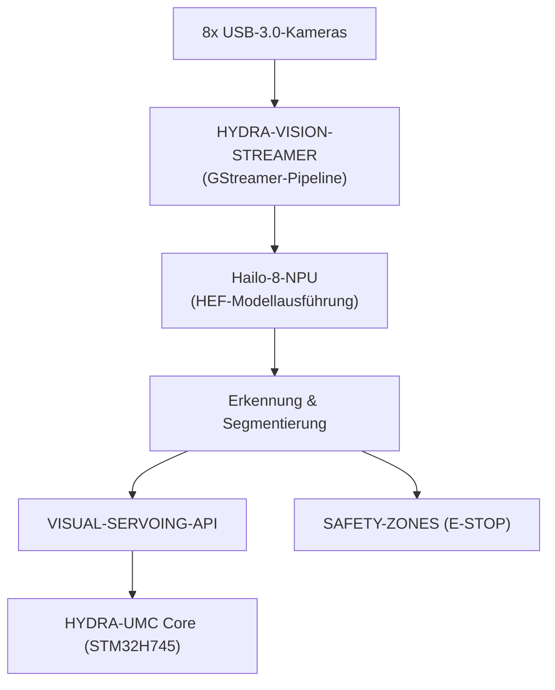

<p align="center">
  
</p>

# 👁️ HYDRA-UMC-VISION-NODE

<p align="center"><a href="README.md">🇺🇸 English</a> | <a href="README_spa.md">🇪🇸 Español</a> | <a href="README_fra.md">🇫🇷 Français</a> | <a href="README_ita.md">🇮🇹 Italiano</a> | 🇩🇪 <b>Deutsch</b> | <a href="README_zho.md">🇨🇳 简体中文</a> | <a href="README_jpn.md">🇯🇵 日本語</a></p>

### 🧠 Hochgeschwindigkeits-Edge-KI-Knoten für Wahrnehmung (Hailo-8 + Raspberry Pi CM5)

<p align="left">
  
  
  
  
  
</p>

---

## 1. 🛠️ TECHNISCHER ÜBERBLICK

**HYDRA-UMC-VISION-NODE** ist die dedizierte Wahrnehmungs-Engine des HYDRA-UMC-Ökosystems. Ausgelegt für den Raspberry Pi Compute Module 5 in Kombination mit einem Hailo-8-M.2-KI-Beschleuniger, soll er massive Videoströme von bis zu 8 USB-3.0-Kameras gleichzeitig verarbeiten.

Er soll als die "Reflexe" des Systems fungieren: sub-millimetergenaues Objekt-Tracking, Defekterkennung und Echtzeit-Sicherheitsüberwachung, ohne den zentralen Orchestrator zu überlasten.

Dieses Projekt ist der **Integrations-Elternteil** der Vision-AI-Node-Familie: Es erledigt diese Arbeit nicht selbst, sondern ist der Knoten, an den die 4 spezialisierten Kind-Projekte unten andocken, jedes mit genau einer Verantwortung:

* **[HYDRA-UMC-VISION-STREAMER](https://github.com/JuanenRac/HYDRA-UMC-VISION-STREAMER)** — erfasst und verarbeitet die Kameraströme vor, die dieser Knoten konsumiert.
* **[HYDRA-UMC-DETECTION-HEF](https://github.com/JuanenRac/HYDRA-UMC-DETECTION-HEF)** — kompiliert und versioniert die `.hef`-Modelle, die dieser Knoten auf seine Hailo-8-NPU lädt.
* **[HYDRA-UMC-SAFETY-ZONES](https://github.com/JuanenRac/HYDRA-UMC-SAFETY-ZONES)** — wandelt die Wahrnehmung dieses Knotens in Eindringlingserkennung und E-STOP-Auslösung um.
* **[HYDRA-UMC-VISUAL-SERVOING-API](https://github.com/JuanenRac/HYDRA-UMC-VISUAL-SERVOING-API)** — wandelt die Wahrnehmung dieses Knotens in kinematische Posenkorrekturen um.

### Kernpunkte

* 🧩 **Familien-Bereitschaftsprüfung (v0):** der echte `family-status`-Unterbefehl liest die eigene `hydra-umc.project.json` jedes der 4 echten Kinder und meldet Präsenz/Version/Reife/Rolle - ehrlich für einen Integrations-Elternteil, der noch keine eigene Hailo-8-Laufzeit oder Kamera-Pipeline betreibt.
* 🩺 **Pipeline-Manifest, Frame-Validierung & Degradierter Modus (v0):** ein echtes, einsehbares Manifest der Form der Wahrnehmungspipeline dieses Knotens (welche Stufen eine Kamera, einen Beschleuniger oder keins von beidem benötigen), echte strukturelle Beschädigungsprüfung eines rohen Frame-Puffers, und echte Erkennung des degradierten Modus, die ehrlich nach echter Kamera-/Hailo-8-Hardware sucht und genau meldet, welche Stufen gerade laufen können - über die neuen Unterbefehle `pipeline-status` und `validate-frame`.
* 🚀 **Hardwarebeschleunigung (geplant):** Ziel ist die native Ausführung von HEF-Modellen auf Hailo-8 (26 TOPS) - die Toolchain, die diese Modelle kompiliert, ist ein separates Projekt ([HYDRA-UMC-DETECTION-HEF](https://github.com/JuanenRac/HYDRA-UMC-DETECTION-HEF)), nicht etwas, das dieser Knoten selbst baut.
* 📷 **Multi-Stream-Verarbeitung (geplant):** gleichzeitige Analyse von bis zu 8 hochauflösenden Kameraströmen, vorgelagert erfasst von [HYDRA-UMC-VISION-STREAMER](https://github.com/JuanenRac/HYDRA-UMC-VISION-STREAMER).
* 🎯 **Präzisionswahrnehmung (geplant):** ausgelegt auf Architekturen der YOLO-Familie für die Erkennung industrieller Komponenten.
* 🛡️ **Aktive Sicherheit (geplant):** Echtzeit-Belegungskartierung, die [HYDRA-UMC-SAFETY-ZONES](https://github.com/JuanenRac/HYDRA-UMC-SAFETY-ZONES) für die Erkennung menschlichen Eindringens speist.
* 🧩 **Warum es existiert:** Ohne einen dedizierten Knoten würde die Wahrnehmungsarbeit den Echtzeitkern STM32H745 in [HYDRA-UMC](https://github.com/JuanenRac/HYDRA-UMC) überlasten (der dafür keine freien Zyklen hat) oder jeden Kameraframe zu einer entfernten GPU zwingen, was eine Latenz hinzufügt, die sich die Sicherheitsschleife nicht leisten kann. Der Betrieb auf CM5 + Hailo-8, physisch neben dem Roboter, hält die Schleife Erkennen → Korrigieren → (falls nötig) E-STOP lokal und schnell.

**Ehrlichkeitscheck - was heute wirklich läuft:** Der bloße Aufruf gibt weiterhin Identität/Version/Rolle aus, aber es gibt jetzt drei echte Unterbefehle: `family-status [--workspace PFAD]` (liest die echten, eigenen Manifeste der 4 echten Kinder), `pipeline-status` (sondiert echte Hardware und meldet den echten, ehrlichen Modus - `full`, oder einen ehrlichen degradierten Modus auf einer Maschine ohne Kamera/Hailo-8, wie dieser Entwicklungsmaschine) und `validate-frame <pfad> --width --height` (echte strukturelle Beschädigungsprüfung eines Frame-Puffers). Nichts von der Hailo-8-Laufzeit, der gRPC-Steuerungs-API oder der echten Kind-Überwachung existiert bereits - sie sind der Daseinsgrund dieses Projekts, nicht etwas, das es heute tut. Siehe [`CHANGELOG.md`](CHANGELOG.md) für genau das, was bisher geliefert wurde, und den Abschnitt "Aktueller Status & Nächste Schritte" unten für das, was noch offen ist.

---

## 2. 🔄 GEPLANTER SYSTEMFLUSS

Das Diagramm unten ist der Ziel-Datenfluss, auf den dieses Skelett hinarbeitet - es dokumentiert die Architekturentscheidung, keine heute lauffähige Pipeline.



---

## 3. 🧠 ERWEITERTE TECHNISCHE INFORMATIONEN

### Warum dieses Projekt der Integrations-Elternteil ist (und was das konkret bedeutet)

Von den 5 Projekten der Vision-AI-Node-Familie ist dieses das einzige, das:

* Einen Ordner **`os/`** trägt — die Konfiguration des gemeinsamen HydraOS-Systemabbilds für den CM5-Host. Die 4 Kinder laufen als Prozesse/Container *auf* diesem einen gemeinsamen Systemabbild; es gibt keinen Grund, warum jedes eine eigene Kopie tragen sollte.
* Einen Ordner **`models/`** trägt — die kompilierten `.hef`-Modelle, die zur Laufzeit tatsächlich auf die Hailo-8-NPU geladen werden. [HYDRA-UMC-DETECTION-HEF](https://github.com/JuanenRac/HYDRA-UMC-DETECTION-HEF) ist der Ort, an dem diese Modelle *kompiliert und versioniert* werden; dieser Knoten ist der Ort, an dem die *ausgelieferte, laufende Kopie* lebt, weil er der Prozess ist, dem das Hailo-8-Gerätehandle gehört.
* **`docker-compose.yml`** trägt — siehe unten.

Keines der 5 Projekte trägt einen `hardware/`- oder `firmware/`-Ordner: CM5 + Hailo-8 ist handelsübliche Hardware ohne eigenes zu entwerfendes Board, anders als (zum Beispiel) die kundenspezifischen STM32H745/STM32G474-Boards in [HYDRA-UMC](https://github.com/JuanenRac/HYDRA-UMC).

### `docker-compose.yml`: eine dokumentierte Integrationskarte, noch kein funktionierender Stack

`docker-compose.yml` im Projektstamm definiert den eigenen Dienst dieses Knotens sowie die 4 Kinder, verdrahtet mit den Devices/Volumes/Ports, die jedes voraussichtlich benötigt (das Hailo-8-Gerät, die V4L2-Geräte pro Kamera, die gRPC-Ports zum HYDRA-UMC-Core). Sie ist ausführlich kommentiert, um zu erklären, *warum* jedes Teil dort ist. **Sie ist heute nicht funktionsfähig** - keines der 4 Kinder liefert bisher ein eigenes `Dockerfile`, sodass `docker compose up` fehlschlagen würde. Sie existiert bereits vor diesem Code, damit die Form der Integration einmal entschieden und dokumentiert wird, statt später von jedem Kind separat improvisiert zu werden.

### In diesem Skelett bereits getroffene Designentscheidungen

* **Die Version wird aus den Metadaten des installierten Pakets gelesen, nicht fest codiert.** `main.py` ruft `importlib.metadata.version("hydra-umc-vision-node")` auf, statt eine zweite `__version__`-Zeichenkette irgendwo im Paket zu pflegen. Das bedeutet, `bump_version.py` hat nur eine Stelle zu bearbeiten (`pyproject.toml`), und die ausgegebene Version kann nie stillschweigend davon abweichen.
* **Der "Kilometerzähler"-Bump berührt automatisch nur `PATCH`/`MINOR`.** `bump_version.py` erhöht `PATCH` bei jedem echten Build, mit Übertrag auf `MINOR` über 9 hinaus, und von `MINOR` auf `MAJOR` über 9 hinaus - erhöht aber niemals `MAJOR` selbst. `MAJOR` ist eine bewusste menschliche, semantische Entscheidung (ein echter Architektur-Meilenstein), keine Sache, die ein Build-Skript allein entscheiden sollte. Dies ist dieselbe Konvention, die bereits im übrigen Ökosystem verwendet wird (siehe `HYDRA-UMC-EDITOR-URDF/bump_version.py` und `HYDRA-UMC-SUITE/bump_version.py`).
* **gRPC/Protobuf statt REST für die geplante Steuerungs-API** (siehe Badge oben) - gewählt, weil die Schleife Wahrnehmung → Korrektur → Firmware, in der dieser Knoten lebt, latenzempfindlich ist und mit anderen Python-/Embedded-Diensten im selben LAN spricht, wo das binäre Framing und die Streaming-Unterstützung von gRPC besser passen als JSON über HTTP. Noch nicht implementiert; hier dokumentiert, damit die Richtung klar ist, bevor der Code kommt.
* **`family-status` liest das eigene Manifest jedes Kindes statt einer manuell gepflegten Liste.** `hydra-umc.project.json` ist bereits die einzige Quelle der Wahrheit, der das Dashboard/der Updater des Ökosystems vertrauen - eine zweite Liste hier würde in dem Moment abdriften, in dem sich die echte Reife eines Kindes ändert und niemand daran denkt, sie zu aktualisieren.
* **Ein fehlender Geschwister-Checkout ist ein echtes, ehrliches „nicht gefunden", kein Absturz.** Ein Integrations-Parent kann wirklich nicht wissen, ob ein Entwickler alle 4 Kinder lokal ausgecheckt hat - `manifest.py` gibt für jeden echten Fehlerfall (fehlendes Repo, fehlende Datei, fehlerhaftes JSON) `None` zurück, sodass `family-status` es klar melden kann, statt eine Exception auszulösen.
* **Warum die Erkennung des degradierten Modus in eine Prüfung und eine reine Entscheidungsfunktion aufgeteilt ist.** `hardware.py`s `camera_available()`/`accelerator_available()` sind die einzigen Teile, die jemals echte Hardware berühren (einen Linux-Gerätenode); `determine_mode()`/`active_stages()` nehmen einfache Booleans entgegen und enthalten die eigentliche Entscheidungslogik. Diese Trennung ist es, die es erlaubt, jede echte Hardwarekombination (vollständig, keine Kamera, kein Beschleuniger, gar keine Hardware) direkt und deterministisch zu testen, ohne ein Dateisystem zu mocken oder echte CM5+Hailo-8-Hardware zu benötigen, um die Logik als korrekt zu beweisen.
* **Warum die Frame-Validierung nur die Struktur prüft, nicht den Pixelinhalt.** Das Erkennen eines abgeschnittenen/übergroßen Puffers oder eines verdächtig gleichförmigen (ein eingefrorener Sensor, eine leere Aufnahme) ist eine echte, nützliche, hardwareunabhängige Validierung, die kein Referenzbild und keine Kamera braucht, um ehrlich getestet zu werden. Zu entscheiden, ob der tatsächliche INHALT eines Frames falsch aussieht (Unschärfe, Belichtung, eine echte Bildqualitätsmetrik), ist ein grundlegend anderes, viel schwierigeres Problem, das echte aufgenommene Frames zum Kalibrieren bräuchte - für dieses v0 ausdrücklich außerhalb des Umfangs.

---

## 📂 VERZEICHNISSTRUKTUR

```text
HYDRA-UMC-VISION-NODE/
├── src/hydra_umc_vision_node/
│   ├── manifest.py       # Echter, defensiver Reader für das Manifest eines Geschwisterprojekts
│   ├── family.py          # Echte Familien-Bereitschaftsprüfung über die 4 echten Kinder
│   ├── pipeline.py          # Echtes Wahrnehmungs-Pipeline-Manifest (Stufen + Hardware-Bedarf)
│   ├── frame.py               # Echte, hardwareunabhängige Frame-Beschädigungsprüfung
│   ├── hardware.py              # Echte Kamera-/Beschleuniger-Sonden + Logik für degradierten Modus
│   ├── api.py                     # Einfache JSON/HTTP-Oberfläche (stdlib http.server) über die 3 echten Subbefehle
│   └── main.py                    # Einstiegspunkt + `family-status`/`pipeline-status`/`validate-frame`
├── tests/               # Echte Tests: Manifest-Lesen, Familienstatus, Pipeline, Frame, Hardware, api, CLI
├── docs/                # Dokumentation und API-Referenz
├── os/                  # HydraOS-Systemabbild-Konfiguration (CM5) - nur hier, wird beim Deployment befüllt (nicht in git)
├── models/              # Kompilierte .hef-Modelle für die Hailo-8-NPU - nur hier, wird beim Deployment befüllt (nicht in git)
├── build/               # Build-Ausgabe (hier lebt auch das lokale .venv)
├── images/              # Medien und Diagramme
├── systemd/
│   └── hydra-umc-vision-node.service # systemd-Unit der lokalen CM5-Wahrnehmungs-API
├── tools/
│   ├── build_test.py    # Nicht-versionierender Build-Check
│   └── ci_validate.py   # Manifest/CHANGELOG/Docs-Validierung, von CI genutzt
├── pyproject.toml       # Paketmetadaten, Abhängigkeiten, Kilometerzähler-Version
├── bump_version.py      # Native Kilometerzähler-artige Versions-Bump (build.sh/.bat)
├── bump_manifest_version.py # Synchronisiert die Version von hydra-umc.project.json mit der nativen (--sync)
├── build.sh / build.bat # venv + editierbare Installation + Compile-Check
├── run.sh / run.bat     # Führt den Einstiegspunkt aus dem lokalen venv aus
├── docker-compose.yml   # Integrationskarte der 4 Kinder (noch nicht funktionsfähig)
└── CHANGELOG.md         # Versions-für-Versions-Historie (Kilometerzähler-Schema, ohne Daten)
```

`hardware/` und `firmware/` existieren in diesem Repository nicht (siehe "Erweiterte technische Informationen" oben für das Warum). `os/` und `models/` existieren nur in diesem Projekt der 5 - die 4 Kinder tragen keine eigene Kopie.

---

## 🏗️ BUILD UND AUSFÜHRUNG

### Voraussetzungen

* **Python 3.10 oder neuer** im `PATH` (geprüft via `python3`/`python` - beide Skripte probieren beides).
* Kein System-Hailo-SDK, GStreamer oder andere native Abhängigkeit wird bisher benötigt - das Skelett hat **null Drittanbieter-Laufzeitabhängigkeiten** (`dependencies = []` in `pyproject.toml`). Diese kommen hinzu, sobald die entsprechende reale Logik eintrifft.
* Genug Festplattenplatz für eine lokale virtuelle Umgebung (angelegt unter `.venv/`, in dieser Phase einige Dutzend MB).

### Schritt für Schritt - was jeder Befehl wirklich tut

```bash
# Linux / macOS
./build.sh
```

1. **Kilometerzähler-Versions-Bump** — führt `bump_version.py` aus, das `PATCH` in `pyproject.toml` erhöht (mit Übertrag auf `MINOR`/`MAJOR` nach obiger Regel). Dies geschieht bei *jedem* Build, einschließlich diesem, den Sie gleich ausführen, erwarten Sie also, dass die Version um 1 steigt.
2. **Virtuelle Umgebung** — erstellt `.venv/`, falls noch nicht vorhanden (sicher erneut auszuführen; ein vorhandenes `.venv/` wird wiederverwendet, nicht neu erstellt).
3. **Editierbare Installation** — `pip install -e .` installiert dieses Paket im "editierbaren" Modus in `.venv`, sodass Quelländerungen unter `src/` sofort wirksam werden, ohne Neuinstallation, und registriert den von `run.sh` genutzten Konsolen-Einstiegspunkt `hydra-umc-vision-node`.
4. **Compile-Check** — `python -m compileall -q src` kompiliert jede `.py`-Datei unter `src/` zu Bytecode und findet so Syntaxfehler im gesamten Paket, auch in Dateien, die `main.py` nie tatsächlich importiert.
5. **Echte Test-Suite** — `pytest tests/` führt alle 48 Tests aus.

Das Skript verwendet `set -euo pipefail` und stoppt beim ersten fehlschlagenden Schritt; `== Build OK ==` wird nur ausgegeben, wenn alle 5 Schritte erfolgreich waren.

```bash
./run.sh
```

Sucht den Python-Interpreter innerhalb von `.venv` (unterstützt sowohl das POSIX-Layout `.venv/bin/python` als auch das Windows-Layout `.venv/Scripts/python.exe`, da dieses Repo plattformübergreifend entwickelt wird) und führt `python -m hydra_umc_vision_node.main` aus, das den Namen, die Version und die Rolle ausgibt und alle Argumente weiterreicht.

Der bloße Aufruf gibt Name + Version + Rolle aus:

```text
HYDRA-UMC-VISION-NODE v0.0.6
High-speed perception edge AI node (Hailo-8 + CM5) - integration parent of Vision-Streamer, Detection-HEF, Safety-Zones and Visual-Servoing-API.
```

Der echte Unterbefehl `family-status` prüft den tatsächlichen lokalen Checkout:

```bash
./run.sh family-status
./run.sh family-status --workspace /path/to/some/other/checkout

# Windows
run.bat family-status
```

Verwendet standardmäßig das übergeordnete Verzeichnis dieses Repos - das echte Layout mit Geschwister-Checkouts, das dieses Ökosystem bereits nutzt. Beendet sich mit `1`, falls ein echtes Kind fehlt.

Der echte Unterbefehl `pipeline-status` sondiert die tatsächliche Hardware und meldet das echte, ehrliche Ergebnis:

```bash
./run.sh pipeline-status
```
```json
{
  "manifest": { "version": "0.1.0", "stages": [ "..." ] },
  "camera_present": false,
  "accelerator_present": false,
  "mode": "degraded_no_hardware",
  "runnable_stages": ["preprocess", "postprocess", "publish"],
  "skipped_stages": ["capture", "inference"]
}
```

Auf dieser Entwicklungsmaschine (kein CM5, kein Hailo-8, keine Kamera) ist das die echte, ehrliche Antwort - Exit-Code `1` (alles außer dem Modus `full`). Der echte Unterbefehl `validate-frame` prüft eine rohe Frame-Puffer-Datei auf strukturelle Beschädigung:

```bash
./run.sh validate-frame path/to/frame.raw --width 1920 --height 1080
# Frame OK: path/to/frame.raw matches 1920x1080x3 (6220800 bytes)

./run.sh validate-frame path/to/truncated.raw --width 1920 --height 1080
# Frame INVALID: path/to/truncated.raw
#   [size_mismatch] frame buffer is ... bytes, expected 6220800 bytes ... - likely truncated or corrupt
```

```bat
:: Windows - gleiche Schritte, Batch-Syntax
build.bat
run.bat
```

### Fehlerbehebung

* **`python`/`python3` nicht gefunden** — Python 3.10+ installieren und sicherstellen, dass es im `PATH` liegt; beide Skripte probieren zuerst `python3`, mit `python` als Fallback.
* **`compileall` schlägt fehl** — bedeutet, dass ein echter Syntaxfehler unter `src/` eingeführt wurde; das Build-Skript beendet sich absichtlich mit Fehlercode, ohne die Installation zu erstellen/aktualisieren, damit ein kaputtes Paket nie als "erfolgreicher Build" dargestellt wird.
* **`run.sh`/`run.bat` meldet "No `.venv` found"** — `build.sh`/`build.bat` muss vorher mindestens einmal ausgeführt worden sein; `run.sh`/`run.bat` erstellt die Umgebung nie selbst, nur Builds tun das.
* **Veraltete editierbare Installation nach einem Pull** — `.venv/` löschen und `build.sh`/`build.bat` erneut ausführen; selten nötig, da `pip install -e .` Codeänderungen normalerweise ohne Neuinstallation erfasst.

---

## 🚀 Aktueller Status & Nächste Schritte

**Was heute funktioniert:** eine echte Familien-Bereitschaftsprüfung (`manifest.py`/`family.py`), ein echtes Pipeline-Manifest und eine echte Erkennung des degradierten Modus (`pipeline.py`/`hardware.py`), die ehrlich nach echter Kamera-/Hailo-8-Hardware sucht, eine echte, hardwareunabhängige Frame-Beschädigungsprüfung (`frame.py`), die CLI-Unterbefehle `family-status`/`pipeline-status`/`validate-frame`, 48 bestandene echte Tests (siehe [`CHANGELOG.md`](CHANGELOG.md) für die genau erfasste Build-/Run-Ausgabe), ein in den Build integrierter Kilometerzähler-Versions-Bump, und eine vollständig dokumentierte (aber noch nicht funktionsfähige) Integrationskarte für die 4 Kinder in `docker-compose.yml`.

**Was noch offen ist, ohne bestimmte Reihenfolge und ohne verbindlichen Zeitplan:**

* Die tatsächliche Hailo-8-Laufzeitinitialisierung und die Inferenzschleife.
* Die gRPC-Steuerungs-API zum HYDRA-UMC-Core.
* Echte Überwachung der 4 Kind-Dienste (heute dokumentiert `docker-compose.yml` nur die geplante Form).
* Multi-Kamera-Pipeline-Synchronisation, sobald [HYDRA-UMC-VISION-STREAMER](https://github.com/JuanenRac/HYDRA-UMC-VISION-STREAMER) eine echte Erfassungspipeline hat, mit der synchronisiert werden kann.
* `docker-compose.yml` in einen tatsächlich lauffähigen Stack verwandeln, was davon abhängt, dass jedes der 4 Kinder zuerst ein eigenes `Dockerfile` liefert.

---

## 🔗 Verwandte Projekte

Dieses Projekt ist Teil des HYDRA-UMC-Robotik-Ökosystems desselben Autors (JuanenRac / Electro Hobby 3D). Gut zu wissen, da eine Anfrage eigentlich eines dieser Projekte betreffen könnte statt dieses Repositorys.

**Untergeordnete Projekte** — jedes davon ist eine bestimmte Stufe oder ein Verbraucher der eigenen Hailo-8-Wahrnehmungspipeline dieses Knotens
- **[HYDRA-UMC-DETECTION-HEF](https://github.com/JuanenRac/HYDRA-UMC-DETECTION-HEF)** — echte Registry für kompilierte Modelle mit Hailo-Architektur-/Prüfsummen-Safe-Load-Verifizierung.
- **[HYDRA-UMC-VISION-STREAMER](https://github.com/JuanenRac/HYDRA-UMC-VISION-STREAMER)** — echter GStreamer-Pipeline- + MediaMTX-Konfigurationsgenerator mit einer echten HailoRT-Integrationsschranke.
- **[HYDRA-UMC-SAFETY-ZONES](https://github.com/JuanenRac/HYDRA-UMC-SAFETY-ZONES)** — echte Zonenverletzungsprüfung und E-STOP-Anforderung, mit erzwungener Kalibrierungsaktualität.
- **[HYDRA-UMC-VISUAL-SERVOING-API](https://github.com/JuanenRac/HYDRA-UMC-VISUAL-SERVOING-API)** — echtes Position-Based-Visual-Servoing-Korrekturgesetz, sicherheitsgesteuert nach vorgelagertem Zonenstatus.

**Direkt verwandt**
- **[HYDRA-UMC](https://github.com/JuanenRac/HYDRA-UMC)** — das physische Motherboard des Roboterarms: CM5-Host + Dual-Core-STM32H745, koordiniert bis zu 8 Werkzeugarme über CAN-OTA/SPI-OTA; die eigene Wahrnehmungspipeline dieses Knotens schließt die Sicherheits-/E-STOP-Schleife über dieser Firmware.
- **[HYDRA-UMC-COGNITIVE-NODE](https://github.com/JuanenRac/HYDRA-UMC-COGNITIVE-NODE)** — Integrationsknoten für die Hailo-10-Cognitive-Pipeline (LLM-/VLA-/Sprach-Orchestrierung), aufgebaut als semantische Schicht direkt über der eigenen Wahrnehmungsausgabe dieses Knotens.

**Ebenfalls Teil des Ökosystems**

*Kern-Hardware & Plattform*
- **[HYDRA-UMC-OS](https://github.com/JuanenRac/HYDRA-UMC-OS)** — reproduzierbare Raspberry-Pi-OS-Produktschicht für den CM5: schreibgeschützter Agent, validierte Konfiguration/Profile, WiFi-Ersteinrichtung.
- **[HYDRA-UMC-SDK](https://github.com/JuanenRac/HYDRA-UMC-SDK)** — der gemeinsame JSON-Schema-Vertrag und die Sicherheitsschranke, gegen die jede Bridge ihre Befehle validiert.

*Kern-Backend & Clients*
- **[HYDRA-UMC-SERVER](https://github.com/JuanenRac/HYDRA-UMC-SERVER)** — das reale Headless-Backend (REST/WebSocket), mit dem jeder Steuerungsclient tatsächlich spricht.
- **[HYDRA-UMC-STUDIO](https://github.com/JuanenRac/HYDRA-UMC-STUDIO)** — Web-Steuerungs-Dashboard mit Echtzeit-3D-Visualisierung mehrerer Roboter.
- **[HYDRA-UMC-SUITE](https://github.com/JuanenRac/HYDRA-UMC-SUITE)** — Desktop-Schwarmleitstand (PySide6) für mehrere Server gleichzeitig, verpackt als eigenständige ausführbare Datei.
- **[HYDRA-UMC-ANDROID-CONTROL](https://github.com/JuanenRac/HYDRA-UMC-ANDROID-CONTROL)** — native Android-Steuerungs-App mit biometrischem Login und einer gekoppelten Wear-OS-Begleit-App.
- **[HYDRA-UMC-IOS-CONTROL](https://github.com/JuanenRac/HYDRA-UMC-IOS-CONTROL)** — iOS/iPadOS-Steuerungs-App (Flutter) mit Echtzeit-WebSocket-Synchronisierung.
- **[HYDRA-UMC-DSI](https://github.com/JuanenRac/HYDRA-UMC-DSI)** — native Touch-UI für das eingebaute 7"-DSI-Touchscreen, direkt auf dem CM5 eingebettet.
- **[HYDRA-UMC-EDITOR-URDF](https://github.com/JuanenRac/HYDRA-UMC-EDITOR-URDF)** — grafischer Desktop-URDF-Ersteller/-Editor, der fertige Modelle in STUDIOs eigenen Katalog überträgt.
- **[HYDRA-UMC-BRIDGE-AMR](https://github.com/JuanenRac/HYDRA-UMC-BRIDGE-AMR)** — Koordinationsschranke für AGV-/AMR-Flotten über einen echten VDA-5050-MQTT-Publisher.
- **[HYDRA-UMC-BRIDGE-CNC](https://github.com/JuanenRac/HYDRA-UMC-BRIDGE-CNC)** — High-Level-Koordinator für CNC-Zellen mit echtem GRBL-Status-/Steuerbyte-Zugriff.
- **[HYDRA-UMC-BRIDGE-DROIDS](https://github.com/JuanenRac/HYDRA-UMC-BRIDGE-DROIDS)** — Koordinationsschranke für laufende/humanoide Droiden, mit einem echten Boston-Dynamics-Spot-Befehlssender.
- **[HYDRA-UMC-BRIDGE-LASER](https://github.com/JuanenRac/HYDRA-UMC-BRIDGE-LASER)** — Sicherheitskoordinator für Laserzellen, liest 3 echte Schlüssel-/Gehäuse-/Verriegelungs-GPIO-Sicherungen.
- **[HYDRA-UMC-BRIDGE-OPENPNP](https://github.com/JuanenRac/HYDRA-UMC-BRIDGE-OPENPNP)** — sicherer High-Level-Koordinator für den Leiterplattenfluss von OpenPnP Pick-and-Place.
- **[HYDRA-UMC-BRIDGE-PRINTER3D](https://github.com/JuanenRac/HYDRA-UMC-BRIDGE-PRINTER3D)** — sichere Koordinationsschranke für Moonraker/Klipper-3D-Drucker, mit echten gesicherten Job-Befehlen.
- **[HYDRA-UMC-BRIDGE-ROS2](https://github.com/JuanenRac/HYDRA-UMC-BRIDGE-ROS2)** — Sicherheitskoordinator mit einem echten, träge importierten rclpy-ROS-2-Transport.
- **[HYDRA-UMC-BRIDGE-UAV](https://github.com/JuanenRac/HYDRA-UMC-BRIDGE-UAV)** — Koordinationsschranke für kameraausgestattete UAVs, mit einem echten MAVLink-Befehlssender.

*URTC-Werkzeugplattform*
- **[URTC](https://github.com/JuanenRac/URTC)** — Firmware für die physische Universal-Robot-Tool-Controller-Platine, 25+ Werkzeugprofile über CAN-Bus.
- **[URTC-FLASHER](https://github.com/JuanenRac/URTC-FLASHER)** — Desktop-GUI-Flash-Tool für URTC-Platinen, CAN-OTA plus Full-Chip-SWD/JTAG.
- **[URTC-TESTER](https://github.com/JuanenRac/URTC-TESTER)** — Desktop-Live-CAN-Bus-Diagnosetool für URTC-Platinen, ein Panel pro Werkzeugprofil.
- **[URTC-WEB-STUDIO](https://github.com/JuanenRac/URTC-WEB-STUDIO)** — browserbasierte Alternative zu URTC-TESTER über die Web-Serial-API, ohne lokale Installation.

*Kognitiver KI-Knoten (Hailo-10)*
- **[HYDRA-UMC-VLA-ENGINE](https://github.com/JuanenRac/HYDRA-UMC-VLA-ENGINE)** — echte Aktions-Token-Kodierung/-Dekodierung und Trajektoriengenerierung für ein Vision-Language-Action-Modell.
- **[HYDRA-UMC-VOICE-UI](https://github.com/JuanenRac/HYDRA-UMC-VOICE-UI)** — echtes Sprach-Frontend (VAD + Intent-Parser) mit einem begrenzten, bestätigungsgesicherten Watch-Relay.
- **[HYDRA-UMC-SEMANTIC-PLANNER](https://github.com/JuanenRac/HYDRA-UMC-SEMANTIC-PLANNER)** — echte regelbasierte Aufgabenzerlegung und semantische Fehlerbehebung über MCU-Fehlercodes.
- **[HYDRA-UMC-DOCS-QA](https://github.com/JuanenRac/HYDRA-UMC-DOCS-QA)** — echte, nur auf der Standardbibliothek basierende TF-IDF-Dokumentensuche über die eigenen Markdown-Dokumente dieses Ökosystems.

*Orchestrierung & Schwarm*
- **[HYDRA-UMC-ORCHESTRATOR](https://github.com/JuanenRac/HYDRA-UMC-ORCHESTRATOR)** — Integrationsknoten mit einem echten gRPC/Protobuf-Health-Report-Vertrag und einer Missions-Zustandsmaschine.
- **[HYDRA-UMC-JOB-DISPATCHER](https://github.com/JuanenRac/HYDRA-UMC-JOB-DISPATCHER)** — echte prioritätsbasierte Job-Queue mit Deduplizierung, über eine echte HTTP-API.
- **[HYDRA-UMC-NODE-HEALING](https://github.com/JuanenRac/HYDRA-UMC-NODE-HEALING)** — echter gRPC-basierter Flotten-Health-Watchdog mit Retry/Backoff und Identitäts-Mismatch-Erkennung.
- **[HYDRA-UMC-PATH-PLANNER-3D](https://github.com/JuanenRac/HYDRA-UMC-PATH-PLANNER-3D)** — echter RRT-basierter 3D-Pfadplaner mit echter Hindernis-/Arbeitsraum-Kollisionsvalidierung.
- **[HYDRA-UMC-SWARM-SYNC](https://github.com/JuanenRac/HYDRA-UMC-SWARM-SYNC)** — echte CRDT-LWW-Element-Map-Zustandssynchronisation, eigenschaftsgetestet auf Multi-Zellen-Konvergenz.

*Digitaler Zwilling & Simulation*
- **[HYDRA-UMC-TWIN](https://github.com/JuanenRac/HYDRA-UMC-TWIN)** — Integrationsknoten für die Digital-Twin-Engine, mit einem echten Versionskompatibilitäts-Sync-Vertrag.
- **[HYDRA-UMC-HIL-BRIDGE](https://github.com/JuanenRac/HYDRA-UMC-HIL-BRIDGE)** — echte Hardware-in-the-Loop-Sicherheitsverriegelung, die Befehle zwischen Simulation und echter Hardware routet.
- **[HYDRA-UMC-PHYSICS-REPLICA](https://github.com/JuanenRac/HYDRA-UMC-PHYSICS-REPLICA)** — echte Vorwärtskinematik und Gelenkgrenzenvalidierung über eine echte URDF-Teilmenge.
- **[HYDRA-UMC-SYNTHETIC-DATA-GEN](https://github.com/JuanenRac/HYDRA-UMC-SYNTHETIC-DATA-GEN)** — echter prozeduraler 2D-Szenengenerator mit YOLO/COCO-Annotationsexport.

*Daten & Analytik*
- **[HYDRA-UMC-DATALAKE](https://github.com/JuanenRac/HYDRA-UMC-DATALAKE)** — echter sqlite3-gestützter Zeitreihenspeicher mit einer echten Ingest-/Abfrage-HTTP-API.
- **[HYDRA-UMC-ANOMALY-DETECTOR](https://github.com/JuanenRac/HYDRA-UMC-ANOMALY-DETECTOR)** — echter FFT- + statistischer Basislinien-Anomaliedetektor mit Drift-Überwachung.
- **[HYDRA-UMC-PRODUCTION-REPORTS](https://github.com/JuanenRac/HYDRA-UMC-PRODUCTION-REPORTS)** — echte OEE-/Verfügbarkeitsberechnung über den DATALAKE-Verlauf, mit reproduzierbarem CSV-Export.
- **[HYDRA-UMC-TELEMETRY-COLLECTOR](https://github.com/JuanenRac/HYDRA-UMC-TELEMETRY-COLLECTOR)** — echte CAN/WebSocket-Ingestion-Pipeline in DATALAKE, mit Sequenz-Deduplizierung.

*Industrie-Gateway*
- **[HYDRA-UMC-GATEWAY-INDUSTRIAL](https://github.com/JuanenRac/HYDRA-UMC-GATEWAY-INDUSTRIAL)** — Integrationsknoten, der zu Industrieprotokollen weiterleitet, mit einer echten Befehls-Allowlist-/Backpressure-Schicht.
- **[HYDRA-UMC-OPCUA-SERVER](https://github.com/JuanenRac/HYDRA-UMC-OPCUA-SERVER)** — echter OPC-UA-Adressraum, verifiziert mit einer echten Binärprotokoll-Client-Session.
- **[HYDRA-UMC-MQTT-BROKER](https://github.com/JuanenRac/HYDRA-UMC-MQTT-BROKER)** — echter MQTT-Broker mit optionaler Pro-Client-Authentifizierung und Topic-ACLs.
- **[HYDRA-UMC-MTCONNECT-ADAPTER](https://github.com/JuanenRac/HYDRA-UMC-MTCONNECT-ADAPTER)** — echte MTConnect-`/probe`- und `/current`-XML-Endpunkte mit Degraded-Mode-Ausgabe.

*Ergänzende Tools & Ökosystembetrieb*
- **[HYDRA-UMC-DASHBOARD-AI](https://github.com/JuanenRac/HYDRA-UMC-DASHBOARD-AI)** — Smart-Summaries- und Anomaly-Highlighting-Panels über DATALAKE/ANOMALY-DETECTOR, mit einem ehrlichen statistischen Fallback.
- **[HYDRA-UMC-TOOL-CLI](https://github.com/JuanenRac/HYDRA-UMC-TOOL-CLI)** — Flotten-CLI mit einem echten, stabilen Exit-Code-Vertrag, ein echter Live-Client der eigenen API von HYDRA-UMC-SERVER.
- **[HYDRA-UMC-WATCH](https://github.com/JuanenRac/HYDRA-UMC-WATCH)** — WearOS-Begleit-App mit echten haptischen Alarmen und einem Sprach-Relay zum gekoppelten Telefon.
- **[URTC-SMART-RACK](https://github.com/JuanenRac/URTC-SMART-RACK)** — Firmware für ein Platinenmontagegestell mit echter Werkzeug-ID-Dekodierung und Smart-Idle-Vorheizlogik.
- **[URTC-VISION-TOOL](https://github.com/JuanenRac/URTC-VISION-TOOL)** — Firmware plus ein echter Python-Vision-Begleiter für einen Thermal-/RGB-Inspektionswerkzeugkopf.
- **[HYDRA-UMC-UPDATER](https://github.com/JuanenRac/HYDRA-UMC-UPDATER)** — administratives Desktop-Tool, das jedes Repository in diesem Ökosystem entdeckt, klont und aktualisiert.

---

## 👤 AUTOR
**JuanenRac** (Electro Hobby 3D)
📧 electrohobby3d@gmail.com
📺 [youtube.com/@electrohobby3d](https://youtube.com/@electrohobby3d)

## 📜 LIZENZ
GPL-3.0 - Siehe LICENSE-Datei für Details.
