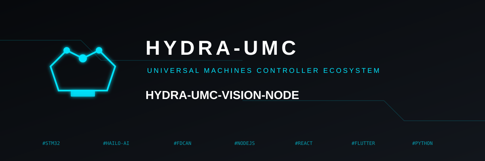
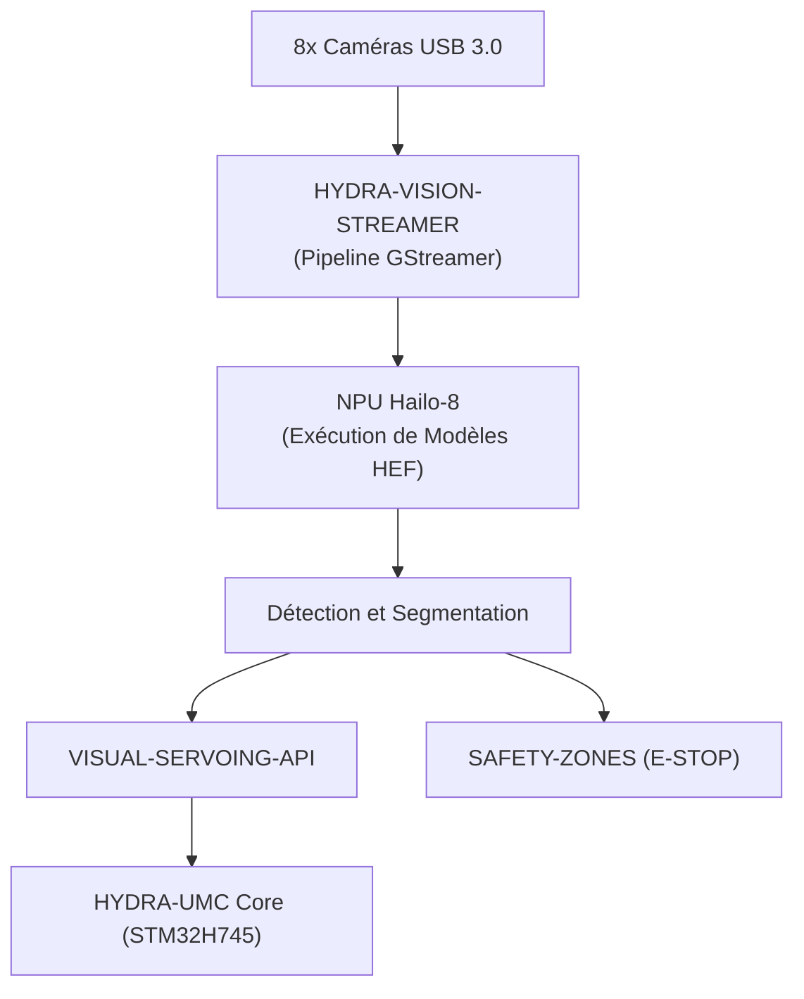

<p align="center">
  
</p>

# 👁️ HYDRA-UMC-VISION-NODE

<p align="center"><a href="README.md">🇺🇸 English</a> | <a href="README_spa.md">🇪🇸 Español</a> | 🇫🇷 <b>Français</b> | <a href="README_ita.md">🇮🇹 Italiano</a> | <a href="README_deu.md">🇩🇪 Deutsch</a> | <a href="README_zho.md">🇨🇳 简体中文</a> | <a href="README_jpn.md">🇯🇵 日本語</a></p>

### 🧠 Nœud d'IA de Périphérie pour Perception Haute Vitesse (Hailo-8 + Raspberry Pi CM5)

<p align="left">
  
  
  
  
  
</p>

---

## 1. 🛠️ VUE D'ENSEMBLE TECHNIQUE

**HYDRA-UMC-VISION-NODE** est le moteur de perception dédié de l'écosystème HYDRA-UMC. Conçu pour fonctionner sur le Raspberry Pi Compute Module 5 associé à un accélérateur IA Hailo-8 M.2, sa fonction prévue est de gérer des flux vidéo massifs provenant de jusqu'à 8 caméras USB 3.0 simultanément.

Il est conçu pour agir comme les « réflexes » du système : suivi d'objets sub-millimétrique, inspection de défauts et surveillance de sécurité en temps réel, sans surcharger l'orchestrateur central.

Ce projet est le **parent d'intégration** de la famille Vision AI Node : il ne fait pas tout ce travail lui-même, c'est le nœud auquel se connectent les 4 enfants spécialisés ci-dessous, chacun ayant une seule responsabilité :

* **[HYDRA-UMC-VISION-STREAMER](https://github.com/JuanenRac/HYDRA-UMC-VISION-STREAMER)** — capture et pré-traite les flux caméra consommés par ce nœud.
* **[HYDRA-UMC-DETECTION-HEF](https://github.com/JuanenRac/HYDRA-UMC-DETECTION-HEF)** — compile et versionne les modèles `.hef` que ce nœud charge sur son NPU Hailo-8.
* **[HYDRA-UMC-SAFETY-ZONES](https://github.com/JuanenRac/HYDRA-UMC-SAFETY-ZONES)** — transforme la perception de ce nœud en détection d'intrusion et déclenchement d'arrêt d'urgence (E-STOP).
* **[HYDRA-UMC-VISUAL-SERVOING-API](https://github.com/JuanenRac/HYDRA-UMC-VISUAL-SERVOING-API)** — transforme la perception de ce nœud en corrections cinématiques de pose.

### Points Clés

* 🧩 **Vérification de disponibilité de la famille (v0) :** le vrai sous-commande `family-status` lit le propre `hydra-umc.project.json` de chacun des 4 vrais enfants et signale présence/version/maturité/rôle - honnête pour un parent d'intégration qui ne fait tourner encore aucun runtime Hailo-8 ni pipeline caméra lui-même. Voir « Vérification d'honnêteté » ci-dessous.
* 🩺 **Manifeste de pipeline, validation de frames et mode dégradé (v0) :** un manifeste réel et inspectable de la forme du pipeline de perception de ce nœud (quelles étapes nécessitent une caméra, un accélérateur, ou aucun des deux), une validation réelle et structurelle de corruption d'un buffer de frame brut, et une détection réelle de mode dégradé qui sonde honnêtement du matériel caméra/Hailo-8 réel et signale exactement quelles étapes peuvent tourner en ce moment - via les nouvelles sous-commandes `pipeline-status` et `validate-frame`.
* 🌐 **API JSON/HTTP (v0) :** la vraie sous-commande `serve` expose `family-status`/`pipeline-status`/`validate-frame` en tant qu'API HTTP (`GET /family-status`, `GET /pipeline-status`, `POST /validate-frame`, plus `GET /stats`) - exactement les mêmes fonctions que celles exécutées par les sous-commandes CLI, au-dessus de `http.server`, sans aucune dépendance supplémentaire. Voir « L'API JSON/HTTP » ci-dessous et [`docs/CLI_REFERENCE.md`](docs/CLI_REFERENCE.md).
* 🚀 **Accélération matérielle (prévu) :** l'objectif est l'exécution native de modèles HEF sur Hailo-8 (26 TOPS) - la chaîne d'outils qui compile ces modèles est un projet séparé ([HYDRA-UMC-DETECTION-HEF](https://github.com/JuanenRac/HYDRA-UMC-DETECTION-HEF)), pas quelque chose que ce nœud construit lui-même.
* 📷 **Traitement multi-flux (prévu) :** analyse simultanée de jusqu'à 8 flux caméra haute résolution, capturés en amont par [HYDRA-UMC-VISION-STREAMER](https://github.com/JuanenRac/HYDRA-UMC-VISION-STREAMER).
* 🎯 **Perception de précision (prévu) :** conçu autour d'architectures de la famille YOLO pour la détection de composants industriels.
* 🛡️ **Sécurité active (prévu) :** cartographie d'occupation en temps réel alimentant [HYDRA-UMC-SAFETY-ZONES](https://github.com/JuanenRac/HYDRA-UMC-SAFETY-ZONES) pour la détection d'intrusion humaine.
* 🧩 **Pourquoi ce projet existe :** sans nœud dédié, le travail de perception surchargerait le cœur temps réel STM32H745 à l'intérieur de [HYDRA-UMC](https://github.com/JuanenRac/HYDRA-UMC) (qui n'a pas de cycles disponibles pour cela), ou forcerait chaque image caméra à transiter vers un GPU distant, ajoutant une latence que la boucle de sécurité ne peut pas se permettre. L'exécuter sur CM5 + Hailo-8, physiquement à côté du robot, garde la boucle détecter → corriger → (si nécessaire) E-STOP locale et rapide.

**Vérification d'honnêteté - ce qui fonctionne réellement aujourd'hui :** ce dépôt est à l'étape squelette. Le point d'entrée réel (`src/hydra_umc_vision_node/main.py`) affiche le nom du projet, sa version installée et une description d'une ligne de son rôle, puis se termine avec le code 0. Rien du runtime Hailo-8, de l'API de contrôle gRPC ou de la logique de supervision des enfants décrite ci-dessus n'existe encore dans le code - c'est la raison d'être de ce projet, pas quelque chose qu'il fait aujourd'hui. Voir [`CHANGELOG.md`](CHANGELOG.md) pour ce qui a été livré exactement jusqu'à présent, et la section « État Actuel et Prochaines Étapes » ci-dessous pour ce qui reste ouvert.

---

## 2. 🔄 FLUX SYSTÈME PRÉVU

Le diagramme ci-dessous est le flux de données cible vers lequel ce squelette est construit - il documente la décision d'architecture, pas un pipeline qui fonctionne aujourd'hui.



---

## 3. 🧠 INFORMATIONS TECHNIQUES AVANCÉES

### Pourquoi ce projet est le parent d'intégration (et ce que cela signifie concrètement)

Parmi les 5 projets de la famille Vision AI Node, celui-ci est le seul à :

* Contenir un dossier **`os/`** — la configuration de l'image système HydraOS partagée pour l'hôte CM5. Les 4 enfants s'exécutent comme processus/conteneurs *au-dessus de* cette unique image système partagée ; aucune raison que chacun ait sa propre copie.
* Contenir un dossier **`models/`** — les modèles `.hef` compilés réellement chargés sur le NPU Hailo-8 à l'exécution. [HYDRA-UMC-DETECTION-HEF](https://github.com/JuanenRac/HYDRA-UMC-DETECTION-HEF) est l'endroit où ces modèles sont *compilés et versionnés* ; ce nœud est l'endroit où vit la *copie servie en exécution*, car c'est le processus propriétaire du handle du périphérique Hailo-8.
* Contenir **`docker-compose.yml`** — voir ci-dessous.

Aucun des 5 projets ne contient de dossier `hardware/` ni `firmware/` : CM5 + Hailo-8 est du matériel existant sur étagère sans carte propre à concevoir, contrairement (par exemple) aux cartes STM32H745/STM32G474 sur mesure à l'intérieur de [HYDRA-UMC](https://github.com/JuanenRac/HYDRA-UMC).

### `docker-compose.yml` : une carte d'intégration documentée, pas encore une stack fonctionnelle

`docker-compose.yml` à la racine du projet définit le service de ce nœud ainsi que les 4 enfants, câblés avec les devices/volumes/ports qu'on attend de chacun (le nœud de périphérique Hailo-8, les devices V4L2 par caméra, les ports gRPC vers le core HYDRA-UMC). Il est abondamment commenté pour expliquer *pourquoi* chaque pièce est là. **Il n'est pas fonctionnel aujourd'hui** - aucun des 4 enfants n'a encore de `Dockerfile` propre, donc `docker compose up` échouerait. Il existe déjà, avant ce code, pour que la forme de l'intégration soit décidée et documentée une seule fois plutôt qu'improvisée séparément par chaque enfant plus tard.

### Décisions de conception déjà prises dans ce squelette

* **La version est lue depuis les métadonnées du paquet installé, pas codée en dur.** `main.py` appelle `importlib.metadata.version("hydra-umc-vision-node")` plutôt que de garder une seconde chaîne `__version__` quelque part dans le paquet. Cela signifie que `bump_version.py` n'a qu'un seul endroit à modifier (`pyproject.toml`), et la version affichée ne peut jamais silencieusement diverger.
* **L'incrément « compteur kilométrique » ne touche automatiquement que `PATCH`/`MINOR`.** `bump_version.py` incrémente `PATCH` à chaque build réel, avec report vers `MINOR` au-delà de 9, et de `MINOR` vers `MAJOR` au-delà de 9 - mais n'incrémente jamais `MAJOR` lui-même. `MAJOR` est une décision humaine et sémantique délibérée (une véritable étape d'architecture), pas quelque chose qu'un script de build devrait décider seul. C'est la même convention déjà utilisée dans le reste de l'écosystème (voir `HYDRA-UMC-EDITOR-URDF/bump_version.py` et `HYDRA-UMC-SUITE/bump_version.py`).
* **gRPC/Protobuf, pas REST, pour l'API de contrôle prévue** (voir badge ci-dessus) - choisi car la boucle perception → correction → firmware dans laquelle vit ce nœud est sensible à la latence et parle à d'autres services Python/embarqués sur le même LAN, où le framing binaire et le support du streaming de gRPC conviennent mieux que JSON sur HTTP. Pas encore implémenté ; documenté ici pour que la direction soit claire avant l'arrivée du code.
* **`family-status` lit le propre manifeste de chaque enfant plutôt qu'une liste maintenue à la main.** `hydra-umc.project.json` est déjà la source unique de vérité en laquelle le tableau de bord/updater de l'écosystème ont confiance - une seconde liste ici dériverait dès que la maturité réelle d'un enfant changerait et que personne ne penserait à la mettre à jour.
* **Un checkout frère manquant est un « not found » réel et honnête, pas un crash.** Un parent d'intégration ne peut vraiment pas savoir si un développeur a bien les 4 enfants checkoutés localement - `manifest.py` retourne `None` pour chaque mode d'échec réel (dépôt manquant, fichier manquant, JSON malformé) afin que `family-status` puisse le signaler clairement plutôt que de lever une exception.
* **Pourquoi la détection de mode dégradé est divisée en une sonde et une fonction de décision pure.** `camera_available()`/`accelerator_available()` de `hardware.py` sont les seules parties qui touchent du matériel réel (un device node Linux) ; `determine_mode()`/`active_stages()` prennent de simples booléens et contiennent la logique de décision réelle. Cette séparation est ce qui permet de tester chaque combinaison matérielle réelle (complet, sans caméra, sans accélérateur, sans aucun matériel) directement et de façon déterministe, sans simuler un système de fichiers ni avoir besoin de matériel CM5+Hailo-8 réel pour prouver que la logique est correcte.
* **Pourquoi la validation de frame ne vérifie que la structure, pas le contenu des pixels.** Détecter un buffer tronqué/surdimensionné ou un buffer étrangement uniforme (un capteur figé, une capture vide) est une validation réelle, utile et indépendante du matériel qui n'a besoin d'aucune image de référence ni d'aucune caméra pour être testée honnêtement. Décider si le CONTENU réel d'une frame semble mauvais (flou, exposition, une vraie métrique de qualité vision) est un problème fondamentalement différent et bien plus difficile qui nécessiterait de vraies frames capturées pour être calibré - explicitement hors du périmètre de cette v0.

---

## 📂 STRUCTURE DES RÉPERTOIRES

```text
HYDRA-UMC-VISION-NODE/
├── src/hydra_umc_vision_node/
│   ├── manifest.py       # Vrai lecteur défensif du manifeste d'un projet frère
│   ├── family.py          # Vraie vérification de disponibilité de la famille sur les 4 vrais enfants
│   ├── pipeline.py          # Vrai manifeste de pipeline de perception (étapes + besoins matériels)
│   ├── frame.py               # Vraie validation de corruption de frame, indépendante du matériel
│   ├── hardware.py              # Vraies sondes caméra/accélérateur + logique de mode dégradé
│   ├── api.py                     # Surface JSON/HTTP simple (http.server de stdlib) sur les 3 vraies sous-commandes
│   └── main.py                    # Point d'entrée + sous-commandes réelles `family-status`/`pipeline-status`/`validate-frame`
├── tests/               # Vrais tests : lecture de manifeste, statut famille, pipeline, frame, matériel, api, CLI
├── docs/                # Documentation et référence API
├── os/                  # Configuration de l'image HydraOS (CM5) - ici uniquement, peuplé au déploiement (absent de git)
├── models/              # Modèles .hef compilés servis au NPU Hailo-8 - ici uniquement, peuplé au déploiement (absent de git)
├── build/               # Sortie de build (le .venv local y vit aussi)
├── images/              # Médias et diagrammes
├── systemd/
│   └── hydra-umc-vision-node.service # Unité systemd de l'API locale de perception sur la CM5
├── tools/
│   ├── build_test.py    # Vérification de build sans versionnage
│   └── ci_validate.py   # Validation manifeste/CHANGELOG/docs utilisée par CI
├── pyproject.toml       # Métadonnées du paquet, dépendances, version compteur kilométrique
├── bump_version.py      # Incrément de version native type compteur kilométrique (build.sh/.bat)
├── bump_manifest_version.py # Synchronise la version de hydra-umc.project.json avec la version native (--sync)
├── build.sh / build.bat # venv + installation éditable + compile-check
├── run.sh / run.bat     # Exécute le point d'entrée depuis le venv local
├── docker-compose.yml   # Carte d'intégration des 4 enfants (pas encore fonctionnelle)
└── CHANGELOG.md         # Historique version par version (schéma compteur kilométrique, sans dates)
```

`hardware/` et `firmware/` n'existent pas dans ce dépôt (voir « Informations Techniques Avancées » ci-dessus pour le pourquoi). `os/` et `models/` n'existent que dans ce projet parmi les 5 - les 4 enfants n'ont pas leur propre copie.

---

## 🏗️ BUILD ET EXÉCUTION

### Prérequis

* **Python 3.10 ou plus récent** sur le `PATH` (vérifié via `python3`/`python` - les scripts essaient les deux).
* Aucun SDK Hailo système, GStreamer ou autre dépendance native n'est requis pour l'instant - le squelette a **zéro dépendance tierce à l'exécution** (`dependencies = []` dans `pyproject.toml`). Elles seront ajoutées au fur et à mesure que la logique réelle correspondante arrivera.
* Suffisamment d'espace disque pour un environnement virtuel local (créé sous `.venv/`, quelques dizaines de Mo à ce stade).

### Étape par étape - ce que fait vraiment chaque commande

```bash
# Linux / macOS
./build.sh
```

1. **Incrément de version compteur kilométrique** — exécute `bump_version.py`, qui incrémente `PATCH` dans `pyproject.toml` (avec report vers `MINOR`/`MAJOR` selon la règle ci-dessus). Cela se produit à *chaque* build, y compris celui-ci que vous êtes sur le point d'exécuter, donc attendez-vous à ce que la version augmente de 1.
2. **Environnement virtuel** — crée `.venv/` s'il n'existe pas déjà (sûr à ré-exécuter ; un `.venv/` existant est réutilisé, pas recréé).
3. **Installation éditable** — `pip install -e .` installe ce paquet dans `.venv` en mode « éditable », donc les modifications de code sous `src/` prennent effet immédiatement sans réinstallation, et enregistre le point d'entrée console `hydra-umc-vision-node` utilisé par `run.sh`.
4. **Compile-check** — `python -m compileall -q src` compile en bytecode chaque fichier `.py` sous `src/`, détectant les erreurs de syntaxe dans tout le paquet, même dans des fichiers jamais réellement importés par `main.py`.
5. **Vraie suite de tests** — `pytest tests/` exécute les 48 tests.

Le script utilise `set -euo pipefail` et s'arrête à la première étape en échec, n'affichant `== Build OK ==` que si les 5 étapes ont réussi.

```bash
./run.sh
```

Localise l'interpréteur Python à l'intérieur de `.venv` (gère à la fois la disposition POSIX `.venv/bin/python` et celle de Windows `.venv/Scripts/python.exe`, car ce dépôt est développé de façon multiplateforme) et exécute `python -m hydra_umc_vision_node.main`, qui transmet tous les arguments.

L'invocation nue affiche le nom, la version et le rôle :

```text
HYDRA-UMC-VISION-NODE v0.0.6
High-speed perception edge AI node (Hailo-8 + CM5) - integration parent of Vision-Streamer, Detection-HEF, Safety-Zones and Visual-Servoing-API.
```

La vraie sous-commande `family-status` vérifie le checkout local réel :

```bash
./run.sh family-status
./run.sh family-status --workspace /path/to/some/other/checkout

# Windows
run.bat family-status
```

Utilise par défaut le répertoire parent de ce dépôt - la vraie disposition en checkouts frères déjà utilisée par cet écosystème. Se termine avec `1` si un vrai enfant manque.

La vraie sous-commande `pipeline-status` sonde le matériel réel et rapporte le résultat réel, honnête :

```bash
./run.sh pipeline-status
```
```json
{
  "manifest": { "version": "0.1.0", "stages": [ "..." ] },
  "camera_present": false,
  "accelerator_present": false,
  "mode": "degraded_no_hardware",
  "runnable_stages": ["preprocess", "postprocess", "publish"],
  "skipped_stages": ["capture", "inference"]
}
```

Sur cette machine de développement (pas de CM5, pas de Hailo-8, pas de caméra) c'est la réponse réelle et honnête - code de sortie `1` (tout sauf le mode `full`). La vraie sous-commande `validate-frame` vérifie un fichier de buffer de frame brut à la recherche d'une corruption structurelle :

```bash
./run.sh validate-frame path/to/frame.raw --width 1920 --height 1080
# Frame OK: path/to/frame.raw matches 1920x1080x3 (6220800 bytes)

./run.sh validate-frame path/to/truncated.raw --width 1920 --height 1080
# Frame INVALID: path/to/truncated.raw
#   [size_mismatch] frame buffer is ... bytes, expected 6220800 bytes ... - likely truncated or corrupt
```

```bat
:: Windows - mêmes étapes, syntaxe batch
build.bat
run.bat
```

### L'API JSON/HTTP

La vraie sous-commande `serve` exécute `family-status`/`pipeline-status`/`validate-frame` en tant qu'API JSON/HTTP au lieu d'un appel CLI ponctuel - la même convention déjà utilisée par les autres `api.py` de cette famille, construite sur `http.server` de la bibliothèque standard (`ThreadingHTTPServer`), sans aucune dépendance d'exécution supplémentaire :

```bash
./run.sh serve --addr 127.0.0.1 --port 8094
```

| Route | Méthode | Notes |
|---|---|---|
| `/family-status` | `GET` | Identique à la sous-commande `family-status`. Le paramètre optionnel `?workspace=CHEMIN` remplace le workspace par défaut du serveur pour cette seule requête. |
| `/pipeline-status` | `GET` | Identique à la sous-commande `pipeline-status`. |
| `/validate-frame` | `POST` | Même vérification que la sous-commande `validate-frame`, mais les octets bruts du frame voyagent dans le corps de la requête au lieu d'un chemin de fichier local - un appelant distant n'a aucun chemin local sur le système de fichiers de ce serveur à lui transmettre. Nécessite les paramètres `?width=W&height=H` (`channels` optionnel, `3` par défaut). |
| `/stats` | `GET` | Rapporte le chemin du workspace par défaut du serveur. |

Exemple de `/validate-frame`, avec le même fixture varié de 48 octets que le parcours CLI ci-dessus :

```bash
curl -X POST "http://127.0.0.1:8094/validate-frame?width=4&height=4&channels=3" --data-binary @vn_good_frame.raw
# {"valid": true, "expectedBytes": 48, "actualBytes": 48, "issues": []}
```

Chaque route répond avec un corps d'erreur honnête (`{"error": "..."}`) et le code HTTP correspondant - `400` pour des paramètres de requête invalides ou manquants, `404` pour une route inconnue - au lieu d'échouer silencieusement. Référence complète route par route : [`docs/CLI_REFERENCE.md`](docs/CLI_REFERENCE.md).

### Dépannage

* **`python`/`python3` introuvable** — installez Python 3.10+ et assurez-vous qu'il est sur le `PATH` ; les deux scripts essaient `python3` en premier, avec `python` en repli.
* **`compileall` échoue** — cela signifie qu'une véritable erreur de syntaxe a été introduite sous `src/` ; le script de build se termine avec un code non nul sans créer/mettre à jour l'installation, volontairement, pour qu'un paquet cassé ne soit jamais présenté comme un « build réussi ».
* **`run.sh`/`run.bat` indique « No `.venv` found »** — `build.sh`/`build.bat` doit être exécuté au moins une fois avant ; `run.sh`/`run.bat` ne crée jamais l'environnement lui-même, seuls les builds le font.
* **Installation éditable obsolète après un pull** — supprimez `.venv/` et relancez `build.sh`/`build.bat` ; rarement nécessaire, car `pip install -e .` capte normalement les changements de code sans réinstallation.

---

## 🚀 État Actuel et Prochaines Étapes

**Ce qui fonctionne aujourd'hui :** un vrai paquet Python installable avec un point d'entrée vérifié, une vraie vérification de disponibilité de la famille (`family-status`), un vrai manifeste de pipeline et une vraie détection de mode dégradé qui sonde honnêtement le matériel caméra/Hailo-8 réel (`pipeline-status`), une vraie validation structurelle de corruption de frame indépendante du matériel (`validate-frame`), une vraie sous-commande `serve` exposant les trois comme API JSON/HTTP (`api.py`), 48 tests réels qui passent (voir [`CHANGELOG.md`](CHANGELOG.md) pour la sortie exacte de build/run capturée), un incrément de version compteur kilométrique intégré au build, et une carte d'intégration entièrement documentée (mais pas encore fonctionnelle) pour les 4 enfants dans `docker-compose.yml`.

**Ce qui reste ouvert, sans ordre particulier et sans calendrier engagé :**

* L'initialisation réelle du runtime Hailo-8 et la boucle d'inférence.
* L'API de contrôle gRPC vers le core HYDRA-UMC.
* La supervision réelle des 4 services enfants (aujourd'hui `docker-compose.yml` documente seulement la forme prévue).
* La synchronisation du pipeline multi-caméra une fois que [HYDRA-UMC-VISION-STREAMER](https://github.com/JuanenRac/HYDRA-UMC-VISION-STREAMER) aura un vrai pipeline de capture avec lequel se synchroniser.
* Transformer `docker-compose.yml` en une stack réellement exécutable, ce qui dépend de la publication d'un `Dockerfile` propre par chacun des 4 enfants.

---

## 🔗 Projets Liés

Ce projet fait partie de l'écosystème robotique HYDRA-UMC du même auteur (JuanenRac / Electro Hobby 3D). Bon à savoir, car une demande pourrait en réalité concerner l'un de ceux-ci plutôt que ce dépôt.

**Projets Enfants** — chacun est une étape spécifique ou un consommateur du propre pipeline de perception Hailo-8 de ce nœud
- **[HYDRA-UMC-DETECTION-HEF](https://github.com/JuanenRac/HYDRA-UMC-DETECTION-HEF)** — registre réel de modèles compilés avec vérification de chargement sécurisé par architecture Hailo/checksum.
- **[HYDRA-UMC-VISION-STREAMER](https://github.com/JuanenRac/HYDRA-UMC-VISION-STREAMER)** — générateur réel de pipeline GStreamer + config MediaMTX, avec une vraie frontière d'intégration HailoRT.
- **[HYDRA-UMC-SAFETY-ZONES](https://github.com/JuanenRac/HYDRA-UMC-SAFETY-ZONES)** — vraie vérification de violation de zone et demande d'E-STOP, avec application de la fraîcheur de calibration.
- **[HYDRA-UMC-VISUAL-SERVOING-API](https://github.com/JuanenRac/HYDRA-UMC-VISUAL-SERVOING-API)** — vraie loi de correction Position-Based Visual Servoing, verrouillée sur l'état de zone en amont.

**Directement Liés**
- **[HYDRA-UMC](https://github.com/JuanenRac/HYDRA-UMC)** — la carte mère physique du bras robotique : hôte CM5 + coprocesseur STM32H745 double cœur, coordonnant jusqu'à 8 bras-outils via CAN-OTA/SPI-OTA ; le propre pipeline de perception de ce nœud est ce qui ferme la boucle de sécurité/E-STOP sur ce firmware.
- **[HYDRA-UMC-COGNITIVE-NODE](https://github.com/JuanenRac/HYDRA-UMC-COGNITIVE-NODE)** — hub d'intégration pour le pipeline cognitif Hailo-10 (orchestration LLM/VLA/voix), construit comme la couche sémantique directement au-dessus de la propre sortie de perception de ce nœud.

**Fait Également Partie de l'Écosystème**

*Matériel & Plateforme de Base*
- **[HYDRA-UMC-OS](https://github.com/JuanenRac/HYDRA-UMC-OS)** — couche produit reproductible sur Raspberry Pi OS pour le CM5 : agent en lecture seule, config/profils validés, provisionnement WiFi de premier contact.
- **[HYDRA-UMC-SDK](https://github.com/JuanenRac/HYDRA-UMC-SDK)** — le contrat JSON-Schema partagé et la barrière de sécurité contre laquelle chaque bridge valide ses commandes.

*Backend Central & Clients*
- **[HYDRA-UMC-SERVER](https://github.com/JuanenRac/HYDRA-UMC-SERVER)** — le vrai backend headless (REST/WebSocket) auquel parle réellement chaque client de contrôle.
- **[HYDRA-UMC-STUDIO](https://github.com/JuanenRac/HYDRA-UMC-STUDIO)** — tableau de bord de contrôle web avec visualisation 3D multi-robot en temps réel.
- **[HYDRA-UMC-SUITE](https://github.com/JuanenRac/HYDRA-UMC-SUITE)** — centre de commande d'essaim de bureau (PySide6) pour plusieurs serveurs à la fois, empaqueté en exécutable autonome.
- **[HYDRA-UMC-ANDROID-CONTROL](https://github.com/JuanenRac/HYDRA-UMC-ANDROID-CONTROL)** — application de contrôle Android native avec connexion biométrique et un compagnon Wear OS jumelé.
- **[HYDRA-UMC-IOS-CONTROL](https://github.com/JuanenRac/HYDRA-UMC-IOS-CONTROL)** — application de contrôle iOS/iPadOS (Flutter) avec synchronisation WebSocket en temps réel.
- **[HYDRA-UMC-DSI](https://github.com/JuanenRac/HYDRA-UMC-DSI)** — interface tactile native pour l'écran tactile DSI 7" embarqué, intégrée directement sur le CM5.
- **[HYDRA-UMC-EDITOR-URDF](https://github.com/JuanenRac/HYDRA-UMC-EDITOR-URDF)** — créateur/éditeur graphique de bureau pour URDF qui envoie les modèles terminés vers le propre catalogue de STUDIO.
- **[HYDRA-UMC-BRIDGE-AMR](https://github.com/JuanenRac/HYDRA-UMC-BRIDGE-AMR)** — frontière de coordination pour les flottes AGV/AMR via un éditeur MQTT VDA 5050 réel.
- **[HYDRA-UMC-BRIDGE-CNC](https://github.com/JuanenRac/HYDRA-UMC-BRIDGE-CNC)** — coordinateur haut niveau pour cellules CNC avec accès réel au statut/octets de contrôle GRBL.
- **[HYDRA-UMC-BRIDGE-DROIDS](https://github.com/JuanenRac/HYDRA-UMC-BRIDGE-DROIDS)** — frontière de coordination pour droïdes à pattes/humanoïdes, avec un véritable émetteur de commandes Boston Dynamics Spot.
- **[HYDRA-UMC-BRIDGE-LASER](https://github.com/JuanenRac/HYDRA-UMC-BRIDGE-LASER)** — coordinateur de sécurité pour cellules laser lisant 3 vraies sécurités GPIO de clé/enceinte/verrouillage.
- **[HYDRA-UMC-BRIDGE-OPENPNP](https://github.com/JuanenRac/HYDRA-UMC-BRIDGE-OPENPNP)** — coordinateur haut niveau sûr pour le flux de cartes du pick-and-place OpenPnP.
- **[HYDRA-UMC-BRIDGE-PRINTER3D](https://github.com/JuanenRac/HYDRA-UMC-BRIDGE-PRINTER3D)** — frontière de coordination sûre pour imprimantes 3D Moonraker/Klipper, avec de vraies commandes de tâche contrôlées.
- **[HYDRA-UMC-BRIDGE-ROS2](https://github.com/JuanenRac/HYDRA-UMC-BRIDGE-ROS2)** — coordinateur de sécurité avec un vrai transport ROS 2 rclpy à importation paresseuse.
- **[HYDRA-UMC-BRIDGE-UAV](https://github.com/JuanenRac/HYDRA-UMC-BRIDGE-UAV)** — frontière de coordination pour UAV équipés de caméra, avec un véritable émetteur de commandes MAVLink.

*Plateforme d'Outils URTC*
- **[URTC](https://github.com/JuanenRac/URTC)** — firmware pour la carte physique Universal Robot Tool Controller, plus de 25 profils d'outil sur bus CAN.
- **[URTC-FLASHER](https://github.com/JuanenRac/URTC-FLASHER)** — outil de bureau à interface graphique pour flasher les cartes URTC, CAN-OTA plus SWD/JTAG puce complète.
- **[URTC-TESTER](https://github.com/JuanenRac/URTC-TESTER)** — outil de bureau de diagnostic CAN-bus en direct pour cartes URTC, un panneau par profil d'outil.
- **[URTC-WEB-STUDIO](https://github.com/JuanenRac/URTC-WEB-STUDIO)** — alternative basée navigateur à URTC-TESTER via la Web Serial API, sans installation locale.

*Nœud IA Cognitif (Hailo-10)*
- **[HYDRA-UMC-VLA-ENGINE](https://github.com/JuanenRac/HYDRA-UMC-VLA-ENGINE)** — vrai encodage/décodage de jetons d'action et génération de trajectoire pour un modèle Vision-Language-Action.
- **[HYDRA-UMC-VOICE-UI](https://github.com/JuanenRac/HYDRA-UMC-VOICE-UI)** — vrai front-end vocal (VAD + analyseur d'intention) avec un relais Watch borné et soumis à confirmation.
- **[HYDRA-UMC-SEMANTIC-PLANNER](https://github.com/JuanenRac/HYDRA-UMC-SEMANTIC-PLANNER)** — vraie décomposition de tâches basée sur des règles et récupération sémantique d'erreurs sur les codes d'erreur MCU.
- **[HYDRA-UMC-DOCS-QA](https://github.com/JuanenRac/HYDRA-UMC-DOCS-QA)** — vraie recherche documentaire TF-IDF (bibliothèque standard uniquement) sur les propres documents Markdown de cet écosystème.

*Orchestration & Essaim*
- **[HYDRA-UMC-ORCHESTRATOR](https://github.com/JuanenRac/HYDRA-UMC-ORCHESTRATOR)** — hub d'intégration avec un vrai contrat de rapport de santé gRPC/Protobuf et une machine à états de mission.
- **[HYDRA-UMC-JOB-DISPATCHER](https://github.com/JuanenRac/HYDRA-UMC-JOB-DISPATCHER)** — vraie file de tâches basée sur la priorité avec déduplication, via une vraie API HTTP.
- **[HYDRA-UMC-NODE-HEALING](https://github.com/JuanenRac/HYDRA-UMC-NODE-HEALING)** — vrai chien de garde de santé de flotte basé sur gRPC, avec retry/backoff et détection d'incohérence d'identité.
- **[HYDRA-UMC-PATH-PLANNER-3D](https://github.com/JuanenRac/HYDRA-UMC-PATH-PLANNER-3D)** — vrai planificateur de trajectoire 3D basé sur RRT, avec vraie validation des collisions obstacle/espace de travail.
- **[HYDRA-UMC-SWARM-SYNC](https://github.com/JuanenRac/HYDRA-UMC-SWARM-SYNC)** — vraie synchronisation d'état CRDT LWW-Element-Map, testée par propriétés pour la convergence multi-cellule.

*Jumeau Numérique & Simulation*
- **[HYDRA-UMC-TWIN](https://github.com/JuanenRac/HYDRA-UMC-TWIN)** — hub d'intégration pour le moteur de jumeau numérique, avec un vrai contrat de synchronisation par compatibilité de version.
- **[HYDRA-UMC-HIL-BRIDGE](https://github.com/JuanenRac/HYDRA-UMC-HIL-BRIDGE)** — vrai verrouillage de sécurité hardware-in-the-loop routant les commandes entre simulation et matériel réel.
- **[HYDRA-UMC-PHYSICS-REPLICA](https://github.com/JuanenRac/HYDRA-UMC-PHYSICS-REPLICA)** — vraie cinématique directe et validation des limites articulaires sur un vrai sous-ensemble URDF.
- **[HYDRA-UMC-SYNTHETIC-DATA-GEN](https://github.com/JuanenRac/HYDRA-UMC-SYNTHETIC-DATA-GEN)** — vrai générateur procédural de scènes 2D avec export d'annotations YOLO/COCO.

*Données & Analytique*
- **[HYDRA-UMC-DATALAKE](https://github.com/JuanenRac/HYDRA-UMC-DATALAKE)** — vrai magasin de séries temporelles basé sur sqlite3, avec une vraie API HTTP d'ingestion/requête.
- **[HYDRA-UMC-ANOMALY-DETECTOR](https://github.com/JuanenRac/HYDRA-UMC-ANOMALY-DETECTOR)** — vrai détecteur d'anomalies FFT + ligne de base statistique, avec surveillance de dérive.
- **[HYDRA-UMC-PRODUCTION-REPORTS](https://github.com/JuanenRac/HYDRA-UMC-PRODUCTION-REPORTS)** — vrai calcul OEE/disponibilité sur l'historique de DATALAKE, avec export CSV reproductible.
- **[HYDRA-UMC-TELEMETRY-COLLECTOR](https://github.com/JuanenRac/HYDRA-UMC-TELEMETRY-COLLECTOR)** — vrai pipeline d'ingestion CAN/WebSocket vers DATALAKE, avec déduplication par séquence.

*Passerelle Industrielle*
- **[HYDRA-UMC-GATEWAY-INDUSTRIAL](https://github.com/JuanenRac/HYDRA-UMC-GATEWAY-INDUSTRIAL)** — hub d'intégration relayant vers les protocoles industriels, avec une vraie couche de liste blanche de commandes/contre-pression.
- **[HYDRA-UMC-OPCUA-SERVER](https://github.com/JuanenRac/HYDRA-UMC-OPCUA-SERVER)** — vrai espace d'adressage OPC-UA, vérifié avec une vraie session client du protocole binaire.
- **[HYDRA-UMC-MQTT-BROKER](https://github.com/JuanenRac/HYDRA-UMC-MQTT-BROKER)** — vrai broker MQTT avec authentification par client optionnelle et ACL de sujets.
- **[HYDRA-UMC-MTCONNECT-ADAPTER](https://github.com/JuanenRac/HYDRA-UMC-MTCONNECT-ADAPTER)** — vrais points de terminaison XML MTConnect `/probe` et `/current`, avec sortie en mode dégradé.

*Outils Complémentaires & Opérations de l'Écosystème*
- **[HYDRA-UMC-DASHBOARD-AI](https://github.com/JuanenRac/HYDRA-UMC-DASHBOARD-AI)** — panneaux Smart Summaries et Anomaly Highlighting sur DATALAKE/ANOMALY-DETECTOR, avec un repli statistique honnête.
- **[HYDRA-UMC-TOOL-CLI](https://github.com/JuanenRac/HYDRA-UMC-TOOL-CLI)** — CLI de flotte avec un vrai contrat de codes de sortie stable, un vrai client en direct de la propre API de HYDRA-UMC-SERVER.
- **[HYDRA-UMC-WATCH](https://github.com/JuanenRac/HYDRA-UMC-WATCH)** — application compagnon WearOS avec de vraies alertes haptiques et un relais vocal vers le téléphone jumelé.
- **[URTC-SMART-RACK](https://github.com/JuanenRac/URTC-SMART-RACK)** — firmware pour un rack de montage de cartes avec décodage réel d'ID d'outil et logique de préchauffage Smart Idle.
- **[URTC-VISION-TOOL](https://github.com/JuanenRac/URTC-VISION-TOOL)** — firmware plus un vrai compagnon de vision Python pour une tête d'outil d'inspection thermique/RGB.
- **[HYDRA-UMC-UPDATER](https://github.com/JuanenRac/HYDRA-UMC-UPDATER)** — outil administratif de bureau qui découvre, clone et met à jour chaque dépôt de cet écosystème.

---

## 📚 Documentation & Communauté

- **[docs/CLI_REFERENCE.md](docs/CLI_REFERENCE.md)** — chaque sous-commande (`family-status`, `pipeline-status`, `validate-frame`, `serve`) et chaque route de l'API JSON/HTTP, avec une sortie réelle capturée.
- **[CONTRIBUTING.md](CONTRIBUTING.md)** — pile technologique et lignes directrices de codage pour une pull request.
- **[CODE_OF_CONDUCT.md](CODE_OF_CONDUCT.md)** — les normes de comportement attendues dans cette communauté.
- **[SECURITY.md](SECURITY.md)** — comment signaler une vulnérabilité, et les véritables axes de sécurité de ce projet.
- **[SUPPORT.md](SUPPORT.md)** — où poser des questions et signaler des bugs.
- **[LICENSE.md](LICENSE.md)** — la licence propre de ce projet.

## 👤 AUTEUR
**JuanenRac** (Electro Hobby 3D)
📧 electrohobby3d@gmail.com
📺 [youtube.com/@electrohobby3d](https://youtube.com/@electrohobby3d)

## 📜 LICENCE
GPL-3.0 - Voir le fichier LICENSE pour les détails.
