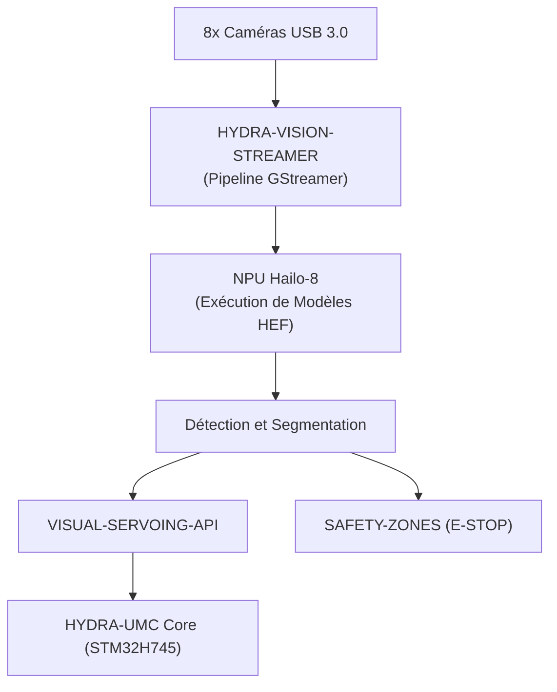

<p align="center">
  
</p>

# 👁️ HYDRA-UMC-VISION-NODE

<p align="center"><a href="README.md">🇺🇸 English</a> | <a href="README_spa.md">🇪🇸 Español</a> | 🇫🇷 <b>Français</b> | <a href="README_ita.md">🇮🇹 Italiano</a> | <a href="README_deu.md">🇩🇪 Deutsch</a> | <a href="README_zho.md">🇨🇳 简体中文</a> | <a href="README_jpn.md">🇯🇵 日本語</a></p>

### 🧠 Nœud d'IA de Périphérie pour Perception Haute Vitesse (Hailo-8 + Raspberry Pi CM5)

<p align="left">
  
  
  
  
  
</p>

---

## 1. 🛠️ VUE D'ENSEMBLE TECHNIQUE

**HYDRA-UMC-VISION-NODE** est le moteur de perception dédié de l'écosystème HYDRA-UMC. Conçu pour fonctionner sur le Raspberry Pi Compute Module 5 associé à un accélérateur IA Hailo-8 M.2, sa fonction prévue est de gérer des flux vidéo massifs provenant de jusqu'à 8 caméras USB 3.0 simultanément.

Il est conçu pour agir comme les « réflexes » du système : suivi d'objets sub-millimétrique, inspection de défauts et surveillance de sécurité en temps réel, sans surcharger l'orchestrateur central.

Ce projet est le **parent d'intégration** de la famille Vision AI Node : il ne fait pas tout ce travail lui-même, c'est le nœud auquel se connectent les 4 enfants spécialisés ci-dessous, chacun ayant une seule responsabilité :

* **[HYDRA-UMC-VISION-STREAMER](https://github.com/JuanenRac/HYDRA-UMC-VISION-STREAMER)** — capture et pré-traite les flux caméra consommés par ce nœud.
* **[HYDRA-UMC-DETECTION-HEF](https://github.com/JuanenRac/HYDRA-UMC-DETECTION-HEF)** — compile et versionne les modèles `.hef` que ce nœud charge sur son NPU Hailo-8.
* **[HYDRA-UMC-SAFETY-ZONES](https://github.com/JuanenRac/HYDRA-UMC-SAFETY-ZONES)** — transforme la perception de ce nœud en détection d'intrusion et déclenchement d'arrêt d'urgence (E-STOP).
* **[HYDRA-UMC-VISUAL-SERVOING-API](https://github.com/JuanenRac/HYDRA-UMC-VISUAL-SERVOING-API)** — transforme la perception de ce nœud en corrections cinématiques de pose.

### Points Clés

* 🧩 **Vérification de disponibilité de la famille (v0) :** le vrai sous-commande `family-status` lit le propre `hydra-umc.project.json` de chacun des 4 vrais enfants et signale présence/version/maturité/rôle - honnête pour un parent d'intégration qui ne fait tourner encore aucun runtime Hailo-8 ni pipeline caméra lui-même. Voir « Vérification d'honnêteté » ci-dessous.
* 🚀 **Accélération matérielle (prévu) :** l'objectif est l'exécution native de modèles HEF sur Hailo-8 (26 TOPS) - la chaîne d'outils qui compile ces modèles est un projet séparé ([HYDRA-UMC-DETECTION-HEF](https://github.com/JuanenRac/HYDRA-UMC-DETECTION-HEF)), pas quelque chose que ce nœud construit lui-même.
* 📷 **Traitement multi-flux (prévu) :** analyse simultanée de jusqu'à 8 flux caméra haute résolution, capturés en amont par [HYDRA-UMC-VISION-STREAMER](https://github.com/JuanenRac/HYDRA-UMC-VISION-STREAMER).
* 🎯 **Perception de précision (prévu) :** conçu autour d'architectures de la famille YOLO pour la détection de composants industriels.
* 🛡️ **Sécurité active (prévu) :** cartographie d'occupation en temps réel alimentant [HYDRA-UMC-SAFETY-ZONES](https://github.com/JuanenRac/HYDRA-UMC-SAFETY-ZONES) pour la détection d'intrusion humaine.
* 🧩 **Pourquoi ce projet existe :** sans nœud dédié, le travail de perception surchargerait le cœur temps réel STM32H745 à l'intérieur de [HYDRA-UMC](https://github.com/JuanenRac/HYDRA-UMC) (qui n'a pas de cycles disponibles pour cela), ou forcerait chaque image caméra à transiter vers un GPU distant, ajoutant une latence que la boucle de sécurité ne peut pas se permettre. L'exécuter sur CM5 + Hailo-8, physiquement à côté du robot, garde la boucle détecter → corriger → (si nécessaire) E-STOP locale et rapide.

**Vérification d'honnêteté - ce qui fonctionne réellement aujourd'hui :** ce dépôt est à l'étape squelette. Le point d'entrée réel (`src/hydra_umc_vision_node/main.py`) affiche le nom du projet, sa version installée et une description d'une ligne de son rôle, puis se termine avec le code 0. Rien du runtime Hailo-8, de l'API de contrôle gRPC ou de la logique de supervision des enfants décrite ci-dessus n'existe encore dans le code - c'est la raison d'être de ce projet, pas quelque chose qu'il fait aujourd'hui. Voir [`CHANGELOG.md`](CHANGELOG.md) pour ce qui a été livré exactement jusqu'à présent, et la section « État Actuel et Prochaines Étapes » ci-dessous pour ce qui reste ouvert.

---

## 2. 🔄 FLUX SYSTÈME PRÉVU

Le diagramme ci-dessous est le flux de données cible vers lequel ce squelette est construit - il documente la décision d'architecture, pas un pipeline qui fonctionne aujourd'hui.



---

## 3. 🧠 INFORMATIONS TECHNIQUES AVANCÉES

### Pourquoi ce projet est le parent d'intégration (et ce que cela signifie concrètement)

Parmi les 5 projets de la famille Vision AI Node, celui-ci est le seul à :

* Contenir un dossier **`os/`** — la configuration de l'image système HydraOS partagée pour l'hôte CM5. Les 4 enfants s'exécutent comme processus/conteneurs *au-dessus de* cette unique image système partagée ; aucune raison que chacun ait sa propre copie.
* Contenir un dossier **`models/`** — les modèles `.hef` compilés réellement chargés sur le NPU Hailo-8 à l'exécution. [HYDRA-UMC-DETECTION-HEF](https://github.com/JuanenRac/HYDRA-UMC-DETECTION-HEF) est l'endroit où ces modèles sont *compilés et versionnés* ; ce nœud est l'endroit où vit la *copie servie en exécution*, car c'est le processus propriétaire du handle du périphérique Hailo-8.
* Contenir **`docker-compose.yml`** — voir ci-dessous.

Aucun des 5 projets ne contient de dossier `hardware/` ni `firmware/` : CM5 + Hailo-8 est du matériel existant sur étagère sans carte propre à concevoir, contrairement (par exemple) aux cartes STM32H745/STM32G474 sur mesure à l'intérieur de [HYDRA-UMC](https://github.com/JuanenRac/HYDRA-UMC).

### `docker-compose.yml` : une carte d'intégration documentée, pas encore une stack fonctionnelle

`docker-compose.yml` à la racine du projet définit le service de ce nœud ainsi que les 4 enfants, câblés avec les devices/volumes/ports qu'on attend de chacun (le nœud de périphérique Hailo-8, les devices V4L2 par caméra, les ports gRPC vers le core HYDRA-UMC). Il est abondamment commenté pour expliquer *pourquoi* chaque pièce est là. **Il n'est pas fonctionnel aujourd'hui** - aucun des 4 enfants n'a encore de `Dockerfile` propre, donc `docker compose up` échouerait. Il existe déjà, avant ce code, pour que la forme de l'intégration soit décidée et documentée une seule fois plutôt qu'improvisée séparément par chaque enfant plus tard.

### Décisions de conception déjà prises dans ce squelette

* **La version est lue depuis les métadonnées du paquet installé, pas codée en dur.** `main.py` appelle `importlib.metadata.version("hydra-umc-vision-node")` plutôt que de garder une seconde chaîne `__version__` quelque part dans le paquet. Cela signifie que `bump_version.py` n'a qu'un seul endroit à modifier (`pyproject.toml`), et la version affichée ne peut jamais silencieusement diverger.
* **L'incrément « compteur kilométrique » ne touche automatiquement que `PATCH`/`MINOR`.** `bump_version.py` incrémente `PATCH` à chaque build réel, avec report vers `MINOR` au-delà de 9, et de `MINOR` vers `MAJOR` au-delà de 9 - mais n'incrémente jamais `MAJOR` lui-même. `MAJOR` est une décision humaine et sémantique délibérée (une véritable étape d'architecture), pas quelque chose qu'un script de build devrait décider seul. C'est la même convention déjà utilisée dans le reste de l'écosystème (voir `HYDRA-UMC-EDITOR-URDF/bump_version.py` et `HYDRA-UMC-SUITE/bump_version.py`).
* **gRPC/Protobuf, pas REST, pour l'API de contrôle prévue** (voir badge ci-dessus) - choisi car la boucle perception → correction → firmware dans laquelle vit ce nœud est sensible à la latence et parle à d'autres services Python/embarqués sur le même LAN, où le framing binaire et le support du streaming de gRPC conviennent mieux que JSON sur HTTP. Pas encore implémenté ; documenté ici pour que la direction soit claire avant l'arrivée du code.

---

## 📂 STRUCTURE DES RÉPERTOIRES

```text
HYDRA-UMC-VISION-NODE/
├── src/                 # Code source (paquet hydra_umc_vision_node)
├── docs/                # Documentation et référence API
├── os/                  # Configuration de l'image HydraOS (CM5) - ici uniquement
├── models/              # Modèles .hef compilés servis au NPU Hailo-8 - ici uniquement
├── build/               # Sortie de build (le .venv local y vit aussi)
├── images/              # Médias et diagrammes
├── scripts/             # Scripts utilitaires (déploiement, configuration)
├── pyproject.toml       # Métadonnées du paquet, dépendances, version compteur kilométrique
├── bump_version.py      # Incrément de version type compteur kilométrique (build.sh/.bat)
├── build.sh / build.bat # venv + installation éditable + compile-check
├── run.sh / run.bat     # Exécute le point d'entrée depuis le venv local
├── docker-compose.yml   # Carte d'intégration des 4 enfants (pas encore fonctionnelle)
└── CHANGELOG.md         # Historique version par version (schéma compteur kilométrique, sans dates)
```

`hardware/` et `firmware/` n'existent pas dans ce dépôt (voir « Informations Techniques Avancées » ci-dessus pour le pourquoi). `os/` et `models/` n'existent que dans ce projet parmi les 5 - les 4 enfants n'ont pas leur propre copie.

---

## 🏗️ BUILD ET EXÉCUTION

### Prérequis

* **Python 3.10 ou plus récent** sur le `PATH` (vérifié via `python3`/`python` - les scripts essaient les deux).
* Aucun SDK Hailo système, GStreamer ou autre dépendance native n'est requis pour l'instant - le squelette a **zéro dépendance tierce à l'exécution** (`dependencies = []` dans `pyproject.toml`). Elles seront ajoutées au fur et à mesure que la logique réelle correspondante arrivera.
* Suffisamment d'espace disque pour un environnement virtuel local (créé sous `.venv/`, quelques dizaines de Mo à ce stade).

### Étape par étape - ce que fait vraiment chaque commande

```bash
# Linux / macOS
./build.sh
```

1. **Incrément de version compteur kilométrique** — exécute `bump_version.py`, qui incrémente `PATCH` dans `pyproject.toml` (avec report vers `MINOR`/`MAJOR` selon la règle ci-dessus). Cela se produit à *chaque* build, y compris celui-ci que vous êtes sur le point d'exécuter, donc attendez-vous à ce que la version augmente de 1.
2. **Environnement virtuel** — crée `.venv/` s'il n'existe pas déjà (sûr à ré-exécuter ; un `.venv/` existant est réutilisé, pas recréé).
3. **Installation éditable** — `pip install -e .` installe ce paquet dans `.venv` en mode « éditable », donc les modifications de code sous `src/` prennent effet immédiatement sans réinstallation, et enregistre le point d'entrée console `hydra-umc-vision-node` utilisé par `run.sh`.
4. **Compile-check** — `python -m compileall -q src` compile en bytecode chaque fichier `.py` sous `src/`, détectant les erreurs de syntaxe dans tout le paquet, même dans des fichiers jamais réellement importés par `main.py`.

Le script utilise `set -euo pipefail` et s'arrête à la première étape en échec, n'affichant `== Build OK ==` que si les 4 étapes ont réussi.

```bash
./run.sh
```

Localise l'interpréteur Python à l'intérieur de `.venv` (gère à la fois la disposition POSIX `.venv/bin/python` et celle de Windows `.venv/Scripts/python.exe`, car ce dépôt est développé de façon multiplateforme) et exécute `python -m hydra_umc_vision_node.main`, qui affiche le nom du projet, la version qui vient d'être incrémentée et sa description de rôle en une ligne.

```bat
:: Windows - mêmes étapes, syntaxe batch
build.bat
run.bat
```

### Dépannage

* **`python`/`python3` introuvable** — installez Python 3.10+ et assurez-vous qu'il est sur le `PATH` ; les deux scripts essaient `python3` en premier, avec `python` en repli.
* **`compileall` échoue** — cela signifie qu'une véritable erreur de syntaxe a été introduite sous `src/` ; le script de build se termine avec un code non nul sans créer/mettre à jour l'installation, volontairement, pour qu'un paquet cassé ne soit jamais présenté comme un « build réussi ».
* **`run.sh`/`run.bat` indique « No `.venv` found »** — `build.sh`/`build.bat` doit être exécuté au moins une fois avant ; `run.sh`/`run.bat` ne crée jamais l'environnement lui-même, seuls les builds le font.
* **Installation éditable obsolète après un pull** — supprimez `.venv/` et relancez `build.sh`/`build.bat` ; rarement nécessaire, car `pip install -e .` capte normalement les changements de code sans réinstallation.

---

## 🚀 État Actuel et Prochaines Étapes

**Ce qui fonctionne aujourd'hui :** un vrai paquet Python installable avec un point d'entrée vérifié (voir [`CHANGELOG.md`](CHANGELOG.md) pour la sortie exacte de build/run capturée), un incrément de version compteur kilométrique intégré au build, et une carte d'intégration entièrement documentée (mais pas encore fonctionnelle) pour les 4 enfants dans `docker-compose.yml`.

**Ce qui reste ouvert, sans ordre particulier et sans calendrier engagé :**

* L'initialisation réelle du runtime Hailo-8 et la boucle d'inférence.
* L'API de contrôle gRPC vers le core HYDRA-UMC.
* La supervision réelle des 4 services enfants (aujourd'hui `docker-compose.yml` documente seulement la forme prévue).
* La synchronisation du pipeline multi-caméra une fois que [HYDRA-UMC-VISION-STREAMER](https://github.com/JuanenRac/HYDRA-UMC-VISION-STREAMER) aura un vrai pipeline de capture avec lequel se synchroniser.
* Transformer `docker-compose.yml` en une stack réellement exécutable, ce qui dépend de la publication d'un `Dockerfile` propre par chacun des 4 enfants.

---

## 🔗 Projets Liés

Ce projet fait partie d'un écosystème robotique plus large du même auteur (JuanenRac / Electro Hobby 3D), couvrant firmware, logiciel de contrôle, nœuds d'IA et outillage de flotte. Bon à savoir, car une demande pourrait en réalité concerner l'un de ces projets plutôt que ce dépôt.

### Famille

**Parent :** aucun — ce projet est lui-même le parent d'intégration de la famille Vision AI Node.

**Enfants :**
- **[HYDRA-UMC-VISION-STREAMER](https://github.com/JuanenRac/HYDRA-UMC-VISION-STREAMER)** — capture et pré-traite les flux caméra consommés par ce nœud.
- **[HYDRA-UMC-DETECTION-HEF](https://github.com/JuanenRac/HYDRA-UMC-DETECTION-HEF)** — compile et versionne les modèles `.hef` que ce nœud charge sur son NPU Hailo-8.
- **[HYDRA-UMC-SAFETY-ZONES](https://github.com/JuanenRac/HYDRA-UMC-SAFETY-ZONES)** — transforme la perception de ce nœud en détection d'intrusion et déclenchement d'E-STOP.
- **[HYDRA-UMC-VISUAL-SERVOING-API](https://github.com/JuanenRac/HYDRA-UMC-VISUAL-SERVOING-API)** — transforme la perception de ce nœud en corrections cinématiques de pose.

### Relation Directe (hors de la famille)

- **[HYDRA-UMC](https://github.com/JuanenRac/HYDRA-UMC)** — referme la boucle perception/E-STOP sur ce firmware.
- **[HYDRA-UMC-COGNITIVE-NODE](https://github.com/JuanenRac/HYDRA-UMC-COGNITIVE-NODE)** — la couche sémantique construite au-dessus de cette perception.

### Reste de l'Écosystème

**Plateforme HYDRA-UMC** — la cellule de micro-usine multi-robot
- **[HYDRA-UMC-SERVER](https://github.com/JuanenRac/HYDRA-UMC-SERVER)** — le backend Express/WebSocket auquel parle chaque client de contrôle.
- **[HYDRA-UMC-STUDIO](https://github.com/JuanenRac/HYDRA-UMC-STUDIO)** — tableau de bord de contrôle web, visualisation 3D multi-robot.
- **[HYDRA-UMC-ANDROID-CONTROL](https://github.com/JuanenRac/HYDRA-UMC-ANDROID-CONTROL)** — application de contrôle Android via Wi-Fi/Bluetooth.
- **[HYDRA-UMC-IOS-CONTROL](https://github.com/JuanenRac/HYDRA-UMC-IOS-CONTROL)** — application de contrôle iOS/iPadOS construite en Flutter.
- **[HYDRA-UMC-SUITE](https://github.com/JuanenRac/HYDRA-UMC-SUITE)** — centre de commande d'essaim de bureau (Python/PySide6).
- **[HYDRA-UMC-EDITOR-URDF](https://github.com/JuanenRac/HYDRA-UMC-EDITOR-URDF)** — éditeur de modèles URDF de bureau pour le catalogue de robots.
- **[HYDRA-UMC-DSI](https://github.com/JuanenRac/HYDRA-UMC-DSI)** — interface tactile native pour l'écran DSI embarqué.

**Plateforme URTC** — le contrôleur de tête d'outil que porte chaque bras HYDRA-UMC
- **[URTC](https://github.com/JuanenRac/URTC)** — contrôleur de tête d'outil sur bus CAN, 25 profils d'outil.
- **[URTC-FLASHER](https://github.com/JuanenRac/URTC-FLASHER)** — outil de bureau de flashage CAN-OTA + SWD/JTAG.
- **[URTC-TESTER](https://github.com/JuanenRac/URTC-TESTER)** — outil de bureau de diagnostic CAN en direct.
- **[URTC-WEB-STUDIO](https://github.com/JuanenRac/URTC-WEB-STUDIO)** — alternative basée navigateur via l'API Web Serial.

**🧠 Cognitive AI Node (Hailo-10)**
- [HYDRA-UMC-VLA-ENGINE](https://github.com/JuanenRac/HYDRA-UMC-VLA-ENGINE)
- [HYDRA-UMC-VOICE-UI](https://github.com/JuanenRac/HYDRA-UMC-VOICE-UI)
- [HYDRA-UMC-SEMANTIC-PLANNER](https://github.com/JuanenRac/HYDRA-UMC-SEMANTIC-PLANNER)
- [HYDRA-UMC-DOCS-QA](https://github.com/JuanenRac/HYDRA-UMC-DOCS-QA)

**🐝 Orchestration & Swarm**
- [HYDRA-UMC-ORCHESTRATOR](https://github.com/JuanenRac/HYDRA-UMC-ORCHESTRATOR)
- [HYDRA-UMC-SWARM-SYNC](https://github.com/JuanenRac/HYDRA-UMC-SWARM-SYNC)
- [HYDRA-UMC-PATH-PLANNER-3D](https://github.com/JuanenRac/HYDRA-UMC-PATH-PLANNER-3D)
- [HYDRA-UMC-JOB-DISPATCHER](https://github.com/JuanenRac/HYDRA-UMC-JOB-DISPATCHER)
- [HYDRA-UMC-NODE-HEALING](https://github.com/JuanenRac/HYDRA-UMC-NODE-HEALING)

**🎮 Digital Twin & Simulation**
- [HYDRA-UMC-TWIN](https://github.com/JuanenRac/HYDRA-UMC-TWIN)
- [HYDRA-UMC-PHYSICS-REPLICA](https://github.com/JuanenRac/HYDRA-UMC-PHYSICS-REPLICA)
- [HYDRA-UMC-HIL-BRIDGE](https://github.com/JuanenRac/HYDRA-UMC-HIL-BRIDGE)
- [HYDRA-UMC-SYNTHETIC-DATA-GEN](https://github.com/JuanenRac/HYDRA-UMC-SYNTHETIC-DATA-GEN)

**📊 Data & Analytics**
- [HYDRA-UMC-DATALAKE](https://github.com/JuanenRac/HYDRA-UMC-DATALAKE)
- [HYDRA-UMC-TELEMETRY-COLLECTOR](https://github.com/JuanenRac/HYDRA-UMC-TELEMETRY-COLLECTOR)
- [HYDRA-UMC-ANOMALY-DETECTOR](https://github.com/JuanenRac/HYDRA-UMC-ANOMALY-DETECTOR)
- [HYDRA-UMC-PRODUCTION-REPORTS](https://github.com/JuanenRac/HYDRA-UMC-PRODUCTION-REPORTS)

**🏭 Industrial Gateway**
- [HYDRA-UMC-GATEWAY-INDUSTRIAL](https://github.com/JuanenRac/HYDRA-UMC-GATEWAY-INDUSTRIAL)
- [HYDRA-UMC-OPCUA-SERVER](https://github.com/JuanenRac/HYDRA-UMC-OPCUA-SERVER)
- [HYDRA-UMC-MQTT-BROKER](https://github.com/JuanenRac/HYDRA-UMC-MQTT-BROKER)
- [HYDRA-UMC-MTCONNECT-ADAPTER](https://github.com/JuanenRac/HYDRA-UMC-MTCONNECT-ADAPTER)

**🛠️ Complementary Tools**
- [URTC-SMART-RACK](https://github.com/JuanenRac/URTC-SMART-RACK)
- [URTC-VISION-TOOL](https://github.com/JuanenRac/URTC-VISION-TOOL)
- [HYDRA-UMC-WATCH](https://github.com/JuanenRac/HYDRA-UMC-WATCH)
- [HYDRA-UMC-TOOL-CLI](https://github.com/JuanenRac/HYDRA-UMC-TOOL-CLI)
- [HYDRA-UMC-DASHBOARD-AI](https://github.com/JuanenRac/HYDRA-UMC-DASHBOARD-AI)

---

## 👤 AUTEUR
**JuanenRac** (Electro Hobby 3D)
📧 electrohobby3d@gmail.com

## 📜 LICENCE
GPL-3.0 - Voir le fichier LICENSE pour les détails.

## 🛠️ BUILD & RUN

Utilisez la vérification de compilation sans versionnement avant une compilation de publication :

| Action | Windows | Linux / macOS |
|---|---|---|
| Vérification de compilation (sans modifier la version ni le CHANGELOG) | `build-test.bat` | `./build-test.sh` |
| Exécution / développement (si disponible) | `run*.bat` ou `dev*.bat` | `./run*.sh` ou `./dev*.sh` |

`build-test.bat` et `build-test.sh` compilent ou valident la pile du projet sans incrémenter `hydra-umc.project.json` ni modifier `CHANGELOG.md`. Ils peuvent uniquement créer les sorties normales du compilateur. Les scripts existants `build*.bat`, `build*.sh`, `run*` et `dev*` conservent leur comportement spécifique de versionnement ou d'exécution ; utilisez-les lorsque ce comportement est requis.