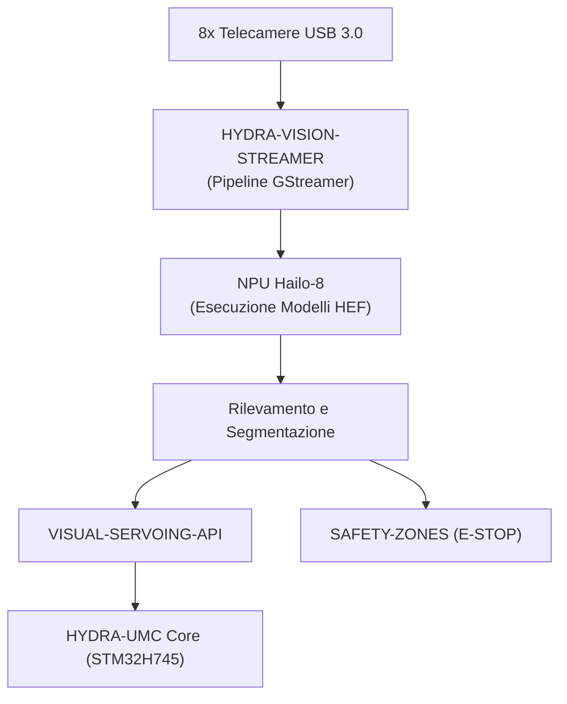

<p align="center">
  
</p>

# 👁️ HYDRA-UMC-VISION-NODE

<p align="center"><a href="README.md">🇺🇸 English</a> | <a href="README_spa.md">🇪🇸 Español</a> | <a href="README_fra.md">🇫🇷 Français</a> | 🇮🇹 <b>Italiano</b> | <a href="README_deu.md">🇩🇪 Deutsch</a> | <a href="README_zho.md">🇨🇳 简体中文</a> | <a href="README_jpn.md">🇯🇵 日本語</a></p>

### 🧠 Nodo IA Edge per Percezione ad Alta Velocità (Hailo-8 + Raspberry Pi CM5)

<p align="left">
  
  
  
  
  
</p>

---

## 1. 🛠️ PANORAMICA TECNICA

**HYDRA-UMC-VISION-NODE** è il motore di percezione dedicato dell'ecosistema HYDRA-UMC. Pensato per girare sul Raspberry Pi Compute Module 5 abbinato a un acceleratore IA Hailo-8 M.2, il suo compito previsto è gestire flussi video massicci fino a 8 telecamere USB 3.0 simultanee.

È pensato per agire come i "riflessi" del sistema: tracciamento oggetti sub-millimetrico, ispezione difetti e monitoraggio sicurezza in tempo reale, senza sovraccaricare l'orchestratore centrale.

Questo progetto è il **genitore di integrazione** della famiglia Vision AI Node: non fa tutto questo lavoro da solo, è il nodo a cui si collegano i 4 figli specializzati sotto, ciascuno con una singola responsabilità:

* **[HYDRA-UMC-VISION-STREAMER](https://github.com/JuanenRac/HYDRA-UMC-VISION-STREAMER)** — cattura e pre-elabora i flussi camera consumati da questo nodo.
* **[HYDRA-UMC-DETECTION-HEF](https://github.com/JuanenRac/HYDRA-UMC-DETECTION-HEF)** — compila e versiona i modelli `.hef` che questo nodo carica sulla sua NPU Hailo-8.
* **[HYDRA-UMC-SAFETY-ZONES](https://github.com/JuanenRac/HYDRA-UMC-SAFETY-ZONES)** — trasforma la percezione di questo nodo in rilevamento intrusioni e attivazione E-STOP.
* **[HYDRA-UMC-VISUAL-SERVOING-API](https://github.com/JuanenRac/HYDRA-UMC-VISUAL-SERVOING-API)** — trasforma la percezione di questo nodo in correzioni cinematiche di posa.

### Punti Chiave

* 🧩 **Verifica di disponibilità della famiglia (v0):** il vero sottocomando `family-status` legge il proprio `hydra-umc.project.json` di ciascuno dei 4 veri figli e riporta presenza/versione/maturità/ruolo - onesto per un genitore di integrazione che non esegue ancora alcun runtime Hailo-8 o pipeline camera in proprio.
* 🩺 **Manifesto della pipeline, validazione dei frame e modalità degradata (v0):** un manifesto reale e ispezionabile della forma della pipeline di percezione di questo nodo (quali fasi richiedono una camera, un acceleratore, o nessuno dei due), una validazione reale e strutturale della corruzione di un buffer di frame grezzo, e un rilevamento reale della modalità degradata che sonda onestamente hardware camera/Hailo-8 reale e riporta esattamente quali fasi possono girare ora - tramite i nuovi sottocomandi `pipeline-status` e `validate-frame`.
* 🚀 **Accelerazione hardware (previsto):** l'obiettivo è l'esecuzione nativa di modelli HEF su Hailo-8 (26 TOPS) - la toolchain che compila questi modelli è un progetto separato ([HYDRA-UMC-DETECTION-HEF](https://github.com/JuanenRac/HYDRA-UMC-DETECTION-HEF)), non qualcosa che questo nodo costruisce da sé.
* 📷 **Elaborazione multi-flusso (previsto):** analisi simultanea fino a 8 flussi camera ad alta risoluzione, catturati a monte da [HYDRA-UMC-VISION-STREAMER](https://github.com/JuanenRac/HYDRA-UMC-VISION-STREAMER).
* 🎯 **Percezione di precisione (previsto):** progettato attorno ad architetture della famiglia YOLO per il rilevamento di componenti industriali.
* 🛡️ **Sicurezza attiva (previsto):** mappatura dell'occupazione in tempo reale che alimenta [HYDRA-UMC-SAFETY-ZONES](https://github.com/JuanenRac/HYDRA-UMC-SAFETY-ZONES) per il rilevamento di intrusioni umane.
* 🧩 **Perché esiste:** senza un nodo dedicato, il lavoro di percezione sovraccaricherebbe il core real-time STM32H745 dentro [HYDRA-UMC](https://github.com/JuanenRac/HYDRA-UMC) (che non ha cicli liberi per questo), oppure costringerebbe ogni fotogramma a viaggiare verso una GPU remota, aggiungendo una latenza che il loop di sicurezza non può permettersi. Eseguirlo su CM5 + Hailo-8, fisicamente accanto al robot, mantiene il ciclo rileva → correggi → (se serve) E-STOP locale e veloce.

**Verifica di onestà - cosa funziona davvero oggi:** l'invocazione senza argomenti stampa ancora identità/versione/ruolo, ma ora esistono tre sottocomandi reali: `family-status [--workspace PERCORSO]` (legge i manifesti reali propri dei 4 figli reali), `pipeline-status` (sonda hardware reale e riporta il modo reale e onesto - `full`, oppure un modo degradato onesto su una macchina senza camera/Hailo-8, come questa macchina di sviluppo) e `validate-frame <percorso> --width --height` (verifica reale di corruzione strutturale di un buffer di frame). Nulla del runtime Hailo-8, dell'API di controllo gRPC o della supervisione reale dei figli esiste ancora - sono la ragione d'essere di questo progetto, non qualcosa che fa oggi. Vedi [`CHANGELOG.md`](CHANGELOG.md) per ciò che è stato consegnato esattamente finora, e la sezione "Stato Attuale e Prossimi Passi" più sotto per ciò che resta aperto.

---

## 2. 🔄 FLUSSO DI SISTEMA PREVISTO

Il diagramma sotto è il flusso dati obiettivo verso cui viene costruito questo scheletro - documenta la decisione architetturale, non una pipeline funzionante oggi.



---

## 3. 🧠 INFORMAZIONI TECNICHE AVANZATE

### Perché questo progetto è il genitore di integrazione (e cosa significa in pratica)

Dei 5 progetti della famiglia Vision AI Node, questo è l'unico che:

* Contiene una cartella **`os/`** — la configurazione dell'immagine di sistema HydraOS condivisa per l'host CM5. I 4 figli girano come processi/container *sopra* quest'unica immagine di sistema condivisa; nessun motivo per cui ognuno abbia una propria copia.
* Contiene una cartella **`models/`** — i modelli `.hef` compilati realmente caricati sulla NPU Hailo-8 a runtime. [HYDRA-UMC-DETECTION-HEF](https://github.com/JuanenRac/HYDRA-UMC-DETECTION-HEF) è dove questi modelli vengono *compilati e versionati*; questo nodo è dove vive la *copia servita in esecuzione*, perché è il processo proprietario dell'handle del dispositivo Hailo-8.
* Contiene **`docker-compose.yml`** — vedi sotto.

Nessuno dei 5 progetti contiene cartelle `hardware/` o `firmware/`: CM5 + Hailo-8 è hardware già esistente senza una scheda propria da progettare, a differenza (ad esempio) delle schede STM32H745/STM32G474 su misura dentro [HYDRA-UMC](https://github.com/JuanenRac/HYDRA-UMC).

### `docker-compose.yml`: una mappa di integrazione documentata, non ancora uno stack funzionante

`docker-compose.yml` nella radice del progetto definisce il servizio di questo nodo più i 4 figli, collegati con i devices/volumes/ports che ci si aspetta servano a ciascuno (il device Hailo-8, i device V4L2 per telecamera, le porte gRPC verso il core HYDRA-UMC). È ampiamente commentato per spiegare *perché* c'è ogni pezzo. **Non è funzionante oggi** - nessuno dei 4 figli ha ancora un proprio `Dockerfile`, quindi `docker compose up` fallirebbe. Esiste già, prima di quel codice, affinché la forma dell'integrazione sia decisa e documentata una sola volta invece che improvvisata separatamente da ogni figlio più avanti.

### Decisioni di design già prese in questo scheletro

* **La versione viene letta dai metadati del pacchetto installato, non è hardcoded.** `main.py` chiama `importlib.metadata.version("hydra-umc-vision-node")` invece di mantenere una seconda stringa `__version__` da qualche parte nel pacchetto. Questo significa che `bump_version.py` ha un solo posto da modificare (`pyproject.toml`), e la versione stampata non può mai disallinearsi silenziosamente.
* **L'incremento "contachilometri" tocca automaticamente solo `PATCH`/`MINOR`.** `bump_version.py` incrementa `PATCH` a ogni build reale, con riporto a `MINOR` oltre il 9, e da `MINOR` a `MAJOR` oltre il 9 - ma non incrementa mai `MAJOR` da solo. `MAJOR` è una decisione umana e semantica deliberata (un vero traguardo architetturale), non qualcosa che uno script di build dovrebbe decidere da solo. È la stessa convenzione già usata nel resto dell'ecosistema (vedi `HYDRA-UMC-EDITOR-URDF/bump_version.py` e `HYDRA-UMC-SUITE/bump_version.py`).
* **gRPC/Protobuf, non REST, per l'API di controllo prevista** (vedi badge sopra) - scelto perché il loop percezione → correzione → firmware in cui vive questo nodo è sensibile alla latenza e parla con altri servizi Python/embedded sulla stessa LAN, dove il framing binario e il supporto streaming di gRPC si adattano meglio di JSON su HTTP. Non ancora implementato; documentato qui perché la direzione sia chiara prima che arrivi il codice.
* **`family-status` legge il manifesto proprio di ciascun figlio invece di una lista mantenuta a mano.** `hydra-umc.project.json` è già l'unica fonte di verità di cui si fidano la dashboard/l'updater dell'ecosistema - una seconda lista qui andrebbe alla deriva nel momento in cui la maturità reale di un figlio cambiasse e nessuno si ricordasse di aggiornarla.
* **Un checkout fratello mancante è un "not found" reale e onesto, non un crash.** Un parent di integrazione non può davvero sapere se uno sviluppatore ha tutti e 4 i figli effettivamente checkoutati in locale - `manifest.py` restituisce `None` per ogni modalità di errore reale (repo mancante, file mancante, JSON malformato) così che `family-status` possa segnalarlo chiaramente invece di sollevare un'eccezione.
* **Perché il rilevamento della modalità degradata è diviso in una sonda e una funzione di decisione pura.** `camera_available()`/`accelerator_available()` di `hardware.py` sono le uniche parti che toccano mai hardware reale (un device node Linux); `determine_mode()`/`active_stages()` accettano semplici booleani e contengono la vera logica decisionale. Questa separazione è ciò che permette di testare ogni combinazione hardware reale (completa, senza fotocamera, senza acceleratore, senza alcun hardware) direttamente e in modo deterministico, senza simulare un filesystem né avere bisogno di hardware CM5+Hailo-8 reale per dimostrare che la logica è corretta.
* **Perché la validazione del frame controlla solo la struttura, non il contenuto dei pixel.** Rilevare un buffer troncato/sovradimensionato o uno sospettosamente uniforme (un sensore bloccato, una cattura vuota) è una validazione reale, utile e indipendente dall'hardware che non richiede alcuna immagine di riferimento né alcuna fotocamera per essere testata onestamente. Decidere se il CONTENUTO reale di un frame sembra sbagliato (sfocatura, esposizione, una vera metrica di qualità visiva) è un problema fondamentalmente diverso e molto più difficile che richiederebbe frame reali catturati per calibrarsi - esplicitamente fuori dall'ambito di questa v0.

---

## 📂 STRUTTURA DELLE DIRECTORY

```text
HYDRA-UMC-VISION-NODE/
├── src/hydra_umc_vision_node/
│   ├── manifest.py       # Vero lettore difensivo del manifesto di un progetto fratello
│   ├── family.py          # Vera verifica di prontezza della famiglia sui 4 figli reali
│   ├── pipeline.py          # Vero manifesto della pipeline di percezione (stadi + esigenze hardware)
│   ├── frame.py               # Vera validazione di corruzione del frame, indipendente dall'hardware
│   ├── hardware.py              # Vere sonde fotocamera/acceleratore + logica di modalità degradata
│   ├── api.py                     # Superficie JSON/HTTP semplice (http.server di stdlib) sui 3 sottocomandi reali
│   └── main.py                    # Entry point + sottocomandi reali `family-status`/`pipeline-status`/`validate-frame`
├── tests/               # Test reali: lettura manifesto, stato famiglia, pipeline, frame, hardware, api, CLI
├── docs/                # Documentazione e riferimento API
├── os/                  # Configurazione immagine HydraOS (CM5) - solo qui, popolata al deployment (non in git)
├── models/              # Modelli .hef compilati serviti alla NPU Hailo-8 - solo qui, popolata al deployment (non in git)
├── build/               # Output di build (qui vive anche il .venv locale)
├── images/              # Media e diagrammi
├── systemd/
│   └── hydra-umc-vision-node.service # Unità systemd della API locale di percezione sulla CM5
├── tools/
│   ├── build_test.py    # Controllo build senza versionamento
│   └── ci_validate.py   # Validazione manifest/CHANGELOG/docs usata dalla CI
├── pyproject.toml       # Metadati pacchetto, dipendenze, versione contachilometri
├── bump_version.py      # Incremento versione nativa tipo contachilometri (build.sh/.bat)
├── bump_manifest_version.py # Sincronizza la versione di hydra-umc.project.json con quella nativa (--sync)
├── build.sh / build.bat # venv + installazione editabile + compile-check
├── run.sh / run.bat     # Esegue l'entry point dal venv locale
├── docker-compose.yml   # Mappa di integrazione dei 4 figli (non ancora funzionante)
└── CHANGELOG.md         # Storico versione per versione (schema contachilometri, senza date)
```

`hardware/` e `firmware/` non esistono in questo repository (vedi "Informazioni Tecniche Avanzate" sopra per il perché). `os/` e `models/` esistono solo in questo progetto dei 5 - i 4 figli non hanno una propria copia.

---

## 🏗️ BUILD ED ESECUZIONE

### Prerequisiti

* **Python 3.10 o superiore** nel `PATH` (verificato via `python3`/`python` - gli script provano entrambi).
* Non serve ancora alcun SDK Hailo di sistema, GStreamer o altra dipendenza nativa - lo scheletro ha **zero dipendenze di terze parti a runtime** (`dependencies = []` in `pyproject.toml`). Verranno aggiunte man mano che arriverà la logica reale corrispondente.
* Spazio su disco sufficiente per un ambiente virtuale locale (creato sotto `.venv/`, poche decine di MB in questa fase).

### Passo dopo passo - cosa fa davvero ogni comando

```bash
# Linux / macOS
./build.sh
```

1. **Incremento versione contachilometri** — esegue `bump_version.py`, che incrementa `PATCH` in `pyproject.toml` (con riporto a `MINOR`/`MAJOR` secondo la regola sopra). Questo avviene a *ogni* build, incluso questo che stai per eseguire, quindi aspettati che la versione salga di 1.
2. **Ambiente virtuale** — crea `.venv/` se non esiste già (sicuro da rieseguire; un `.venv/` esistente viene riutilizzato, non ricreato).
3. **Installazione editabile** — `pip install -e .` installa questo pacchetto in `.venv` in modalità "editabile", quindi le modifiche al codice sotto `src/` hanno effetto immediato senza reinstallare, e registra l'entry point da console `hydra-umc-vision-node` usato da `run.sh`.
4. **Compile-check** — `python -m compileall -q src` compila in bytecode ogni file `.py` sotto `src/`, individuando errori di sintassi in tutto il pacchetto anche in file mai realmente importati da `main.py`.
5. **Suite di test reale** — `pytest tests/` esegue tutti i 48 test.

Lo script usa `set -euo pipefail` e si ferma al primo passo che fallisce, stampando `== Build OK ==` solo se tutti e 5 i passi hanno avuto successo.

```bash
./run.sh
```

Individua l'interprete Python dentro `.venv` (gestisce sia il layout POSIX `.venv/bin/python` sia quello Windows `.venv/Scripts/python.exe`, poiché questo repo è sviluppato in modo cross-platform) ed esegue `python -m hydra_umc_vision_node.main`, inoltrando eventuali argomenti.

L'invocazione nuda stampa nome + versione + ruolo:

```text
HYDRA-UMC-VISION-NODE v0.0.6
High-speed perception edge AI node (Hailo-8 + CM5) - integration parent of Vision-Streamer, Detection-HEF, Safety-Zones and Visual-Servoing-API.
```

Il sottocomando reale `family-status` controlla il checkout locale effettivo:

```bash
./run.sh family-status
./run.sh family-status --workspace /path/to/some/other/checkout

# Windows
run.bat family-status
```

Per default usa la directory padre di questo repo - il vero layout a checkout fratelli già usato da questo ecosistema. Esce con `1` se manca un vero figlio.

Il sottocomando reale `pipeline-status` sonda l'hardware reale e riporta il risultato reale e onesto:

```bash
./run.sh pipeline-status
```
```json
{
  "manifest": { "version": "0.1.0", "stages": [ "..." ] },
  "camera_present": false,
  "accelerator_present": false,
  "mode": "degraded_no_hardware",
  "runnable_stages": ["preprocess", "postprocess", "publish"],
  "skipped_stages": ["capture", "inference"]
}
```

Su questa macchina di sviluppo (nessun CM5, nessun Hailo-8, nessuna fotocamera) questa è la risposta reale e onesta - codice di uscita `1` (qualsiasi cosa tranne la modalità `full`). Il sottocomando reale `validate-frame` controlla un file di buffer frame grezzo per corruzione strutturale:

```bash
./run.sh validate-frame path/to/frame.raw --width 1920 --height 1080
# Frame OK: path/to/frame.raw matches 1920x1080x3 (6220800 bytes)

./run.sh validate-frame path/to/truncated.raw --width 1920 --height 1080
# Frame INVALID: path/to/truncated.raw
#   [size_mismatch] frame buffer is ... bytes, expected 6220800 bytes ... - likely truncated or corrupt
```

```bat
:: Windows - stessi passi, sintassi batch
build.bat
run.bat
```

### Risoluzione dei problemi

* **`python`/`python3` non trovato** — installa Python 3.10+ e assicurati che sia nel `PATH`; entrambi gli script provano prima `python3`, con `python` come fallback.
* **`compileall` fallisce** — significa che è stato introdotto un vero errore di sintassi sotto `src/`; lo script di build esce con codice diverso da zero senza creare/aggiornare l'installazione, di proposito, così un pacchetto rotto non viene mai presentato come "build riuscita".
* **`run.sh`/`run.bat` dice "No `.venv` found"** — `build.sh`/`build.bat` deve essere eseguito almeno una volta prima; `run.sh`/`run.bat` non crea mai l'ambiente da solo, solo i build lo fanno.
* **Installazione editabile obsoleta dopo un pull** — elimina `.venv/` e riesegui `build.sh`/`build.bat`; raramente necessario, poiché `pip install -e .` normalmente recepisce le modifiche al codice senza reinstallare.

---

## 🚀 Stato Attuale e Prossimi Passi

**Cosa funziona oggi:** una vera verifica di disponibilità della famiglia (`manifest.py`/`family.py`), un vero manifesto della pipeline e un vero rilevamento del modo degradato (`pipeline.py`/`hardware.py`) che sonda onestamente hardware camera/Hailo-8 reale, una vera validazione di corruzione dei frame indipendente dall'hardware (`frame.py`), i sottocomandi CLI `family-status`/`pipeline-status`/`validate-frame`, 48 test reali che passano (vedi [`CHANGELOG.md`](CHANGELOG.md) per l'output esatto di build/run catturato), un incremento di versione contachilometri integrato nel build, e una mappa di integrazione completamente documentata (ma non ancora funzionante) per i 4 figli in `docker-compose.yml`.

**Cosa resta aperto, senza ordine particolare e senza calendario impegnato:**

* L'inizializzazione reale del runtime Hailo-8 e il loop di inferenza.
* L'API di controllo gRPC verso il core HYDRA-UMC.
* Supervisione reale dei 4 servizi figli (oggi `docker-compose.yml` documenta solo la forma prevista).
* Sincronizzazione della pipeline multi-camera una volta che [HYDRA-UMC-VISION-STREAMER](https://github.com/JuanenRac/HYDRA-UMC-VISION-STREAMER) avrà una vera pipeline di cattura con cui sincronizzarsi.
* Trasformare `docker-compose.yml` in uno stack realmente eseguibile, il che dipende dalla pubblicazione di un proprio `Dockerfile` da parte di ciascuno dei 4 figli.

---

## 🔗 Progetti Correlati

Questo progetto fa parte dell'ecosistema robotico HYDRA-UMC dello stesso autore (JuanenRac / Electro Hobby 3D). Vale la pena conoscerlo, poiché una richiesta potrebbe in realtà riguardare uno di questi invece di questo repository.

**Progetti Figli** — ciascuno è una fase specifica o un consumatore della pipeline di percezione Hailo-8 di questo nodo
- **[HYDRA-UMC-DETECTION-HEF](https://github.com/JuanenRac/HYDRA-UMC-DETECTION-HEF)** — registro reale di modelli compilati con verifica di caricamento sicuro per architettura Hailo/checksum.
- **[HYDRA-UMC-VISION-STREAMER](https://github.com/JuanenRac/HYDRA-UMC-VISION-STREAMER)** — generatore reale di pipeline GStreamer + config MediaMTX, con una vera barriera di integrazione HailoRT.
- **[HYDRA-UMC-SAFETY-ZONES](https://github.com/JuanenRac/HYDRA-UMC-SAFETY-ZONES)** — vero controllo di violazione zona e richiesta E-STOP, con imposizione della freschezza di calibrazione.
- **[HYDRA-UMC-VISUAL-SERVOING-API](https://github.com/JuanenRac/HYDRA-UMC-VISUAL-SERVOING-API)** — vera legge di correzione Position-Based Visual Servoing, con cancello di sicurezza sullo stato di zona a monte.

**Direttamente Correlati**
- **[HYDRA-UMC](https://github.com/JuanenRac/HYDRA-UMC)** — la scheda madre fisica del braccio robotico: host CM5 + coprocessore STM32H745 dual-core, che coordina fino a 8 bracci utensile via CAN-OTA/SPI-OTA; la pipeline di percezione di questo nodo è ciò che chiude il loop di sicurezza/E-STOP su quel firmware.
- **[HYDRA-UMC-COGNITIVE-NODE](https://github.com/JuanenRac/HYDRA-UMC-COGNITIVE-NODE)** — hub di integrazione per la pipeline cognitiva Hailo-10 (orchestrazione LLM/VLA/voce), costruito come strato semantico direttamente sopra l'output di percezione di questo nodo.

**Fa Anche Parte dell'Ecosistema**

*Hardware e Piattaforma di Base*
- **[HYDRA-UMC-OS](https://github.com/JuanenRac/HYDRA-UMC-OS)** — livello prodotto riproducibile su Raspberry Pi OS per il CM5: agente in sola lettura, config/profili validati, provisioning WiFi al primo contatto.
- **[HYDRA-UMC-SDK](https://github.com/JuanenRac/HYDRA-UMC-SDK)** — il contratto JSON-Schema condiviso e la barriera di sicurezza contro cui ogni bridge valida i propri comandi.

*Backend Centrale e Client*
- **[HYDRA-UMC-SERVER](https://github.com/JuanenRac/HYDRA-UMC-SERVER)** — il vero backend headless (REST/WebSocket) con cui parla davvero ogni client di controllo.
- **[HYDRA-UMC-STUDIO](https://github.com/JuanenRac/HYDRA-UMC-STUDIO)** — dashboard di controllo web con visualizzazione 3D multi-robot in tempo reale.
- **[HYDRA-UMC-SUITE](https://github.com/JuanenRac/HYDRA-UMC-SUITE)** — centro di comando sciame desktop (PySide6) per più server contemporaneamente, pacchettizzato come eseguibile standalone.
- **[HYDRA-UMC-ANDROID-CONTROL](https://github.com/JuanenRac/HYDRA-UMC-ANDROID-CONTROL)** — app di controllo nativa per Android con login biometrico e un companion Wear OS abbinato.
- **[HYDRA-UMC-IOS-CONTROL](https://github.com/JuanenRac/HYDRA-UMC-IOS-CONTROL)** — app di controllo per iOS/iPadOS (Flutter) con sincronizzazione WebSocket in tempo reale.
- **[HYDRA-UMC-DSI](https://github.com/JuanenRac/HYDRA-UMC-DSI)** — interfaccia touch nativa per il touchscreen DSI da 7" a bordo, incorporata direttamente nel CM5.
- **[HYDRA-UMC-EDITOR-URDF](https://github.com/JuanenRac/HYDRA-UMC-EDITOR-URDF)** — creatore/editor grafico desktop di URDF che invia i modelli finiti al catalogo di STUDIO.
- **[HYDRA-UMC-BRIDGE-AMR](https://github.com/JuanenRac/HYDRA-UMC-BRIDGE-AMR)** — barriera di coordinamento per flotte AGV/AMR tramite un publisher MQTT VDA 5050 reale.
- **[HYDRA-UMC-BRIDGE-CNC](https://github.com/JuanenRac/HYDRA-UMC-BRIDGE-CNC)** — coordinatore ad alto livello per celle CNC con accesso reale a stato/byte di controllo GRBL.
- **[HYDRA-UMC-BRIDGE-DROIDS](https://github.com/JuanenRac/HYDRA-UMC-BRIDGE-DROIDS)** — barriera di coordinamento per droidi con zampe/umanoidi, con un vero mittente di comandi per Boston Dynamics Spot.
- **[HYDRA-UMC-BRIDGE-LASER](https://github.com/JuanenRac/HYDRA-UMC-BRIDGE-LASER)** — coordinatore di sicurezza per celle laser che legge 3 salvaguardie GPIO reali di chiave/involucro/interblocco.
- **[HYDRA-UMC-BRIDGE-OPENPNP](https://github.com/JuanenRac/HYDRA-UMC-BRIDGE-OPENPNP)** — coordinatore ad alto livello sicuro per il flusso schede del pick-and-place OpenPnP.
- **[HYDRA-UMC-BRIDGE-PRINTER3D](https://github.com/JuanenRac/HYDRA-UMC-BRIDGE-PRINTER3D)** — barriera di coordinamento sicura per stampanti 3D Moonraker/Klipper, con comandi di lavoro reali e controllati.
- **[HYDRA-UMC-BRIDGE-ROS2](https://github.com/JuanenRac/HYDRA-UMC-BRIDGE-ROS2)** — coordinatore di sicurezza con un vero trasporto ROS 2 rclpy, importato in modo lazy.
- **[HYDRA-UMC-BRIDGE-UAV](https://github.com/JuanenRac/HYDRA-UMC-BRIDGE-UAV)** — barriera di coordinamento per UAV dotati di fotocamera, con un vero mittente di comandi MAVLink.

*Piattaforma Strumenti URTC*
- **[URTC](https://github.com/JuanenRac/URTC)** — firmware per la scheda fisica dell'Universal Robot Tool Controller, oltre 25 profili utensile su bus CAN.
- **[URTC-FLASHER](https://github.com/JuanenRac/URTC-FLASHER)** — strumento desktop con GUI per il flashing delle schede URTC, CAN-OTA più SWD/JTAG a chip intero.
- **[URTC-TESTER](https://github.com/JuanenRac/URTC-TESTER)** — strumento desktop di diagnostica CAN-bus dal vivo per schede URTC, un pannello per profilo utensile.
- **[URTC-WEB-STUDIO](https://github.com/JuanenRac/URTC-WEB-STUDIO)** — alternativa basata su browser a URTC-TESTER tramite la Web Serial API, senza installazione locale.

*Nodo IA Cognitivo (Hailo-10)*
- **[HYDRA-UMC-VLA-ENGINE](https://github.com/JuanenRac/HYDRA-UMC-VLA-ENGINE)** — vera codifica/decodifica di token d'azione e generazione di traiettoria per un modello Vision-Language-Action.
- **[HYDRA-UMC-VOICE-UI](https://github.com/JuanenRac/HYDRA-UMC-VOICE-UI)** — vero front-end vocale (VAD + parser di intenti) con un relay verso Watch limitato e soggetto a conferma.
- **[HYDRA-UMC-SEMANTIC-PLANNER](https://github.com/JuanenRac/HYDRA-UMC-SEMANTIC-PLANNER)** — vera scomposizione dei task basata su regole e recupero semantico degli errori sui codici errore MCU.
- **[HYDRA-UMC-DOCS-QA](https://github.com/JuanenRac/HYDRA-UMC-DOCS-QA)** — vera ricerca documentale TF-IDF (solo libreria standard) sui documenti Markdown di questo ecosistema.

*Orchestrazione e Sciame*
- **[HYDRA-UMC-ORCHESTRATOR](https://github.com/JuanenRac/HYDRA-UMC-ORCHESTRATOR)** — hub di integrazione con un vero contratto di health-report gRPC/Protobuf e una macchina a stati di missione.
- **[HYDRA-UMC-JOB-DISPATCHER](https://github.com/JuanenRac/HYDRA-UMC-JOB-DISPATCHER)** — vera coda di lavori basata su priorità con deduplicazione, su una vera API HTTP.
- **[HYDRA-UMC-NODE-HEALING](https://github.com/JuanenRac/HYDRA-UMC-NODE-HEALING)** — vero watchdog di salute della flotta basato su gRPC, con retry/backoff e rilevamento di discrepanza d'identità.
- **[HYDRA-UMC-PATH-PLANNER-3D](https://github.com/JuanenRac/HYDRA-UMC-PATH-PLANNER-3D)** — vero pianificatore di percorsi 3D basato su RRT, con vera validazione delle collisioni ostacolo/spazio di lavoro.
- **[HYDRA-UMC-SWARM-SYNC](https://github.com/JuanenRac/HYDRA-UMC-SWARM-SYNC)** — vera sincronizzazione di stato CRDT LWW-Element-Map, con property test per la convergenza multi-cella.

*Gemello Digitale e Simulazione*
- **[HYDRA-UMC-TWIN](https://github.com/JuanenRac/HYDRA-UMC-TWIN)** — hub di integrazione per il motore di gemello digitale, con un vero contratto di sincronizzazione per compatibilità di versione.
- **[HYDRA-UMC-HIL-BRIDGE](https://github.com/JuanenRac/HYDRA-UMC-HIL-BRIDGE)** — vero interblocco di sicurezza hardware-in-the-loop che instrada i comandi tra simulazione e hardware reale.
- **[HYDRA-UMC-PHYSICS-REPLICA](https://github.com/JuanenRac/HYDRA-UMC-PHYSICS-REPLICA)** — vera cinematica diretta e validazione dei limiti articolari su un vero sottoinsieme URDF.
- **[HYDRA-UMC-SYNTHETIC-DATA-GEN](https://github.com/JuanenRac/HYDRA-UMC-SYNTHETIC-DATA-GEN)** — vero generatore procedurale di scene 2D con esportazione di annotazioni YOLO/COCO.

*Dati e Analisi*
- **[HYDRA-UMC-DATALAKE](https://github.com/JuanenRac/HYDRA-UMC-DATALAKE)** — vero archivio di serie temporali basato su sqlite3, con una vera API HTTP di ingestione/query.
- **[HYDRA-UMC-ANOMALY-DETECTOR](https://github.com/JuanenRac/HYDRA-UMC-ANOMALY-DETECTOR)** — vero rilevatore di anomalie FFT + baseline statistica, con monitoraggio della deriva.
- **[HYDRA-UMC-PRODUCTION-REPORTS](https://github.com/JuanenRac/HYDRA-UMC-PRODUCTION-REPORTS)** — vero calcolo OEE/disponibilità sullo storico di DATALAKE, con esportazione CSV riproducibile.
- **[HYDRA-UMC-TELEMETRY-COLLECTOR](https://github.com/JuanenRac/HYDRA-UMC-TELEMETRY-COLLECTOR)** — vera pipeline di ingestione CAN/WebSocket verso DATALAKE, con deduplicazione per sequenza.

*Gateway Industriale*
- **[HYDRA-UMC-GATEWAY-INDUSTRIAL](https://github.com/JuanenRac/HYDRA-UMC-GATEWAY-INDUSTRIAL)** — hub di integrazione che inoltra ai protocolli industriali, con un vero livello di allowlist dei comandi/backpressure.
- **[HYDRA-UMC-OPCUA-SERVER](https://github.com/JuanenRac/HYDRA-UMC-OPCUA-SERVER)** — vero spazio di indirizzi OPC-UA, verificato con una vera sessione client del protocollo binario.
- **[HYDRA-UMC-MQTT-BROKER](https://github.com/JuanenRac/HYDRA-UMC-MQTT-BROKER)** — vero broker MQTT con autenticazione opzionale per client e ACL sui topic.
- **[HYDRA-UMC-MTCONNECT-ADAPTER](https://github.com/JuanenRac/HYDRA-UMC-MTCONNECT-ADAPTER)** — veri endpoint XML `/probe` e `/current` di MTConnect, con output in modalità degradata.

*Strumenti Complementari e Operazioni dell'Ecosistema*
- **[HYDRA-UMC-DASHBOARD-AI](https://github.com/JuanenRac/HYDRA-UMC-DASHBOARD-AI)** — pannelli Smart Summaries e Anomaly Highlighting su DATALAKE/ANOMALY-DETECTOR, con un fallback statistico onesto.
- **[HYDRA-UMC-TOOL-CLI](https://github.com/JuanenRac/HYDRA-UMC-TOOL-CLI)** — CLI di flotta con un vero e stabile contratto di exit-code, un client live reale della stessa API di HYDRA-UMC-SERVER.
- **[HYDRA-UMC-WATCH](https://github.com/JuanenRac/HYDRA-UMC-WATCH)** — app companion WearOS con avvisi aptici reali e un relay vocale verso il telefono abbinato.
- **[URTC-SMART-RACK](https://github.com/JuanenRac/URTC-SMART-RACK)** — firmware per un rack di montaggio schede con decodifica reale dell'ID utensile e logica di preriscaldamento Smart Idle.
- **[URTC-VISION-TOOL](https://github.com/JuanenRac/URTC-VISION-TOOL)** — firmware più un vero companion di visione Python per una testa utensile di ispezione termica/RGB.
- **[HYDRA-UMC-UPDATER](https://github.com/JuanenRac/HYDRA-UMC-UPDATER)** — strumento amministrativo desktop che scopre, clona e aggiorna ogni repository di questo ecosistema.

---

## 📚 Documentazione e Comunità

- **[CONTRIBUTING.md](CONTRIBUTING.md)** — stack tecnologico e linee guida di codifica per una pull request.
- **[CODE_OF_CONDUCT.md](CODE_OF_CONDUCT.md)** — gli standard di comportamento attesi in questa comunità.
- **[SECURITY.md](SECURITY.md)** — come segnalare una vulnerabilità, e le reali aree di attenzione sulla sicurezza di questo progetto.
- **[SUPPORT.md](SUPPORT.md)** — dove porre domande e segnalare bug.
- **[LICENSE.md](LICENSE.md)** — la licenza propria di questo progetto.

## 👤 AUTORE
**JuanenRac** (Electro Hobby 3D)
📧 electrohobby3d@gmail.com
📺 [youtube.com/@electrohobby3d](https://youtube.com/@electrohobby3d)

## 📜 LICENZA
GPL-3.0 - Vedi il file LICENSE per i dettagli.
