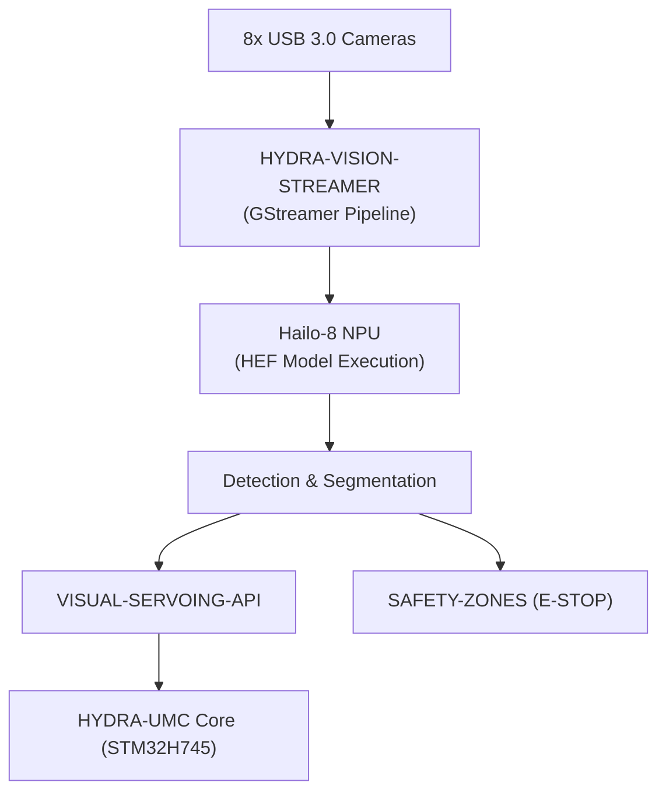

<p align="center">
  
</p>

# 👁️ HYDRA-UMC-VISION-NODE

<p align="center"><a href="README.md">🇺🇸 English</a> | <a href="README_spa.md">🇪🇸 Español</a> | <a href="README_fra.md">🇫🇷 Français</a> | <a href="README_ita.md">🇮🇹 Italiano</a> | <a href="README_deu.md">🇩🇪 Deutsch</a> | <a href="README_zho.md">🇨🇳 简体中文</a> | 🇯🇵 <b>日本語</b></p>

### 🧠 高速知覚エッジ AI ノード（Hailo-8 + Raspberry Pi CM5）

<p align="left">
  
  
  
  
  
</p>

---

## 1. 🛠️ 技術概要

**HYDRA-UMC-VISION-NODE** は、HYDRA-UMC エコシステムの専用知覚エンジンです。
Raspberry Pi Compute Module 5 に Hailo-8 M.2 AI アクセラレーターを組み合わせて
実行するよう設計されており、最大 8 台の USB 3.0 カメラからの大量のビデオ
ストリームを同時に処理することを目的としています。

システムの「反射神経」として機能し、中央オーケストレーターに過負荷をかける
ことなく、サブミリメートル単位の物体追跡、欠陥検査、リアルタイム安全監視を
行うことを意図しています。

本プロジェクトは Vision AI Node ファミリーの**統合親プロジェクト**です。
それ自体がすべての作業を行うのではなく、以下の 4 つの専門子プロジェクトが
接続される先のノードであり、それぞれが単一の責任を担います：

* **[HYDRA-UMC-VISION-STREAMER](https://github.com/JuanenRac/HYDRA-UMC-VISION-STREAMER)** — 本ノードが消費するカメラフィードをキャプチャし前処理します。
* **[HYDRA-UMC-DETECTION-HEF](https://github.com/JuanenRac/HYDRA-UMC-DETECTION-HEF)** — 本ノードがその Hailo-8 NPU にロードする `.hef` モデルをコンパイルしバージョン管理します。
* **[HYDRA-UMC-SAFETY-ZONES](https://github.com/JuanenRac/HYDRA-UMC-SAFETY-ZONES)** — 本ノードの知覚結果を侵入検知と E-STOP トリガーに変換します。
* **[HYDRA-UMC-VISUAL-SERVOING-API](https://github.com/JuanenRac/HYDRA-UMC-VISUAL-SERVOING-API)** — 本ノードの知覚結果を運動学的な姿勢補正に変換します。

### 要点

* 🧩 **ファミリーレディネスチェック（v0）：** 実際の `family-status` サブコマンドが 4 つの実際の子プロジェクトそれぞれの実際の `hydra-umc.project.json` を読み取り、存在/バージョン/成熟度/役割を報告します——自分自身はまだ Hailo-8 ランタイムもカメラパイプラインも動かしていない統合親プロジェクトとして正直な機能です。下記「正直な現状確認」を参照してください。
* 🩺 **パイプラインマニフェスト、フレーム検証、デグレードモード（v0）：** このノードの知覚パイプラインの形状(どのステージがカメラ、アクセラレータ、あるいはどちらも必要としないか)についての実際の、検査可能なマニフェスト、生のフレームバッファに対する実際の構造的破損チェック、そして実際のカメラ/Hailo-8 ハードウェアを正直に探索し、今どのステージが実際に実行可能かを正確に報告する実際のデグレードモード検出——新しい `pipeline-status` と `validate-frame` サブコマンド経由です。
* 🚀 **ハードウェアアクセラレーション（計画中）：** Hailo-8（26 TOPS）上での HEF モデルのネイティブ実行を目標に設計されています——これらのモデルをコンパイルするツールチェーンは別プロジェクト（[HYDRA-UMC-DETECTION-HEF](https://github.com/JuanenRac/HYDRA-UMC-DETECTION-HEF)）であり、本ノード自体が構築するものではありません。
* 📷 **マルチストリーム処理（計画中）：** [HYDRA-UMC-VISION-STREAMER](https://github.com/JuanenRac/HYDRA-UMC-VISION-STREAMER) が上流でキャプチャした、最大 8 台の高解像度カメラフィードを同時分析します。
* 🎯 **精密知覚（計画中）：** 産業用部品検出のために YOLO 系アーキテクチャを中心に設計されています。
* 🛡️ **アクティブセーフティ（計画中）：** リアルタイムの占有マッピングを [HYDRA-UMC-SAFETY-ZONES](https://github.com/JuanenRac/HYDRA-UMC-SAFETY-ZONES) に供給し、人の侵入を検知します。
* 🧩 **存在理由：** 専用ノードがなければ、知覚処理は [HYDRA-UMC](https://github.com/JuanenRac/HYDRA-UMC) 内部の STM32H745 リアルタイムコア（これに割く余剰サイクルはありません）を過負荷にするか、あるいはすべてのカメラフレームをリモート GPU へ送信せざるを得ず、安全ループが許容できない遅延を追加することになります。ロボット本体のすぐそばで CM5 + Hailo-8 上で実行することで、検知 → 補正 →（必要であれば）E-STOP のループをローカルかつ高速に保ちます。

**正直な現状確認 —— 今日実際に動くもの：** 引数なしの呼び出しは引き続き識別情報/バージョン/役割を表示しますが、今では実際の `family-status [--workspace パス]` サブコマンドもあります：ローカルチェックアウトから `HYDRA-UMC-VISION-STREAMER`/`HYDRA-UMC-DETECTION-HEF`/`HYDRA-UMC-SAFETY-ZONES`/`HYDRA-UMC-VISUAL-SERVOING-API` それぞれの実際のマニフェストを読み取り、見つけたものを正直に報告します。上記で説明した Hailo-8 ランタイム、
gRPC 制御 API、実際の子プロセス監督ロジックはいずれもまだ存在して
いません——それらは本プロジェクトが存在する理由であり、現在行っている
ことではありません。実際に出荷済みの内容は [`CHANGELOG.md`](CHANGELOG.md)
を、まだ残っている作業は下記の「現在の状況と次のステップ」セクションを
参照してください。

---

## 2. 🔄 目標システムフロー

下図は、本スケルトンが構築を目指している目標データフローです——これは
今日実行されているパイプラインではなく、アーキテクチャ上の決定事項を
記録したものです。



---

## 3. 🧠 高度な技術情報

### 本プロジェクトが統合親プロジェクトである理由（具体的に何を意味するか）

Vision AI Node ファミリーの 5 つのプロジェクトの中で、本プロジェクトだけが
以下を持っています：

* **`os/`** フォルダ —— CM5 ホスト向けの共有 HydraOS システムイメージ設定。4 つの子プロジェクトは、その 1 つの共有 OS イメージの*上に*プロセス/コンテナとして実行されます。それぞれが独自のコピーを持つ理由はありません。
* **`models/`** フォルダ —— Hailo-8 NPU に実際にロードされ実行される、コンパイル済みの `.hef` モデル。[HYDRA-UMC-DETECTION-HEF](https://github.com/JuanenRac/HYDRA-UMC-DETECTION-HEF) はこれらのモデルが*コンパイルされバージョン管理される*場所であり、本ノードは Hailo-8 デバイスハンドルを保持するプロセスであるため、*実際に配信され実行されているコピー*が存在する場所です。
* **`docker-compose.yml`** —— 下記参照。

5 つのプロジェクトのいずれも `hardware/` や `firmware/` フォルダを持って
いません。CM5 + Hailo-8 は市販のハードウェアであり、[HYDRA-UMC](https://github.com/JuanenRac/HYDRA-UMC) 内部のカスタム STM32H745/STM32G474 基板とは異なり、独自に設計する基板はありません。

### `docker-compose.yml`：文書化された統合マップであり、（まだ）動作するスタックではない

プロジェクトルートの `docker-compose.yml` は、本ノード自身のサービスと
4 つの子プロジェクトすべてを定義し、それぞれが必要とすると想定される
デバイス/ボリューム/ポート（Hailo-8 デバイスノード、カメラごとの V4L2
デバイス、HYDRA-UMC コアへの gRPC ポート）を結び付けています。各要素が
なぜそこにあるのかを説明する詳細なコメントが付いています。**今日の時点
では機能しません**——4 つの子プロジェクトはいずれもまだ `Dockerfile` を
提供していないため、`docker compose up` は失敗します。これはコードに
先行して存在しており、統合の形が一度だけ決定・文書化され、後で各子
プロジェクトがばらばらに即興で対応することのないようにするためです。

### 本スケルトンで既に行われた設計上の決定

* **バージョンはハードコードではなく、インストール済みパッケージのメタデータから読み取られます。** `main.py` はパッケージ内のどこかに 2 つ目の `__version__` 文字列を保持する代わりに `importlib.metadata.version("hydra-umc-vision-node")` を呼び出します。これにより、`bump_version.py` が編集すべき箇所は常に 1 か所（`pyproject.toml`）だけとなり、表示されるバージョンがそれと静かにずれることは決してありません。
* **オドメーター式のインクリメントは自動的に `PATCH`/`MINOR` にのみ触れます。** `bump_version.py` は実際のビルドごとに `PATCH` を増加させ、9 を超えると `MINOR` に繰り上がり、`MINOR` も 9 を超えると `MAJOR` に繰り上がりますが、`MAJOR` 自体を自動で増加させることは決してありません。`MAJOR` は意図的な、人間による意味的な決定（実際のアーキテクチャ上のマイルストーン）であり、ビルドスクリプトが自ら決めるべきことではありません。これはエコシステム全体で既に使われている慣例と同じです（`HYDRA-UMC-EDITOR-URDF/bump_version.py` と `HYDRA-UMC-SUITE/bump_version.py` を参照）。
* **計画中の制御 API には REST ではなく gRPC/Protobuf を採用**（上記のバッジ参照）——本ノードが位置する知覚 → 補正 → ファームウェアのループは遅延に敏感であり、同一 LAN 内の他の Python/組み込みサービスと通信するため、gRPC のバイナリフレーミングとストリーミングサポートが JSON-over-HTTP よりも適しているという理由で選択されました。まだ実装されていませんが、コードが実現する前に方向性を明確にするためここに記録しています。
* **`family-status` が手作業で管理するリストではなく、各子プロジェクト自身のマニフェストを読み取る理由。** `hydra-umc.project.json` は、エコシステム全体のダッシュボードとアップデーターがすでに信頼している唯一の真実の情報源です——ここに第 2 のリストを持つと、子プロジェクトの実際の成熟度が変わった瞬間、誰も更新を忘れずに済むとは限らず、すぐに食い違いが生じてしまいます。
* **兄弟プロジェクトのローカルチェックアウトが見つからない場合、実際の正直な「見つかりません」になる理由（クラッシュではなく）。** 統合親プロジェクトは、開発者が実際に 4 つの子プロジェクトすべてをローカルにチェックアウトしているかどうかを本当には知り得ません——`manifest.py` は実際に起こりうるあらゆる失敗（リポジトリなし、マニフェストなし、不正な JSON）に対して `None` を返すため、`family-status` は例外を発生させる代わりにそれを明確に報告します。
* **デグレードモード検出がプローブと純粋な決定関数に分かれている理由。** `hardware.py` の `camera_available()`/`accelerator_available()` は実際のハードウェア(Linux のデバイスノード)に触れる唯一の部分です——`determine_mode()`/`active_stages()` は単純な真偽値だけを受け取り、実際の決定ロジックを含みます。この分離があるからこそ、あらゆる実際のハードウェアの組み合わせ(フル、カメラなし、アクセラレータなし、ハードウェアなし)を、ファイルシステムをモックすることも、ロジックが正しいことを証明するために実際の CM5+Hailo-8 ハードウェアを必要とすることもなく、直接的かつ決定論的にテストできます。
* **フレーム検証が構造のみをチェックし、ピクセル内容をチェックしない理由。** 切り詰められた/サイズ超過のバッファ、あるいは疑わしいほど均一なバッファ(センサーの固着、空白のキャプチャ)を検出することは、参照画像もカメラも必要とせず正直にテストできる、実際の、有用な、ハードウェアに依存しない検証です。フレームの実際の内容がおかしく見えるかどうか(ブレ、露出、実際の映像品質指標)を判断することは、根本的に異なる、はるかに難しい問題であり、校正のために実際にキャプチャされたフレームを必要とします——この v0 では明示的にスコープ外です。

---

## 📂 リポジトリ構成

```text
HYDRA-UMC-VISION-NODE/
├── src/hydra_umc_vision_node/
│   ├── manifest.py       # 兄弟プロジェクト自身のマニフェストの実際の防御的リーダー
│   ├── family.py          # 4 つの実際の子プロジェクトに対する実際のファミリーレディネスチェック
│   ├── pipeline.py          # 実際の知覚パイプラインマニフェスト（ステージ + ハードウェア要件）
│   ├── frame.py                # 実際の、ハードウェアに依存しないフレーム破損検証
│   ├── hardware.py               # 実際のカメラ/アクセラレータ探索 + デグレードモードロジック
│   ├── api.py                      # シンプルなJSON/HTTPサーフェス(stdlibのhttp.server)。実際の3つのサブコマンドを橋渡し
│   └── main.py                     # エントリポイント + `family-status`/`pipeline-status`/`validate-frame`
├── tests/               # 実際のテスト：マニフェスト読み込み、ファミリーステータス、pipeline、frame、hardware、api、CLI
├── docs/                # ドキュメントと API リファレンス
├── os/                  # HydraOS システムイメージ設定（CM5）——親プロジェクト専用、デプロイ時に配置(gitには含まれない)
├── models/               # Hailo-8 NPU に配信されるコンパイル済み .hef モデル——親プロジェクト専用、デプロイ時に配置(gitには含まれない)
├── build/               # ビルド出力（ローカルの .venv もここに存在）
├── images/              # メディアと図表
├── systemd/
│   └── hydra-umc-vision-node.service # ローカルCM5知覚APIのsystemdユニット
├── tools/
│   ├── build_test.py    # バージョンを増やさないビルドチェック
│   └── ci_validate.py   # CI が使用するマニフェスト/CHANGELOG/ドキュメント検証
├── pyproject.toml       # パッケージメタデータ、依存関係、オドメーターバージョン
├── bump_version.py      # ネイティブバージョンのオドメーター式インクリメント（build.sh/.bat が実行）
├── bump_manifest_version.py # hydra-umc.project.json のバージョンをネイティブ版と同期(--sync)
├── build.sh / build.bat # venv + editable インストール（dev エクストラ付き） + コンパイルチェック + テスト
├── run.sh / run.bat     # ローカル venv からエントリポイントを実行（引数を転送）
├── docker-compose.yml   # Vision AI Node の 4 つの子プロジェクトの統合マップ（まだ機能しません）
└── CHANGELOG.md         # バージョンごとの履歴（オドメーター方式、日付なし）
```

`hardware/` と `firmware/` は本リポジトリには存在しません（理由は上記
「高度な技術情報」を参照）。`os/` と `models/` は 5 つのプロジェクトの
うち本プロジェクトにのみ存在します——4 つの子プロジェクトは独自のコピー
を持ちません。

---

## 🏗️ ビルドと実行

### 前提条件

* `PATH` 上に **Python 3.10 以降**があること（`python3`/`python` の両方を試すスクリプトで確認済み）。
* システムレベルの Hailo SDK、GStreamer、その他のネイティブ依存関係は現時点では不要です——**サードパーティのランタイム依存関係が一切ありません**（`pyproject.toml` の `dependencies = []`）。`pytest` は開発専用のエクストラであり、実際のテストスイートのためだけに使用されます。対応する実際のロジックが実装され次第、これらのランタイム依存関係は追加されます。
* ローカル仮想環境用の十分なディスク容量（この段階では `.venv/` 下に作成され、数十 MB 程度です）。

### ステップバイステップ —— 各コマンドが実際に行うこと

```bash
# Linux / macOS
./build.sh
```

1. **オドメーター式バージョンインクリメント** — `bump_version.py` を実行し、`pyproject.toml` 内の `PATCH` を増加させます（上記のオドメーター規則に従って `MINOR`/`MAJOR` に繰り上がります）。これは今から実行しようとしているこのビルドを含め、*毎回*のビルドで発生するため、バージョンが 1 つ上がることを想定してください。
2. **仮想環境** — `.venv/` がまだ存在しない場合は作成します（再実行しても安全です。既存の `.venv/` は再作成されず再利用されます）。
3. **Editable インストール（dev エクストラ付き）** — `pip install -e ".[dev]"` は本パッケージを「editable」モードで `.venv` にインストールするため、`src/` 下のソース変更は再インストールなしに即座に反映され、`pytest` がインストールされ、`run.sh` が使用する `hydra-umc-vision-node` コンソールエントリポイントが登録されます。
4. **コンパイルチェック** — `python -m compileall -q src` は `src/` 下のすべての `.py` ファイルをバイトコンパイルし、`main.py` から一度も実際にインポートされないファイルであっても、パッケージ全体にわたる構文エラーを検出します。
5. **実際のテストスイート** — `pytest tests/` が全 48 件のテストを実行します。

スクリプトは `set -euo pipefail` を使用し、最初に失敗したステップで停止
します。すべてのステップが成功した場合にのみ `== Build OK ==` を
表示します。

```bash
./run.sh
```

`.venv` 内の Python インタープリタを特定し（本リポジトリはクロス
プラットフォームで開発されているため、POSIX の `.venv/bin/python` と
Windows 形式の `.venv/Scripts/python.exe` の両方のレイアウトに対応）、
`python -m hydra_umc_vision_node.main` を実行し、あらゆる引数を転送します。

引数なしで呼び出すと名前 + バージョン + 役割を表示します：

```text
HYDRA-UMC-VISION-NODE v0.0.6
High-speed perception edge AI node (Hailo-8 + CM5) - integration parent of Vision-Streamer, Detection-HEF, Safety-Zones and Visual-Servoing-API.
```

実際の `family-status` サブコマンドは、実際のローカルチェックアウトを
確認します：

```bash
./run.sh family-status
./run.sh family-status --workspace /path/to/some/other/checkout

# Windows
run.bat family-status
```

デフォルトでは、本リポジトリ自身の親ディレクトリを使用します——これは
このエコシステムの実際のチェックアウトがすでに使用しているのと同じ
レイアウトです。実際の子プロジェクトが 1 つでも見つからない場合は `1`
で終了します。

実際の `pipeline-status` サブコマンドは実際のハードウェアを探索し、実際の、
正直な結果を報告します：

```bash
./run.sh pipeline-status
```
```json
{
  "manifest": { "version": "0.1.0", "stages": [ "..." ] },
  "camera_present": false,
  "accelerator_present": false,
  "mode": "degraded_no_hardware",
  "runnable_stages": ["preprocess", "postprocess", "publish"],
  "skipped_stages": ["capture", "inference"]
}
```

この開発マシン(CM5 も Hailo-8 もカメラもない)では、これが実際の、正直な
答えです——終了コード `1`(`full` モード以外すべて)。実際の `validate-frame`
サブコマンドは、ディスク上の生のフレームバッファファイルの構造的破損を
チェックします：

```bash
./run.sh validate-frame path/to/frame.raw --width 1920 --height 1080
# Frame OK: path/to/frame.raw matches 1920x1080x3 (6220800 bytes)

./run.sh validate-frame path/to/truncated.raw --width 1920 --height 1080
# Frame INVALID: path/to/truncated.raw
#   [size_mismatch] frame buffer is ... bytes, expected 6220800 bytes ... - likely truncated or corrupt
```

```bat
:: Windows - 手順は同じ、バッチ構文
build.bat
run.bat
```

### トラブルシューティング

* **`python`/`python3` が見つからない** — Python 3.10+ をインストールし `PATH` に含まれていることを確認してください。両スクリプトとも先に `python3` を試し、次に `python` にフォールバックします。
* **`compileall` が失敗する** — `src/` 下に実際の構文エラーが導入されたことを意味します。ビルドスクリプトは意図的に非ゼロで終了し、インストールの作成/更新は行いません。壊れたパッケージが「ビルド成功」のまま放置されることは決してありません。
* **`run.sh`/`run.bat` が「`.venv` が見つかりません」と表示する** — 先に少なくとも 1 回 `build.sh`/`build.bat` を実行する必要があります。`run.sh`/`run.bat` 自体が環境を作成することはなく、ビルドのみが作成します。
* **変更を取り込んだ後、editable インストールが古いままになる** — `.venv/` を削除して `build.sh`/`build.bat` を再実行してください。`pip install -e .` は通常、再インストールなしにソースの変更を認識するため、これが必要になることはまれです。

---

## 🚀 現在の状況と次のステップ

**今日実現していること：** 実際のファミリーレディネスチェック（`manifest.py`/`family.py`）——4 つの実際の子プロジェクトそれぞれのマニフェストを読み取り、存在/バージョン/成熟度/役割を報告します——、実際のパイプラインマニフェストと実際のデグレードモード検出（`pipeline.py`/`hardware.py`）——実際のカメラ/Hailo-8 ハードウェアを正直に探索し、どのパイプラインステージが実行可能かを正確に報告します——、実際の、ハードウェアに依存しないフレーム破損検証（`frame.py`）、`family-status`/`pipeline-status`/`validate-frame` の各 CLI サブコマンド、通過した 48 件のテスト、そして `docker-compose.yml` における 4 つの
子プロジェクトの完全な（ただしまだ機能しない）統合マップの文書化——実際の完全なビルド/実行出力は [`CHANGELOG.md`](CHANGELOG.md) を参照してください。

**まだ残っている作業（順不同、確定した期限なし）：**

* 実際の Hailo-8 ランタイム初期化と推論ループ。
* HYDRA-UMC コアへの gRPC 制御 API。
* 4 つの子サービスの実際の監督（現在の `family-status` は存在/成熟度のみを確認し、ランタイムの健全性は確認しません。`docker-compose.yml` は意図された形を文書化しているだけです）。
* [HYDRA-UMC-VISION-STREAMER](https://github.com/JuanenRac/HYDRA-UMC-VISION-STREAMER) が実際のキャプチャパイプラインを持ち次第、マルチカメラパイプラインの同期。
* `docker-compose.yml` を実際に実行可能なスタックに変換すること。これは 4 つの子プロジェクトがそれぞれ独自の `Dockerfile` を先に提供することに依存します。

---

## 🔗 関連プロジェクト

本プロジェクトは、同一著者（JuanenRac / Electro Hobby 3D）による、
ファームウェア、制御ソフトウェア、AI ノード、フリート管理ツールにまたがる、
より大きなロボティクスエコシステムの一部です。ご要望が実際にはこれらの
プロジェクトのいずれかに関するものであり、本リポジトリのものではない
可能性もあるため、知っておく価値があります。

### プロジェクトファミリー

**親プロジェクト：** なし —— 本プロジェクト自体が Vision AI Node ファミリーの統合親プロジェクトです。

**子プロジェクト：**
- **[HYDRA-UMC-VISION-STREAMER](https://github.com/JuanenRac/HYDRA-UMC-VISION-STREAMER)** — 本ノードが消費するカメラフィードをキャプチャし前処理します。
- **[HYDRA-UMC-DETECTION-HEF](https://github.com/JuanenRac/HYDRA-UMC-DETECTION-HEF)** — 本ノードがその Hailo-8 NPU にロードする `.hef` モデルをコンパイルしバージョン管理します。
- **[HYDRA-UMC-SAFETY-ZONES](https://github.com/JuanenRac/HYDRA-UMC-SAFETY-ZONES)** — 本ノードの知覚結果を侵入検知と E-STOP トリガーに変換します。
- **[HYDRA-UMC-VISUAL-SERVOING-API](https://github.com/JuanenRac/HYDRA-UMC-VISUAL-SERVOING-API)** — 本ノードの知覚結果を運動学的な姿勢補正に変換します。

### 直接関連（ファミリー外）

- **[HYDRA-UMC](https://github.com/JuanenRac/HYDRA-UMC)** — 本ファームウェアの上で知覚/E-STOP ループを閉じます。
- **[HYDRA-UMC-COGNITIVE-NODE](https://github.com/JuanenRac/HYDRA-UMC-COGNITIVE-NODE)** — 本知覚能力の上に構築されるセマンティック層。

### エコシステムのその他のプロジェクト

**HYDRA-UMC プラットフォーム** — マルチロボット・マイクロファクトリーセル
- **[HYDRA-UMC-SERVER](https://github.com/JuanenRac/HYDRA-UMC-SERVER)** — すべての制御クライアントが接続する Express/WebSocket バックエンド。
- **[HYDRA-UMC-STUDIO](https://github.com/JuanenRac/HYDRA-UMC-STUDIO)** — Web ベースの制御ダッシュボード、マルチロボット 3D 可視化。
- **[HYDRA-UMC-ANDROID-CONTROL](https://github.com/JuanenRac/HYDRA-UMC-ANDROID-CONTROL)** — Wi-Fi/Bluetooth 経由の Android 制御アプリ。
- **[HYDRA-UMC-IOS-CONTROL](https://github.com/JuanenRac/HYDRA-UMC-IOS-CONTROL)** — Flutter で構築された iOS/iPadOS 制御アプリ。
- **[HYDRA-UMC-SUITE](https://github.com/JuanenRac/HYDRA-UMC-SUITE)** — デスクトップ版群制御コマンドセンター（Python/PySide6）。
- **[HYDRA-UMC-EDITOR-URDF](https://github.com/JuanenRac/HYDRA-UMC-EDITOR-URDF)** — ロボットカタログ向けのデスクトップ版 URDF モデルエディター。
- **[HYDRA-UMC-DSI](https://github.com/JuanenRac/HYDRA-UMC-DSI)** — 機載 DSI タッチスクリーン用のネイティブタッチ UI。

**URTC プラットフォーム** — すべての HYDRA-UMC ロボットアームが搭載するツールヘッドコントローラー
- **[URTC](https://github.com/JuanenRac/URTC)** — CAN バスツールヘッドコントローラー、25 種類のツールプロファイル。
- **[URTC-FLASHER](https://github.com/JuanenRac/URTC-FLASHER)** — デスクトップ版 CAN-OTA + SWD/JTAG フラッシュツール。
- **[URTC-TESTER](https://github.com/JuanenRac/URTC-TESTER)** — デスクトップ版ライブ CAN バス診断ツール。
- **[URTC-WEB-STUDIO](https://github.com/JuanenRac/URTC-WEB-STUDIO)** — Web Serial API によるブラウザベースの代替版。

**🧠 認知 AI ノード（Hailo-10）**
- [HYDRA-UMC-VLA-ENGINE](https://github.com/JuanenRac/HYDRA-UMC-VLA-ENGINE)
- [HYDRA-UMC-VOICE-UI](https://github.com/JuanenRac/HYDRA-UMC-VOICE-UI)
- [HYDRA-UMC-SEMANTIC-PLANNER](https://github.com/JuanenRac/HYDRA-UMC-SEMANTIC-PLANNER)
- [HYDRA-UMC-DOCS-QA](https://github.com/JuanenRac/HYDRA-UMC-DOCS-QA)

**🐝 オーケストレーションと群制御**
- [HYDRA-UMC-ORCHESTRATOR](https://github.com/JuanenRac/HYDRA-UMC-ORCHESTRATOR)
- [HYDRA-UMC-SWARM-SYNC](https://github.com/JuanenRac/HYDRA-UMC-SWARM-SYNC)
- [HYDRA-UMC-PATH-PLANNER-3D](https://github.com/JuanenRac/HYDRA-UMC-PATH-PLANNER-3D)
- [HYDRA-UMC-JOB-DISPATCHER](https://github.com/JuanenRac/HYDRA-UMC-JOB-DISPATCHER)
- [HYDRA-UMC-NODE-HEALING](https://github.com/JuanenRac/HYDRA-UMC-NODE-HEALING)

**🎮 デジタルツインとシミュレーション**
- [HYDRA-UMC-TWIN](https://github.com/JuanenRac/HYDRA-UMC-TWIN)
- [HYDRA-UMC-PHYSICS-REPLICA](https://github.com/JuanenRac/HYDRA-UMC-PHYSICS-REPLICA)
- [HYDRA-UMC-HIL-BRIDGE](https://github.com/JuanenRac/HYDRA-UMC-HIL-BRIDGE)
- [HYDRA-UMC-SYNTHETIC-DATA-GEN](https://github.com/JuanenRac/HYDRA-UMC-SYNTHETIC-DATA-GEN)

**📊 データと分析**
- [HYDRA-UMC-DATALAKE](https://github.com/JuanenRac/HYDRA-UMC-DATALAKE)
- [HYDRA-UMC-TELEMETRY-COLLECTOR](https://github.com/JuanenRac/HYDRA-UMC-TELEMETRY-COLLECTOR)
- [HYDRA-UMC-ANOMALY-DETECTOR](https://github.com/JuanenRac/HYDRA-UMC-ANOMALY-DETECTOR)
- [HYDRA-UMC-PRODUCTION-REPORTS](https://github.com/JuanenRac/HYDRA-UMC-PRODUCTION-REPORTS)

**🏭 産業用ゲートウェイ**
- [HYDRA-UMC-GATEWAY-INDUSTRIAL](https://github.com/JuanenRac/HYDRA-UMC-GATEWAY-INDUSTRIAL)
- [HYDRA-UMC-OPCUA-SERVER](https://github.com/JuanenRac/HYDRA-UMC-OPCUA-SERVER)
- [HYDRA-UMC-MQTT-BROKER](https://github.com/JuanenRac/HYDRA-UMC-MQTT-BROKER)
- [HYDRA-UMC-MTCONNECT-ADAPTER](https://github.com/JuanenRac/HYDRA-UMC-MTCONNECT-ADAPTER)

**🛠️ 補完ツール**
- [URTC-SMART-RACK](https://github.com/JuanenRac/URTC-SMART-RACK)
- [URTC-VISION-TOOL](https://github.com/JuanenRac/URTC-VISION-TOOL)
- [HYDRA-UMC-WATCH](https://github.com/JuanenRac/HYDRA-UMC-WATCH)
- [HYDRA-UMC-TOOL-CLI](https://github.com/JuanenRac/HYDRA-UMC-TOOL-CLI)
- [HYDRA-UMC-DASHBOARD-AI](https://github.com/JuanenRac/HYDRA-UMC-DASHBOARD-AI)

---

## 👤 作者
**JuanenRac** (Electro Hobby 3D)
📧 electrohobby3d@gmail.com
📺 [youtube.com/@electrohobby3d](https://youtube.com/@electrohobby3d)

## 📜 ライセンス
GPL-3.0 —— 詳細は LICENSE を参照してください。
