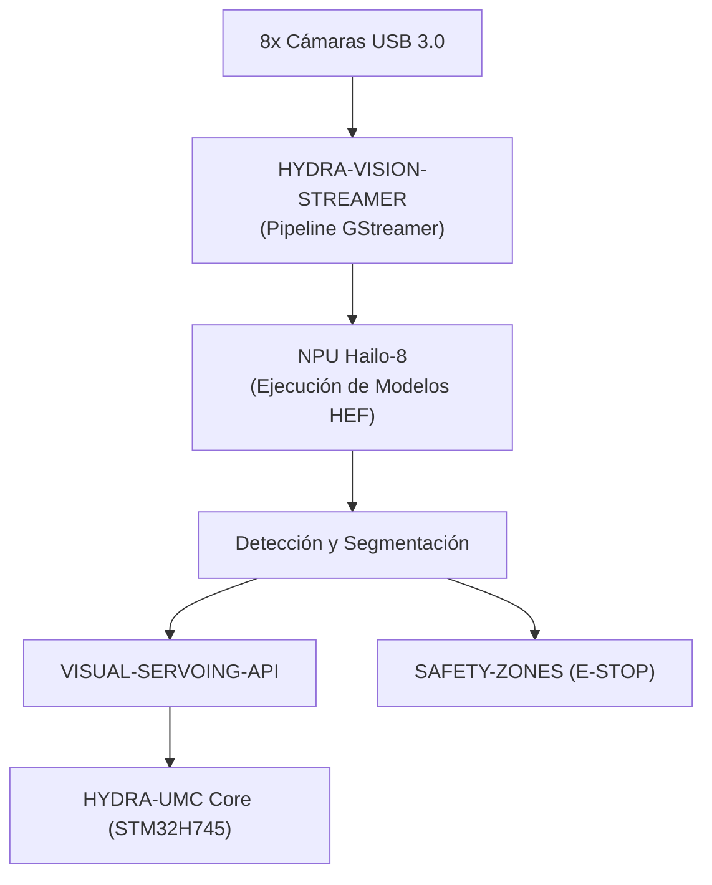

<p align="center">
  
</p>

# 👁️ HYDRA-UMC-VISION-NODE

<p align="center"><a href="README.md">🇺🇸 English</a> | 🇪🇸 <b>Español</b> | <a href="README_fra.md">🇫🇷 Français</a> | <a href="README_ita.md">🇮🇹 Italiano</a> | <a href="README_deu.md">🇩🇪 Deutsch</a> | <a href="README_zho.md">🇨🇳 简体中文</a> | <a href="README_jpn.md">🇯🇵 日本語</a></p>

### 🧠 Nodo de IA de Borde para Percepción de Alta Velocidad (Hailo-8 + Raspberry Pi CM5)

<p align="left">
  
  
  
  
  
</p>

---

## 1. 🛠️ VISIÓN GENERAL TÉCNICA

**HYDRA-UMC-VISION-NODE** es el motor de percepción dedicado del ecosistema HYDRA-UMC. Diseñado para ejecutarse en el Raspberry Pi Compute Module 5 junto con un acelerador de IA Hailo-8 M.2, su función prevista es gestionar flujos masivos de video de hasta 8 cámaras USB 3.0 simultáneamente.

Está pensado para actuar como los "reflejos" del sistema: seguimiento de objetos sub-milimétrico, inspección de defectos y monitorización de seguridad en tiempo real, sin sobrecargar al orquestador central.

Este proyecto es el **padre de integración** de la familia Vision AI Node: no hace todo ese trabajo él mismo, es el nodo en el que se conectan los 4 hijos especializados de abajo, cada uno con una responsabilidad única:

* **[HYDRA-UMC-VISION-STREAMER](https://github.com/JuanenRac/HYDRA-UMC-VISION-STREAMER)** — captura y pre-procesa los flujos de cámara que consume este nodo.
* **[HYDRA-UMC-DETECTION-HEF](https://github.com/JuanenRac/HYDRA-UMC-DETECTION-HEF)** — compila y versiona los modelos `.hef` que este nodo carga en su NPU Hailo-8.
* **[HYDRA-UMC-SAFETY-ZONES](https://github.com/JuanenRac/HYDRA-UMC-SAFETY-ZONES)** — convierte la percepción de este nodo en detección de intrusión y disparo de E-STOP.
* **[HYDRA-UMC-VISUAL-SERVOING-API](https://github.com/JuanenRac/HYDRA-UMC-VISUAL-SERVOING-API)** — convierte la percepción de este nodo en correcciones cinemáticas de pose.

### Puntos Clave

* 🧩 **Chequeo de Disponibilidad de Familia (v0):** el subcomando real `family-status` lee el propio `hydra-umc.project.json` de cada uno de los 4 hijos reales y reporta presencia/versión/madurez/rol - honesto para un padre de integración que todavía no ejecuta ningún runtime Hailo-8 ni pipeline de cámara por sí mismo. Ver "Comprobación de honestidad" abajo.
* 🩺 **Manifiesto de Pipeline, Validación de Frames y Modo Degradado (v0):** un manifiesto real e inspeccionable de la forma del pipeline de percepción de este nodo (qué etapas necesitan cámara, acelerador, o ninguno de los dos), validación real y estructural de corrupción de un buffer de frame crudo, y detección real de modo degradado que sondea honestamente hardware real de cámara/Hailo-8 y reporta exactamente qué etapas pueden correr ahora mismo - via los nuevos subcomandos `pipeline-status` y `validate-frame`.
* 🚀 **Aceleración por Hardware (previsto):** el diseño apunta a ejecución nativa de modelos HEF en Hailo-8 (26 TOPS) - el toolchain que compila esos modelos es un proyecto aparte ([HYDRA-UMC-DETECTION-HEF](https://github.com/JuanenRac/HYDRA-UMC-DETECTION-HEF)), no algo que construya este nodo.
* 📷 **Procesamiento Multi-flujo (previsto):** análisis simultáneo de hasta 8 fuentes de cámara de alta resolución, capturadas aguas arriba por [HYDRA-UMC-VISION-STREAMER](https://github.com/JuanenRac/HYDRA-UMC-VISION-STREAMER).
* 🎯 **Percepción de Precisión (previsto):** diseñado en torno a arquitecturas de la familia YOLO para detección de componentes industriales.
* 🛡️ **Seguridad Activa (previsto):** mapeo de ocupación en tiempo real que alimenta a [HYDRA-UMC-SAFETY-ZONES](https://github.com/JuanenRac/HYDRA-UMC-SAFETY-ZONES) para detección de intrusiones humanas.
* 🧩 **Por qué existe:** sin un nodo dedicado, el trabajo de percepción sobrecargaría el núcleo de tiempo real STM32H745 dentro de [HYDRA-UMC](https://github.com/JuanenRac/HYDRA-UMC) (que no tiene ciclos libres para ello), o forzaría a enviar cada fotograma por cable a una GPU remota, añadiendo una latencia que el bucle de seguridad no puede permitirse. Ejecutarlo en CM5 + Hailo-8, físicamente junto al robot, mantiene el bucle detectar → corregir → (si hace falta) E-STOP local y rápido.

**Comprobación de honestidad - qué funciona hoy de verdad:** la invocación sin argumentos sigue imprimiendo identidad/versión/rol, pero ahora existe un subcomando real `family-status [--workspace RUTA]`: lee los manifiestos reales propios de `HYDRA-UMC-VISION-STREAMER`/`HYDRA-UMC-DETECTION-HEF`/`HYDRA-UMC-SAFETY-ZONES`/`HYDRA-UMC-VISUAL-SERVOING-API` desde un checkout local y reporta con honestidad lo que encuentra. Nada del runtime Hailo-8, la API gRPC de control ni la supervisión real de hijos existe todavía - son la razón de ser de este proyecto, no algo que haga hoy. Ver [`CHANGELOG.md`](CHANGELOG.md) para lo que se ha entregado exactamente hasta ahora, y la sección "Estado Actual y Próximos Pasos" más abajo para lo que sigue abierto.

---

## 2. 🔄 FLUJO DE SISTEMA PREVISTO

El diagrama de abajo es el flujo de datos objetivo hacia el que se construye este esqueleto - documenta la decisión de arquitectura, no un pipeline que funcione hoy.



---

## 3. 🧠 INFORMACIÓN TÉCNICA AVANZADA

### Por qué este proyecto es el padre de integración (y qué significa en la práctica)

De los 5 proyectos de la familia Vision AI Node, este es el único que:

* Lleva una carpeta **`os/`** — la configuración de la imagen de sistema HydraOS compartida para el host CM5. Los 4 hijos corren como procesos/contenedores *sobre* esa única imagen de sistema compartida; no hay razón para que cada uno lleve su propia copia.
* Lleva una carpeta **`models/`** — los modelos `.hef` compilados realmente cargados en la NPU Hailo-8 en tiempo de ejecución. [HYDRA-UMC-DETECTION-HEF](https://github.com/JuanenRac/HYDRA-UMC-DETECTION-HEF) es donde esos modelos se *compilan y versionan*; este nodo es donde vive la *copia servida en ejecución*, porque es el proceso dueño del handle del dispositivo Hailo-8.
* Lleva **`docker-compose.yml`** — ver abajo.

Ninguno de los 5 proyectos lleva carpeta `hardware/` ni `firmware/`: CM5 + Hailo-8 es hardware ya existente sin placa propia que diseñar, a diferencia (por ejemplo) de las placas STM32H745/STM32G474 a medida dentro de [HYDRA-UMC](https://github.com/JuanenRac/HYDRA-UMC).

### `docker-compose.yml`: un mapa de integración documentado, todavía no un stack funcional

`docker-compose.yml` en la raíz del proyecto define el propio servicio de este nodo más los 4 hijos, conectados con los devices/volumes/ports que se espera que cada uno necesite (el nodo de dispositivo Hailo-8, los devices V4L2 por cámara, los puertos gRPC hacia el core HYDRA-UMC). Está muy comentado explicando *por qué* está cada pieza. **No es funcional hoy** - ninguno de los 4 hijos tiene todavía `Dockerfile` propio, así que `docker compose up` fallaría. Existe ya, antes que ese código, para que la forma de la integración quede decidida y documentada una sola vez en vez de improvisada por separado por cada hijo más adelante.

### Decisiones de diseño ya tomadas en este esqueleto

* **La versión se lee de los metadatos del paquete instalado, no está fija en el código.** `main.py` llama a `importlib.metadata.version("hydra-umc-vision-node")` en vez de mantener una segunda cadena `__version__` en algún lugar del paquete. Esto significa que `bump_version.py` solo tiene un lugar que editar (`pyproject.toml`), y la versión impresa nunca puede desincronizarse silenciosamente de ella.
* **El bump cuentakilómetros solo toca `PATCH`/`MINOR` automáticamente.** `bump_version.py` incrementa `PATCH` en cada build real, con acarreo a `MINOR` al pasar de 9, y de `MINOR` a `MAJOR` al pasar de 9 - pero nunca incrementa `MAJOR` por sí mismo. `MAJOR` es una decisión humana y semántica deliberada (un hito real de arquitectura), no algo que un script de build deba decidir solo. Es la misma convención ya usada en el resto del ecosistema (ver `HYDRA-UMC-EDITOR-URDF/bump_version.py` y `HYDRA-UMC-SUITE/bump_version.py`).
* **gRPC/Protobuf, no REST, para la API de control prevista** (ver badge arriba) - elegido porque el bucle percepción → corrección → firmware en el que vive este nodo es sensible a la latencia y habla con otros servicios Python/embebidos dentro de la misma LAN, donde el framing binario y el soporte de streaming de gRPC encajan mejor que JSON sobre HTTP. Todavía no implementado; documentado aquí para que la dirección quede clara antes de que llegue el código.
* **`family-status` lee el manifiesto propio de cada hijo en vez de una lista mantenida a mano.** `hydra-umc.project.json` ya es la única fuente de verdad en la que confían el dashboard/updater del ecosistema - una segunda lista aquí se desincronizaría en cuanto la madurez real de un hijo cambiara y nadie recordara actualizarla.
* **Un checkout hermano ausente es un "no encontrado" real y honesto, en vez de un crash.** Un padre de integración genuinamente no puede saber si un desarrollador tiene los 4 hijos clonados localmente - `manifest.py` devuelve `None` ante cualquier fallo real (repo ausente, fichero ausente, JSON malformado) para que `family-status` pueda reportarlo con claridad en vez de lanzar una excepción.
* **Por qué la detección de modo degradado se divide en un sondeo y una función de decisión pura.** `camera_available()`/`accelerator_available()` de `hardware.py` son las únicas partes que tocan hardware real (un device node de Linux); `determine_mode()`/`active_stages()` reciben booleanos planos y contienen la lógica de decisión real. Esa división es lo que permite probar cada combinación real de hardware (completo, sin cámara, sin acelerador, sin hardware) de forma directa y determinista, sin mockear un sistema de archivos ni necesitar hardware CM5+Hailo-8 real para probar que la lógica es correcta.
* **Por qué la validación de frames solo revisa estructura, no contenido de píxeles.** Detectar un buffer truncado/sobredimensionado o uno sospechosamente uniforme (un sensor congelado, una captura en blanco) es validación real, útil e independiente de hardware que no necesita ninguna imagen de referencia ni cámara para probarse con honestidad. Decidir si el CONTENIDO real de un frame se ve mal (desenfoque, exposición, una métrica real de calidad de visión) es un problema fundamentalmente distinto y mucho más difícil que necesitaría frames reales capturados para calibrarse - explícitamente fuera de alcance para esta v0.

---

## 📂 ESTRUCTURA DE DIRECTORIOS

```text
HYDRA-UMC-VISION-NODE/
├── src/hydra_umc_vision_node/
│   ├── manifest.py       # Lector real y defensivo del manifiesto propio de un hermano
│   ├── family.py          # Chequeo real de disponibilidad de familia sobre los 4 hijos reales
│   ├── pipeline.py          # Manifiesto real del pipeline de percepción (etapas + necesidades de hardware)
│   ├── frame.py                # Validación real de corrupción de frames, independiente de hardware
│   ├── hardware.py               # Sondeos reales de cámara/acelerador + lógica de modo degradado
│   ├── api.py                      # Superficie JSON/HTTP plana (http.server de stdlib) sobre los 3 subcomandos reales
│   └── main.py                     # Entry point + `family-status`/`pipeline-status`/`validate-frame`
├── tests/               # Tests reales: manifiesto, family status, pipeline, frame, hardware, api, CLI
├── docs/                # Documentación y referencia de API
├── os/                  # Configuración de la imagen HydraOS (CM5) - solo aquí, se puebla al desplegar (no está en git)
├── models/              # Modelos .hef compilados servidos a la NPU Hailo-8 - solo aquí, se puebla al desplegar (no está en git)
├── build/               # Salida de build (aquí vive también el .venv local)
├── images/              # Medios y diagramas
├── systemd/
│   └── hydra-umc-vision-node.service # Unidad systemd de la API local de percepción en la CM5
├── tools/
│   ├── build_test.py    # Comprobación de compilación sin versionado
│   └── ci_validate.py   # Validación de manifiesto/CHANGELOG/docs usada por CI
├── pyproject.toml       # Metadatos del paquete, dependencias, versión cuentakilómetros
├── bump_version.py      # Bump de versión nativa tipo cuentakilómetros (build.sh/.bat)
├── bump_manifest_version.py # Sincroniza la versión de hydra-umc.project.json con la nativa (--sync)
├── build.sh / build.bat # venv + instalación editable (extras dev) + compile-check + tests
├── run.sh / run.bat     # Ejecuta el entry point desde el venv local (reenvía argumentos)
├── docker-compose.yml   # Mapa de integración de los 4 hijos (todavía no funcional)
└── CHANGELOG.md         # Historial versión a versión (esquema cuentakilómetros, sin fechas)
```

`hardware/` y `firmware/` no existen en este repositorio (ver "Información Técnica Avanzada" arriba para el porqué). `os/` y `models/` existen solo en este proyecto de los 5 - los 4 hijos no llevan copia propia.

---

## 🏗️ BUILD Y RUN

### Requisitos previos

* **Python 3.10 o superior** en el `PATH` (se comprueba vía `python3`/`python` - los scripts prueban ambos).
* No hace falta ningún SDK de Hailo a nivel de sistema, GStreamer ni otra dependencia nativa todavía - **cero dependencias de terceros en tiempo de ejecución** (`dependencies = []` en `pyproject.toml`); `pytest` es un extra solo de desarrollo usado exclusivamente para la suite de tests real. Se irán añadiendo a medida que llegue la lógica real correspondiente.
* Espacio en disco suficiente para un entorno virtual local (creado en `.venv/`, unas pocas decenas de MB en esta etapa).

### Paso a paso - qué hace cada comando de verdad

```bash
# Linux / macOS
./build.sh
```

1. **Bump de versión cuentakilómetros** — ejecuta `bump_version.py`, que incrementa `PATCH` en `pyproject.toml` (con acarreo a `MINOR`/`MAJOR` según la regla de arriba). Esto ocurre en *cada* build, incluido este que estás a punto de ejecutar, así que la versión subirá en 1.
2. **Entorno virtual** — crea `.venv/` si no existe ya (seguro re-ejecutar; un `.venv/` existente se reutiliza, no se recrea).
3. **Instalación editable (con extras dev)** — `pip install -e ".[dev]"` instala este paquete en `.venv` en modo "editable", así que los cambios de código bajo `src/` tienen efecto inmediato sin reinstalar, instala `pytest`, y registra el entry point de consola `hydra-umc-vision-node` que usa `run.sh`.
4. **Compile-check** — `python -m compileall -q src` compila a bytecode cada archivo `.py` bajo `src/`, detectando errores de sintaxis en todo el paquete incluso en archivos que `main.py` nunca importa realmente.
5. **Suite de tests real** — `pytest tests/` ejecuta los 48 tests.

El script usa `set -euo pipefail` y se detiene en el primer paso que falle, imprimiendo `== Build OK ==` solo si todos los pasos tuvieron éxito.

```bash
./run.sh
```

Localiza el intérprete de Python dentro de `.venv` (soporta tanto el layout POSIX `.venv/bin/python` como el de Windows `.venv/Scripts/python.exe`, porque este repo se desarrolla multiplataforma) y ejecuta `python -m hydra_umc_vision_node.main`, reenviando cualquier argumento.

La invocación sin argumentos imprime nombre + versión + rol:

```text
HYDRA-UMC-VISION-NODE v0.0.6
High-speed perception edge AI node (Hailo-8 + CM5) - integration parent of Vision-Streamer, Detection-HEF, Safety-Zones and Visual-Servoing-API.
```

El subcomando real `family-status` comprueba el checkout local real:

```bash
./run.sh family-status
./run.sh family-status --workspace /ruta/a/otro/checkout

# Windows
run.bat family-status
```

Por defecto usa el propio directorio padre de este repositorio - la disposición real de checkout-hermano que ya usa este ecosistema. Sale con `1` si falta algún hijo real.

El subcomando real `pipeline-status` sondea hardware real y reporta el resultado real y honesto:

```bash
./run.sh pipeline-status
```
```json
{
  "manifest": { "version": "0.1.0", "stages": [ "..." ] },
  "camera_present": false,
  "accelerator_present": false,
  "mode": "degraded_no_hardware",
  "runnable_stages": ["preprocess", "postprocess", "publish"],
  "skipped_stages": ["capture", "inference"]
}
```

En esta máquina de desarrollo (sin CM5, sin Hailo-8, sin cámara) esa es la respuesta real y honesta - código de salida `1` (cualquier cosa distinta de modo `full`). El subcomando real `validate-frame` revisa un archivo de buffer de frame crudo en busca de corrupción estructural:

```bash
./run.sh validate-frame ruta/al/frame.raw --width 1920 --height 1080
# Frame OK: ruta/al/frame.raw matches 1920x1080x3 (6220800 bytes)

./run.sh validate-frame ruta/al/truncado.raw --width 1920 --height 1080
# Frame INVALID: ruta/al/truncado.raw
#   [size_mismatch] frame buffer is ... bytes, expected 6220800 bytes ... - likely truncated or corrupt
```

```bat
:: Windows - mismos pasos, sintaxis batch
build.bat
run.bat
```

### Solución de problemas

* **No se encuentra `python`/`python3`** — instala Python 3.10+ y asegúrate de que está en el `PATH`; ambos scripts prueban `python3` primero, con `python` como respaldo.
* **`compileall` falla** — significa que se introdujo un error de sintaxis real bajo `src/`; el script de build sale con código distinto de cero sin crear/actualizar la instalación, a propósito, para que nunca quede un paquete roto marcado como "build correcto".
* **`run.sh`/`run.bat` dice "No `.venv` found"** — hay que ejecutar `build.sh`/`build.bat` al menos una vez antes; `run.sh`/`run.bat` nunca crea el entorno por sí mismo, solo los builds lo hacen.
* **Instalación editable desactualizada tras hacer pull de cambios** — borra `.venv/` y vuelve a ejecutar `build.sh`/`build.bat`; rara vez hace falta, ya que `pip install -e .` normalmente recoge los cambios de código sin reinstalar.

---

## 🚀 Estado Actual y Próximos Pasos

**Qué funciona hoy:** un chequeo real de disponibilidad de familia (`manifest.py`/`family.py`) que lee el manifiesto propio de cada uno de los 4 hijos reales y reporta presencia/versión/madurez/rol, un manifiesto real de pipeline y detección real de modo degradado (`pipeline.py`/`hardware.py`) que sondea honestamente hardware real de cámara/Hailo-8 y reporta exactamente qué etapas del pipeline pueden correr, validación real de corrupción de frames independiente de hardware (`frame.py`), los subcomandos CLI `family-status`/`pipeline-status`/`validate-frame`, 48 tests pasando, y un mapa de integración completamente documentado (pero todavía no funcional) para los 4 hijos en `docker-compose.yml` - ver [`CHANGELOG.md`](CHANGELOG.md) para la salida completa real de build/run.

**Qué sigue abierto, sin orden particular y sin calendario comprometido:**

* La inicialización real del runtime Hailo-8 y el bucle de inferencia.
* La API gRPC de control hacia el core HYDRA-UMC.
* Supervisión real de los 4 servicios hijos (hoy `family-status` solo comprueba presencia/madurez, no salud en tiempo de ejecución; `docker-compose.yml` solo documenta la forma prevista).
* Sincronización del pipeline multi-cámara una vez que [HYDRA-UMC-VISION-STREAMER](https://github.com/JuanenRac/HYDRA-UMC-VISION-STREAMER) tenga un pipeline de captura real con el que sincronizar.
* Convertir `docker-compose.yml` en un stack realmente ejecutable, lo cual depende de que cada uno de los 4 hijos publique primero su propio `Dockerfile`.

---

## 🔗 Proyectos Relacionados

Este proyecto forma parte de un ecosistema de robótica más amplio del mismo autor (JuanenRac / Electro Hobby 3D), que abarca firmware, software de control, nodos de IA y herramientas de flota. Vale la pena conocerlo, ya que una petición podría en realidad ser sobre uno de estos proyectos en vez de sobre este repositorio.

### Familia

**Padre:** ninguno — este proyecto es él mismo el padre de integración de la familia Vision AI Node.

**Hijos:**
- **[HYDRA-UMC-VISION-STREAMER](https://github.com/JuanenRac/HYDRA-UMC-VISION-STREAMER)** — captura y pre-procesa los flujos de cámara que consume este nodo.
- **[HYDRA-UMC-DETECTION-HEF](https://github.com/JuanenRac/HYDRA-UMC-DETECTION-HEF)** — compila y versiona los modelos `.hef` que este nodo carga en su NPU Hailo-8.
- **[HYDRA-UMC-SAFETY-ZONES](https://github.com/JuanenRac/HYDRA-UMC-SAFETY-ZONES)** — convierte la percepción de este nodo en detección de intrusión y disparo de E-STOP.
- **[HYDRA-UMC-VISUAL-SERVOING-API](https://github.com/JuanenRac/HYDRA-UMC-VISUAL-SERVOING-API)** — convierte la percepción de este nodo en correcciones cinemáticas de pose.

### Relación Directa (fuera de la familia)

- **[HYDRA-UMC](https://github.com/JuanenRac/HYDRA-UMC)** — cierra el bucle de percepción/E-STOP sobre este firmware.
- **[HYDRA-UMC-COGNITIVE-NODE](https://github.com/JuanenRac/HYDRA-UMC-COGNITIVE-NODE)** — la capa semántica construida sobre esta percepción.

### Resto del Ecosistema

**Plataforma HYDRA-UMC** — la célula de micro-fábrica multi-robot
- **[HYDRA-UMC-SERVER](https://github.com/JuanenRac/HYDRA-UMC-SERVER)** — el backend Express/WebSocket con el que habla cada cliente de control.
- **[HYDRA-UMC-STUDIO](https://github.com/JuanenRac/HYDRA-UMC-STUDIO)** — panel de control web, visualización 3D multi-robot.
- **[HYDRA-UMC-ANDROID-CONTROL](https://github.com/JuanenRac/HYDRA-UMC-ANDROID-CONTROL)** — app de control Android por Wi-Fi/Bluetooth.
- **[HYDRA-UMC-IOS-CONTROL](https://github.com/JuanenRac/HYDRA-UMC-IOS-CONTROL)** — app de control iOS/iPadOS construida en Flutter.
- **[HYDRA-UMC-SUITE](https://github.com/JuanenRac/HYDRA-UMC-SUITE)** — centro de mando de enjambre de escritorio (Python/PySide6).
- **[HYDRA-UMC-EDITOR-URDF](https://github.com/JuanenRac/HYDRA-UMC-EDITOR-URDF)** — editor de modelos URDF de escritorio para el catálogo de robots.
- **[HYDRA-UMC-DSI](https://github.com/JuanenRac/HYDRA-UMC-DSI)** — interfaz táctil nativa para la pantalla DSI integrada.

**Plataforma URTC** — el controlador de cabezal de herramienta que lleva cada brazo HYDRA-UMC
- **[URTC](https://github.com/JuanenRac/URTC)** — controlador de cabezal de herramienta CAN, 25 perfiles de herramienta.
- **[URTC-FLASHER](https://github.com/JuanenRac/URTC-FLASHER)** — herramienta de escritorio de flasheo CAN-OTA + SWD/JTAG.
- **[URTC-TESTER](https://github.com/JuanenRac/URTC-TESTER)** — herramienta de escritorio de diagnóstico CAN en vivo.
- **[URTC-WEB-STUDIO](https://github.com/JuanenRac/URTC-WEB-STUDIO)** — alternativa basada en navegador vía Web Serial API.

**🧠 Nodo de IA Cognitiva (Hailo-10)**
- [HYDRA-UMC-VLA-ENGINE](https://github.com/JuanenRac/HYDRA-UMC-VLA-ENGINE)
- [HYDRA-UMC-VOICE-UI](https://github.com/JuanenRac/HYDRA-UMC-VOICE-UI)
- [HYDRA-UMC-SEMANTIC-PLANNER](https://github.com/JuanenRac/HYDRA-UMC-SEMANTIC-PLANNER)
- [HYDRA-UMC-DOCS-QA](https://github.com/JuanenRac/HYDRA-UMC-DOCS-QA)

**🐝 Orquestación y Enjambre**
- [HYDRA-UMC-ORCHESTRATOR](https://github.com/JuanenRac/HYDRA-UMC-ORCHESTRATOR)
- [HYDRA-UMC-SWARM-SYNC](https://github.com/JuanenRac/HYDRA-UMC-SWARM-SYNC)
- [HYDRA-UMC-PATH-PLANNER-3D](https://github.com/JuanenRac/HYDRA-UMC-PATH-PLANNER-3D)
- [HYDRA-UMC-JOB-DISPATCHER](https://github.com/JuanenRac/HYDRA-UMC-JOB-DISPATCHER)
- [HYDRA-UMC-NODE-HEALING](https://github.com/JuanenRac/HYDRA-UMC-NODE-HEALING)

**🎮 Gemelo Digital y Simulación**
- [HYDRA-UMC-TWIN](https://github.com/JuanenRac/HYDRA-UMC-TWIN)
- [HYDRA-UMC-PHYSICS-REPLICA](https://github.com/JuanenRac/HYDRA-UMC-PHYSICS-REPLICA)
- [HYDRA-UMC-HIL-BRIDGE](https://github.com/JuanenRac/HYDRA-UMC-HIL-BRIDGE)
- [HYDRA-UMC-SYNTHETIC-DATA-GEN](https://github.com/JuanenRac/HYDRA-UMC-SYNTHETIC-DATA-GEN)

**📊 Datos y Analítica**
- [HYDRA-UMC-DATALAKE](https://github.com/JuanenRac/HYDRA-UMC-DATALAKE)
- [HYDRA-UMC-TELEMETRY-COLLECTOR](https://github.com/JuanenRac/HYDRA-UMC-TELEMETRY-COLLECTOR)
- [HYDRA-UMC-ANOMALY-DETECTOR](https://github.com/JuanenRac/HYDRA-UMC-ANOMALY-DETECTOR)
- [HYDRA-UMC-PRODUCTION-REPORTS](https://github.com/JuanenRac/HYDRA-UMC-PRODUCTION-REPORTS)

**🏭 Pasarela Industrial**
- [HYDRA-UMC-GATEWAY-INDUSTRIAL](https://github.com/JuanenRac/HYDRA-UMC-GATEWAY-INDUSTRIAL)
- [HYDRA-UMC-OPCUA-SERVER](https://github.com/JuanenRac/HYDRA-UMC-OPCUA-SERVER)
- [HYDRA-UMC-MQTT-BROKER](https://github.com/JuanenRac/HYDRA-UMC-MQTT-BROKER)
- [HYDRA-UMC-MTCONNECT-ADAPTER](https://github.com/JuanenRac/HYDRA-UMC-MTCONNECT-ADAPTER)

**🛠️ Herramientas Complementarias**
- [URTC-SMART-RACK](https://github.com/JuanenRac/URTC-SMART-RACK)
- [URTC-VISION-TOOL](https://github.com/JuanenRac/URTC-VISION-TOOL)
- [HYDRA-UMC-WATCH](https://github.com/JuanenRac/HYDRA-UMC-WATCH)
- [HYDRA-UMC-TOOL-CLI](https://github.com/JuanenRac/HYDRA-UMC-TOOL-CLI)
- [HYDRA-UMC-DASHBOARD-AI](https://github.com/JuanenRac/HYDRA-UMC-DASHBOARD-AI)

---

## 👤 AUTOR
**JuanenRac** (Electro Hobby 3D)
📧 electrohobby3d@gmail.com
📺 [youtube.com/@electrohobby3d](https://youtube.com/@electrohobby3d)

## 📜 LICENCIA
GPL-3.0 - Ver archivo LICENSE para más detalles.
