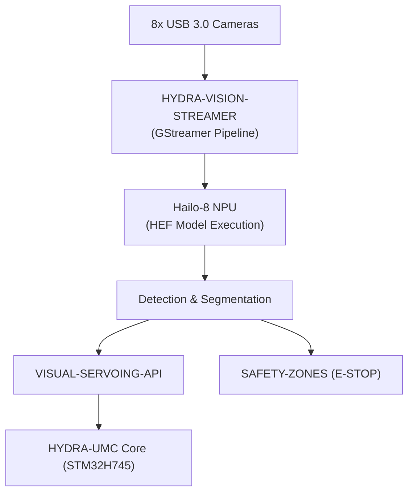

<p align="center">
  
</p>

# 👁️ HYDRA-UMC-VISION-NODE

<p align="center"><a href="README.md">🇺🇸 English</a> | <a href="README_spa.md">🇪🇸 Español</a> | <a href="README_fra.md">🇫🇷 Français</a> | <a href="README_ita.md">🇮🇹 Italiano</a> | <a href="README_deu.md">🇩🇪 Deutsch</a> | 🇨🇳 <b>简体中文</b> | <a href="README_jpn.md">🇯🇵 日本語</a></p>

### 🧠 高速感知边缘 AI 节点（Hailo-8 + Raspberry Pi CM5）

<p align="left">
  
  
  
  
  
</p>

---

## 1. 🛠️ 技术概述

**HYDRA-UMC-VISION-NODE** 是 HYDRA-UMC 生态系统的专用感知引擎。设计为运行在
Raspberry Pi Compute Module 5 上，并搭配 Hailo-8 M.2 AI 加速器，其预期任务是
同时处理最多 8 路 USB 3.0 摄像头的海量视频流。

它的定位是系统的"反射神经"，执行亚毫米级物体跟踪、缺陷检测和实时安全监控，
而不会使中央编排器过载。

本项目是 Vision AI Node 系列的**集成父项目**：它本身并不完成所有这些工作，
而是下方 4 个专项子项目所接入的节点，每个子项目各自负责一项职责：

* **[HYDRA-UMC-VISION-STREAMER](https://github.com/JuanenRac/HYDRA-UMC-VISION-STREAMER)** —— 捕获并预处理本节点所消费的摄像头画面。
* **[HYDRA-UMC-DETECTION-HEF](https://github.com/JuanenRac/HYDRA-UMC-DETECTION-HEF)** —— 编译并管理本节点在其 Hailo-8 NPU 上加载的 `.hef` 模型版本。
* **[HYDRA-UMC-SAFETY-ZONES](https://github.com/JuanenRac/HYDRA-UMC-SAFETY-ZONES)** —— 将本节点的感知结果转化为入侵检测和 E-STOP 触发。
* **[HYDRA-UMC-VISUAL-SERVOING-API](https://github.com/JuanenRac/HYDRA-UMC-VISUAL-SERVOING-API)** —— 将本节点的感知结果转化为运动学位姿修正。

### 关键要点

* 🧩 **家族就绪检查（v0）：** 真实的 `family-status` 子命令读取 4 个真实子项目各自真实的 `hydra-umc.project.json`，报告其是否存在/版本/成熟度/角色——对于一个自身尚未运行任何 Hailo-8 运行时或摄像头流水线的集成父项目来说，这是诚实的。详见下方"诚实说明"。
* 🩺 **流水线清单、帧验证与降级模式（v0）：** 一份真实的、可检视的本节点感知流水线形状清单（哪些阶段需要摄像头、加速器，或两者都不需要），对原始帧缓冲区进行真实的结构性损坏校验，以及真实的降级模式检测——诚实地探测真实的摄像头/Hailo-8 硬件，并准确报告当前哪些阶段真的可以运行——通过新增的 `pipeline-status` 和 `validate-frame` 子命令实现。
* 🌐 **JSON/HTTP API（v0）：** 真实的 `serve` 子命令将 `family-status`/`pipeline-status`/`validate-frame` 以 HTTP API 的形式对外提供（`GET /family-status`、`GET /pipeline-status`、`POST /validate-frame`，外加 `GET /stats`）——与 CLI 子命令执行的完全是同一批函数，构建在 `http.server` 之上，不引入任何额外依赖。详见下文"JSON/HTTP API"一节以及 [`docs/CLI_REFERENCE.md`](docs/CLI_REFERENCE.md)。
* 🚀 **硬件加速（计划中）：** 设计目标是在 Hailo-8（26 TOPS）上原生执行 HEF 模型——编译这些模型的工具链是一个独立项目（[HYDRA-UMC-DETECTION-HEF](https://github.com/JuanenRac/HYDRA-UMC-DETECTION-HEF)），并非本节点自身构建。
* 📷 **多路流处理（计划中）：** 同时分析最多 8 路高分辨率摄像头画面，由 [HYDRA-UMC-VISION-STREAMER](https://github.com/JuanenRac/HYDRA-UMC-VISION-STREAMER) 在上游捕获。
* 🎯 **精准感知（计划中）：** 围绕 YOLO 系列架构设计，用于工业组件检测。
* 🛡️ **主动安全（计划中）：** 实时占用地图输入至 [HYDRA-UMC-SAFETY-ZONES](https://github.com/JuanenRac/HYDRA-UMC-SAFETY-ZONES) 以进行人员入侵检测。
* 🧩 **存在的意义：** 若没有专用节点，感知工作要么会使 [HYDRA-UMC](https://github.com/JuanenRac/HYDRA-UMC) 内部的 STM32H745 实时核心过载（该核心没有多余算力承担此任务），要么必须将每一帧摄像头画面通过网络传输到远程 GPU，从而增加安全回路无法承受的延迟。将其运行在紧邻机器人本体的 CM5 + Hailo-8 上，可使检测 → 修正 →（必要时）E-STOP 的回路保持本地化和快速。

**诚实说明——今天实际运行的内容：** 无参数调用时仍会打印身份/版本/角色，但现在新增了一个真实的 `family-status [--workspace 路径]` 子命令：从本地检出中读取 `HYDRA-UMC-VISION-STREAMER`/`HYDRA-UMC-DETECTION-HEF`/`HYDRA-UMC-SAFETY-ZONES`/`HYDRA-UMC-VISUAL-SERVOING-API` 各自真实的清单，并诚实地报告发现的内容。上文描述的 Hailo-8 运行时、gRPC 控制
API 或真实的子节点监督逻辑目前均尚未实现——它们是本项目存在的原因，而非
当前已完成的工作。具体已交付内容请参见 [`CHANGELOG.md`](CHANGELOG.md)，
尚待完成的内容请参见下方"当前状态与后续步骤"章节。

---

## 2. 🔄 目标系统流程

下图是本骨架项目正朝其构建的目标数据流——它记录的是架构决策，而非当前已
运行的流水线。



---

## 3. 🧠 高级技术信息

### 为什么本项目是集成父项目（以及这具体意味着什么）

在 Vision AI Node 系列的 5 个项目中，只有本项目：

* 拥有 **`os/`** 文件夹——CM5 主机共享的 HydraOS 系统镜像配置。4 个子项目作为进程/容器运行在这一份共享 OS 镜像*之上*；没有理由让每个子项目各自携带一份副本。
* 拥有 **`models/`** 文件夹——实际加载到 Hailo-8 NPU 上运行的已编译 `.hef` 模型。[HYDRA-UMC-DETECTION-HEF](https://github.com/JuanenRac/HYDRA-UMC-DETECTION-HEF) 是这些模型*被编译和管理版本*的地方；本节点则是*实际提供服务、正在运行的副本*所在之处，因为它是持有 Hailo-8 设备句柄的进程。
* 拥有 **`docker-compose.yml`**——见下文。

5 个项目中没有一个携带 `hardware/` 或 `firmware/` 文件夹：CM5 + Hailo-8 是现
成硬件，没有需要自行设计的板卡，这与（例如）[HYDRA-UMC](https://github.com/JuanenRac/HYDRA-UMC) 内部定制的 STM32H745/STM32G474 板卡不同。

### `docker-compose.yml`：一份已记录的集成蓝图，而非（目前）一个可运行的栈

项目根目录下的 `docker-compose.yml` 定义了本节点自身的服务以及全部 4 个子
项目，并将它们各自预期所需的设备/卷/端口（Hailo-8 设备节点、每个摄像头的
V4L2 设备、通往 HYDRA-UMC 核心的 gRPC 端口）连接在一起。文件中有大量注释
解释*为什么*每个部分存在。它**目前并不可运行**——4 个子项目均尚未提供
`Dockerfile`，因此 `docker compose up` 会失败。它先于代码存在，是为了让
集成方案先被决定和记录一次，而不是由每个子项目日后各自零散地摸索。

### 本骨架中已做出的设计决策

* **版本从已安装的包元数据读取，而非硬编码。** `main.py` 调用 `importlib.metadata.version("hydra-umc-vision-node")`，而不是在包内某处再保留一个 `__version__` 字符串。这意味着 `bump_version.py` 永远只有一处需要修改（`pyproject.toml`），打印出的版本号永远不会与之悄然失步。
* **里程表式递增只自动触及 `PATCH`/`MINOR`。** `bump_version.py` 在每次真实构建时递增 `PATCH`，超过 9 时进位到 `MINOR`，`MINOR` 超过 9 时进位到 `MAJOR`——但它从不自行递增 `MAJOR`。`MAJOR` 是一个刻意的、人为的语义决策（一个真正的架构里程碑），而非构建脚本应自行决定的事。这与生态系统中已使用的惯例相同（参见 `HYDRA-UMC-EDITOR-URDF/bump_version.py` 和 `HYDRA-UMC-SUITE/bump_version.py`）。
* **计划中的控制 API 使用 gRPC/Protobuf，而非 REST**（见上方徽章）——之所以如此选择，是因为本节点所处的感知 → 修正 → 固件回路对延迟敏感，且在同一局域网内与其他 Python/嵌入式服务通信，gRPC 的二进制帧格式和流式支持比 JSON-over-HTTP 更合适。尚未实现；在此记录以便在代码落地前方向已经明确。
* **为何 `family-status` 读取每个子项目自身的清单，而不是一份手工维护的列表。** `hydra-umc.project.json` 已经是整个生态系统仪表盘和更新器都信任的唯一真相来源——在这里再维护第二份列表，只要某个子项目的真实成熟度发生变化而没人记得同步更新，就会立刻产生偏差。
* **为何缺少某个兄弟项目的本地检出会得到一个真实、诚实的"未找到"，而非一次崩溃。** 一个集成父项目真的无法预先知道开发者是否在本地检出了全部 4 个子项目——`manifest.py` 对每一种真实的失败情形（仓库缺失、清单缺失、JSON 格式错误）都返回 `None`，让 `family-status` 清楚地报告出来，而不是直接抛出异常。
* **为何降级模式检测被拆分为一个探测函数和一个纯决策函数。** `hardware.py` 中的 `camera_available()`/`accelerator_available()` 是唯一真正接触硬件（一个 Linux 设备节点）的部分；`determine_mode()`/`active_stages()` 只接收普通布尔值，包含真正的决策逻辑。正是这种拆分，让每一种真实的硬件组合（完整、无摄像头、无加速器、完全无硬件）都能直接、确定性地被测试，无需模拟文件系统，也无需真实的 CM5+Hailo-8 硬件来证明逻辑正确。
* **为何帧验证只检查结构，不检查像素内容。** 检测一个被截断/超大的缓冲区，或一个可疑地全部一致的缓冲区（传感器冻结、空白采集），是真实的、有用的、与硬件无关的验证，不需要任何参考图像也不需要摄像头即可诚实地测试。而判断一帧的真实内容是否看起来有问题（模糊、曝光、真正的视觉质量指标）则是一个根本不同、难得多的问题，需要真实采集的帧来校准——明确排除在这个 v0 的范围之外。

---

## 📂 目录结构

```text
HYDRA-UMC-VISION-NODE/
├── src/hydra_umc_vision_node/
│   ├── manifest.py       # 真实的、具防御性的兄弟项目自身清单读取器
│   ├── family.py          # 对 4 个真实子项目的真实家族就绪检查
│   ├── pipeline.py          # 真实的感知流水线清单（阶段 + 硬件需求）
│   ├── frame.py                # 真实的、与硬件无关的帧损坏校验
│   ├── hardware.py               # 真实的摄像头/加速器探测 + 降级模式逻辑
│   ├── api.py                      # 简洁的 JSON/HTTP 接口(基于 stdlib http.server),桥接真实的 3 个子命令
│   └── main.py                     # 入口点 + `family-status`/`pipeline-status`/`validate-frame`
├── tests/               # 真实测试：清单读取、家族状态、pipeline、frame、hardware、api、CLI
├── docs/                # 文档与 API 参考
├── os/                  # HydraOS 系统镜像配置（CM5）——仅父项目拥有,部署时填充(不在 git 中)
├── models/               # 提供给 Hailo-8 NPU 的已编译 .hef 模型——仅父项目拥有,部署时填充(不在 git 中)
├── build/               # 构建输出（本地 .venv 也存放于此）
├── images/              # 媒体与图表
├── systemd/
│   └── hydra-umc-vision-node.service # 本地 CM5 感知 API 的 systemd 单元
├── tools/
│   ├── build_test.py    # 不递增版本号的构建检查
│   └── ci_validate.py   # CI 使用的清单/CHANGELOG/文档校验
├── pyproject.toml       # 包元数据、依赖项、里程表版本号
├── bump_version.py      # 原生版本的里程表式递增（由 build.sh/.bat 运行）
├── bump_manifest_version.py # 将 hydra-umc.project.json 的版本与原生版本同步(--sync)
├── build.sh / build.bat # venv + 可编辑安装（含 dev 附加依赖） + 编译检查 + 测试
├── run.sh / run.bat     # 从本地 venv 运行入口点（转发参数）
├── docker-compose.yml   # Vision AI Node 4 个子项目的集成蓝图（尚未可运行）
└── CHANGELOG.md         # 逐版本历史（里程表方案，无日期）
```

本仓库中不存在 `hardware/` 和 `firmware/`（原因见上方"高级技术信息"）。
`os/` 和 `models/` 仅存在于本项目中——5 个项目中，4 个子项目并不携带各自
的副本。

---

## 🏗️ 构建与运行

### 前提条件

* `PATH` 中存在 **Python 3.10 或更新版本**（通过 `python3`/`python` 检查——脚本会依次尝试两者）。
* 目前不需要任何系统级 Hailo SDK、GStreamer 或其他原生依赖——**没有任何第三方运行时依赖**（`pyproject.toml` 中 `dependencies = []`）；`pytest` 只是一个开发附加依赖，仅用于真实的测试套件。相应的真实逻辑落地后才会添加运行时依赖。
* 有足够的磁盘空间用于本地虚拟环境（在此阶段创建于 `.venv/` 下，仅需数十 MB）。

### 逐步说明——每条命令实际执行的操作

```bash
# Linux / macOS
./build.sh
```

1. **里程表式版本递增** —— 运行 `bump_version.py`，在 `pyproject.toml` 中递增 `PATCH`（按照上述里程表规则进位到 `MINOR`/`MAJOR`）。这在*每次*构建时都会发生，包括你即将运行的这一次，因此版本号预期会上升 1。
2. **虚拟环境** —— 若 `.venv/` 尚不存在则创建它（可安全重复运行；已存在的 `.venv/` 会被复用，而非重新创建）。
3. **可编辑安装（含 dev 附加依赖）** —— `pip install -e ".[dev]"` 以"可编辑"模式将本包安装到 `.venv` 中，因此对 `src/` 下源代码的修改会立即生效而无需重新安装，安装 `pytest`，并注册 `run.sh` 所使用的 `hydra-umc-vision-node` 控制台入口点。
4. **编译检查** —— `python -m compileall -q src` 对 `src/` 下的每个 `.py` 文件进行字节码编译，即使某个文件从未被 `main.py` 实际导入，也能捕获整个包中的语法错误。
5. **真实测试套件** —— `pytest tests/` 运行全部 48 个测试。

脚本使用 `set -euo pipefail`，在第一个失败步骤处停止，只有全部步骤
均成功时才打印 `== Build OK ==`。

```bash
./run.sh
```

在 `.venv` 内定位 Python 解释器（同时支持 POSIX 的 `.venv/bin/python` 和
Windows 风格的 `.venv/Scripts/python.exe` 目录结构，因为本仓库是跨平台
开发的），并运行 `python -m hydra_umc_vision_node.main`，并转发任何参数。

无参数调用会打印名称 + 版本 + 角色：

```text
HYDRA-UMC-VISION-NODE v0.0.6
High-speed perception edge AI node (Hailo-8 + CM5) - integration parent of Vision-Streamer, Detection-HEF, Safety-Zones and Visual-Servoing-API.
```

真实的 `family-status` 子命令会检查真实的本地检出：

```bash
./run.sh family-status
./run.sh family-status --workspace /path/to/some/other/checkout

# Windows
run.bat family-status
```

默认使用本仓库自身的父目录——这正是本生态系统任何真实检出已经在使用的
布局。如果缺少任何真实子项目，将以 `1` 退出。

真实的 `pipeline-status` 子命令会探测真实硬件并报告真实、诚实的结果：

```bash
./run.sh pipeline-status
```
```json
{
  "manifest": { "version": "0.1.0", "stages": [ "..." ] },
  "camera_present": false,
  "accelerator_present": false,
  "mode": "degraded_no_hardware",
  "runnable_stages": ["preprocess", "postprocess", "publish"],
  "skipped_stages": ["capture", "inference"]
}
```

在这台开发机器上（没有 CM5、没有 Hailo-8、没有摄像头），这就是真实、诚实的
答案——退出码 `1`（任何非 `full` 模式）。真实的 `validate-frame` 子命令会
检查磁盘上的原始帧缓冲区文件是否存在结构性损坏：

```bash
./run.sh validate-frame path/to/frame.raw --width 1920 --height 1080
# Frame OK: path/to/frame.raw matches 1920x1080x3 (6220800 bytes)

./run.sh validate-frame path/to/truncated.raw --width 1920 --height 1080
# Frame INVALID: path/to/truncated.raw
#   [size_mismatch] frame buffer is ... bytes, expected 6220800 bytes ... - likely truncated or corrupt
```

```bat
:: Windows - 步骤相同，批处理语法
build.bat
run.bat
```

### JSON/HTTP API

真实的 `serve` 子命令会将 `family-status`/`pipeline-status`/`validate-frame` 作为 JSON/HTTP API 运行，而不是一次性的 CLI 调用——这与本系列其他 `api.py` 文件已经采用的约定相同，构建在标准库的 `http.server`（`ThreadingHTTPServer`）之上，不引入任何额外的运行时依赖：

```bash
./run.sh serve --addr 127.0.0.1 --port 8094
```

| 路由 | 方法 | 说明 |
|---|---|---|
| `/family-status` | `GET` | 与 `family-status` 子命令相同。可选查询参数 `?workspace=PATH` 仅针对该次请求覆盖服务器默认的工作区。 |
| `/pipeline-status` | `GET` | 与 `pipeline-status` 子命令相同。 |
| `/validate-frame` | `POST` | 与 `validate-frame` 子命令相同的校验，但原始帧字节通过请求体传输，而不是服务器端的文件路径——真实的远程调用方根本没有本服务器自身文件系统上的本地路径可以传递。需要 `?width=W&height=H` 查询参数（`channels` 可选，默认 `3`）。 |
| `/stats` | `GET` | 报告服务器默认的工作区路径。 |

`/validate-frame` 示例，使用与上文 CLI 演示相同的 48 字节多样化测试数据：

```bash
curl -X POST "http://127.0.0.1:8094/validate-frame?width=4&height=4&channels=3" --data-binary @vn_good_frame.raw
# {"valid": true, "expectedBytes": 48, "actualBytes": 48, "issues": []}
```

每个路由都会返回诚实的错误响应体（`{"error": "..."}`）和对应的 HTTP 状态码——查询参数错误或缺失时返回 `400`，未知路径返回 `404`——而不是静默失败。逐路由的完整参考见 [`docs/CLI_REFERENCE.md`](docs/CLI_REFERENCE.md)。

### 故障排查

* **找不到 `python`/`python3`** —— 安装 Python 3.10+ 并确保其在 `PATH` 中；两个脚本都会先尝试 `python3`，再回退到 `python`。
* **`compileall` 失败** —— 意味着 `src/` 下确实引入了语法错误；构建脚本会以非零状态退出，且不会创建/更新安装，这是故意设计的，为的是绝不留下一个"构建成功"却损坏的包。
* **`run.sh`/`run.bat` 提示"未找到 `.venv`"** —— 必须先至少运行一次 `build.sh`/`build.bat`；`run.sh`/`run.bat` 自身从不创建环境，只有构建脚本会。
* **拉取更新后可编辑安装过期** —— 删除 `.venv/` 并重新运行 `build.sh`/`build.bat`；这种情况很少需要，因为 `pip install -e .` 通常无需重新安装即可识别源代码变更。

---

## 🚀 当前状态与后续步骤

**今天已实现的内容：** 一个真实的家族就绪检查（`manifest.py`/`family.py`），读取 4 个真实子项目各自的清单并报告是否存在/版本/成熟度/角色，一个真实的流水线清单和真实的降级模式检测（`pipeline.py`/`hardware.py`），会诚实地探测真实的摄像头/Hailo-8 硬件并准确报告哪些流水线阶段可以运行，真实的、与硬件无关的帧损坏校验（`frame.py`），`family-status`/`pipeline-status`/`validate-frame` 这几个 CLI 子命令，外加一个将这三者以 JSON/HTTP API 形式对外提供的 `serve` 子命令（`api.py`），48 个通过的测试，以及 `docker-compose.yml` 中针对 4 个子
项目的完整（但尚未可运行的）集成蓝图文档——具体的真实构建/运行输出见 [`CHANGELOG.md`](CHANGELOG.md)。

**仍待完成的内容（顺序不分先后，无既定时间表）：**

* 实际的 Hailo-8 运行时初始化与推理循环。
* 面向 HYDRA-UMC 核心的 gRPC 控制 API。
* 对 4 个子服务的真实监督（今天的 `family-status` 只检查是否存在/成熟度，不检查运行时健康状况；`docker-compose.yml` 仅记录了预期形态）。
* 一旦 [HYDRA-UMC-VISION-STREAMER](https://github.com/JuanenRac/HYDRA-UMC-VISION-STREAMER) 拥有真实的采集流水线，即进行多摄像头流水线同步。
* 将 `docker-compose.yml` 转化为真正可运行的技术栈，这取决于 4 个子项目率先各自提供自己的 `Dockerfile`。

---

## 🔗 相关项目

本项目是同一作者(JuanenRac / Electro Hobby 3D)打造的 HYDRA-UMC 机器人生态系统的一部分。值得了解,因为某个请求实际上可能是关于这些项目之一,而非本仓库本身。

**子项目** —— 每一个都是本节点自身 Hailo-8 感知流水线中的特定阶段或消费者
- **[HYDRA-UMC-DETECTION-HEF](https://github.com/JuanenRac/HYDRA-UMC-DETECTION-HEF)** —— 具备 Hailo 架构/校验和安全加载验证的真实编译模型注册表。
- **[HYDRA-UMC-VISION-STREAMER](https://github.com/JuanenRac/HYDRA-UMC-VISION-STREAMER)** —— 具备真实 HailoRT 集成边界的真实 GStreamer 流水线 + MediaMTX 配置生成器。
- **[HYDRA-UMC-SAFETY-ZONES](https://github.com/JuanenRac/HYDRA-UMC-SAFETY-ZONES)** —— 具备校准新鲜度强制检查的真实区域入侵检测与 E-STOP 请求。
- **[HYDRA-UMC-VISUAL-SERVOING-API](https://github.com/JuanenRac/HYDRA-UMC-VISUAL-SERVOING-API)** —— 具备真实 Position-Based Visual Servoing 修正律,并依据上游区域状态进行安全门控。

**直接相关**
- **[HYDRA-UMC](https://github.com/JuanenRac/HYDRA-UMC)** —— 机器人手臂的真实主板——CM5 主机 + 双核 STM32H745,通过 CAN-OTA/SPI-OTA 协调最多 8 条工具臂;本节点自身的感知流水线正是在该固件之上闭合安全/E-STOP 回路的部分。
- **[HYDRA-UMC-COGNITIVE-NODE](https://github.com/JuanenRac/HYDRA-UMC-COGNITIVE-NODE)** —— 面向 Hailo-10 认知流水线(LLM/VLA/语音编排)的集成中枢,构建为直接位于本节点自身感知输出之上的语义层。

**生态系统中的其他项目**

*核心硬件与平台*
- **[HYDRA-UMC-OS](https://github.com/JuanenRac/HYDRA-UMC-OS)** —— 面向 CM5 的可复现 Raspberry Pi OS 产品层——只读代理、经过验证的配置/配置文件、WiFi 首次配网。
- **[HYDRA-UMC-SDK](https://github.com/JuanenRac/HYDRA-UMC-SDK)** —— 每个桥接都据此校验自身指令的共享 JSON-Schema 契约与安全门限边界。

*核心后端与客户端*
- **[HYDRA-UMC-SERVER](https://github.com/JuanenRac/HYDRA-UMC-SERVER)** —— 每个控制客户端真正通信的真实无头后端(REST/WebSocket)。
- **[HYDRA-UMC-STUDIO](https://github.com/JuanenRac/HYDRA-UMC-STUDIO)** —— 具有实时多机器人 3D 可视化的网页控制面板。
- **[HYDRA-UMC-SUITE](https://github.com/JuanenRac/HYDRA-UMC-SUITE)** —— 面向多台服务器的桌面(PySide6)集群指挥中心,打包为独立可执行文件。
- **[HYDRA-UMC-ANDROID-CONTROL](https://github.com/JuanenRac/HYDRA-UMC-ANDROID-CONTROL)** —— 具有生物识别登录和配对 Wear OS 伴侣应用的原生 Android 控制应用。
- **[HYDRA-UMC-IOS-CONTROL](https://github.com/JuanenRac/HYDRA-UMC-IOS-CONTROL)** —— 具有实时 WebSocket 同步的 iOS/iPadOS 控制应用(Flutter)。
- **[HYDRA-UMC-DSI](https://github.com/JuanenRac/HYDRA-UMC-DSI)** —— 面向机载 7 英寸 DSI 触摸屏的原生触控界面,直接嵌入 CM5 本体。
- **[HYDRA-UMC-EDITOR-URDF](https://github.com/JuanenRac/HYDRA-UMC-EDITOR-URDF)** —— 将完成的模型推送到 STUDIO 自身目录的桌面版图形化 URDF 创建/编辑工具。
- **[HYDRA-UMC-BRIDGE-AMR](https://github.com/JuanenRac/HYDRA-UMC-BRIDGE-AMR)** —— 通过真实的 VDA 5050 MQTT 发布者为 AGV/AMR 车队提供的协调边界。
- **[HYDRA-UMC-BRIDGE-CNC](https://github.com/JuanenRac/HYDRA-UMC-BRIDGE-CNC)** —— 具备真实 GRBL 状态/控制字节访问能力的高层 CNC 单元协调器。
- **[HYDRA-UMC-BRIDGE-DROIDS](https://github.com/JuanenRac/HYDRA-UMC-BRIDGE-DROIDS)** —— 面向足式/人形机器人的协调边界,具备真实的 Boston Dynamics Spot 指令发送器。
- **[HYDRA-UMC-BRIDGE-LASER](https://github.com/JuanenRac/HYDRA-UMC-BRIDGE-LASER)** —— 读取 3 项真实钥匙/外壳/联锁 GPIO 安全信号的激光单元安全协调器。
- **[HYDRA-UMC-BRIDGE-OPENPNP](https://github.com/JuanenRac/HYDRA-UMC-BRIDGE-OPENPNP)** —— 面向 OpenPnP 贴片机板级流程的安全高层协调器。
- **[HYDRA-UMC-BRIDGE-PRINTER3D](https://github.com/JuanenRac/HYDRA-UMC-BRIDGE-PRINTER3D)** —— 面向 Moonraker/Klipper 3D 打印机的安全协调边界,具备真实的受控作业指令。
- **[HYDRA-UMC-BRIDGE-ROS2](https://github.com/JuanenRac/HYDRA-UMC-BRIDGE-ROS2)** —— 具备真实的惰性导入 rclpy ROS 2 传输层的安全协调器。
- **[HYDRA-UMC-BRIDGE-UAV](https://github.com/JuanenRac/HYDRA-UMC-BRIDGE-UAV)** —— 面向搭载摄像头的无人机的协调边界,具备真实的 MAVLink 指令发送器。

*URTC 工具平台*
- **[URTC](https://github.com/JuanenRac/URTC)** —— 面向实体 Universal Robot Tool Controller 板卡的固件,通过 CAN 总线支持 25 种以上工具配置。
- **[URTC-FLASHER](https://github.com/JuanenRac/URTC-FLASHER)** —— 面向 URTC 板卡的桌面图形烧录工具,支持 CAN-OTA 以及全芯片 SWD/JTAG。
- **[URTC-TESTER](https://github.com/JuanenRac/URTC-TESTER)** —— 面向 URTC 板卡的桌面实时 CAN 总线诊断工具,每种工具配置对应一个面板。
- **[URTC-WEB-STUDIO](https://github.com/JuanenRac/URTC-WEB-STUDIO)** —— 通过 Web Serial API 实现的浏览器版 URTC-TESTER 替代方案,无需本地安装。

*认知 AI 节点(Hailo-10)*
- **[HYDRA-UMC-VLA-ENGINE](https://github.com/JuanenRac/HYDRA-UMC-VLA-ENGINE)** —— 面向 Vision-Language-Action 模型的真实动作 token 编解码与轨迹生成。
- **[HYDRA-UMC-VOICE-UI](https://github.com/JuanenRac/HYDRA-UMC-VOICE-UI)** —— 具备受限、需确认的 Watch 中继的真实语音前端(VAD + 意图解析)。
- **[HYDRA-UMC-SEMANTIC-PLANNER](https://github.com/JuanenRac/HYDRA-UMC-SEMANTIC-PLANNER)** —— 基于真实规则的任务分解,以及针对 MCU 错误码的语义化错误恢复。
- **[HYDRA-UMC-DOCS-QA](https://github.com/JuanenRac/HYDRA-UMC-DOCS-QA)** —— 面向本生态系统自身 Markdown 文档的真实纯标准库 TF-IDF 文档检索。

*编排与集群*
- **[HYDRA-UMC-ORCHESTRATOR](https://github.com/JuanenRac/HYDRA-UMC-ORCHESTRATOR)** —— 具备真实 gRPC/Protobuf 健康报告契约与任务状态机的集成中枢。
- **[HYDRA-UMC-JOB-DISPATCHER](https://github.com/JuanenRac/HYDRA-UMC-JOB-DISPATCHER)** —— 基于真实 HTTP API 的真实优先级任务队列,支持去重。
- **[HYDRA-UMC-NODE-HEALING](https://github.com/JuanenRac/HYDRA-UMC-NODE-HEALING)** —— 具备重试/退避与身份不匹配检测的真实基于 gRPC 的车队健康看门狗。
- **[HYDRA-UMC-PATH-PLANNER-3D](https://github.com/JuanenRac/HYDRA-UMC-PATH-PLANNER-3D)** —— 具备真实障碍物/工作空间碰撞校验的真实基于 RRT 的三维路径规划器。
- **[HYDRA-UMC-SWARM-SYNC](https://github.com/JuanenRac/HYDRA-UMC-SWARM-SYNC)** —— 经过多单元收敛属性测试的真实 CRDT LWW-Element-Map 状态同步。

*数字孪生与仿真*
- **[HYDRA-UMC-TWIN](https://github.com/JuanenRac/HYDRA-UMC-TWIN)** —— 面向数字孪生引擎的集成中枢,具备真实的版本兼容性同步契约。
- **[HYDRA-UMC-HIL-BRIDGE](https://github.com/JuanenRac/HYDRA-UMC-HIL-BRIDGE)** —— 在仿真与真实硬件之间路由指令的真实硬件在环安全联锁。
- **[HYDRA-UMC-PHYSICS-REPLICA](https://github.com/JuanenRac/HYDRA-UMC-PHYSICS-REPLICA)** —— 面向真实 URDF 子集的真实正向运动学与关节限位校验。
- **[HYDRA-UMC-SYNTHETIC-DATA-GEN](https://github.com/JuanenRac/HYDRA-UMC-SYNTHETIC-DATA-GEN)** —— 具备 YOLO/COCO 标注导出功能的真实程序化 2D 场景生成器。

*数据与分析*
- **[HYDRA-UMC-DATALAKE](https://github.com/JuanenRac/HYDRA-UMC-DATALAKE)** —— 具备真实数据摄入/查询 HTTP API 的真实 sqlite3 时序数据存储。
- **[HYDRA-UMC-ANOMALY-DETECTOR](https://github.com/JuanenRac/HYDRA-UMC-ANOMALY-DETECTOR)** —— 具备漂移监测能力的真实 FFT + 统计基线异常检测器。
- **[HYDRA-UMC-PRODUCTION-REPORTS](https://github.com/JuanenRac/HYDRA-UMC-PRODUCTION-REPORTS)** —— 基于 DATALAKE 历史数据的真实 OEE/可用率计算,支持可复现的 CSV 导出。
- **[HYDRA-UMC-TELEMETRY-COLLECTOR](https://github.com/JuanenRac/HYDRA-UMC-TELEMETRY-COLLECTOR)** —— 面向 DATALAKE 的真实 CAN/WebSocket 数据摄入管道,支持序列去重。

*工业网关*
- **[HYDRA-UMC-GATEWAY-INDUSTRIAL](https://github.com/JuanenRac/HYDRA-UMC-GATEWAY-INDUSTRIAL)** —— 中继至工业协议的集成中枢,具备真实的指令白名单/背压控制层。
- **[HYDRA-UMC-OPCUA-SERVER](https://github.com/JuanenRac/HYDRA-UMC-OPCUA-SERVER)** —— 经真实二进制协议客户端会话验证的真实 OPC-UA 地址空间。
- **[HYDRA-UMC-MQTT-BROKER](https://github.com/JuanenRac/HYDRA-UMC-MQTT-BROKER)** —— 具备可选按客户端认证与主题 ACL 的真实 MQTT 代理。
- **[HYDRA-UMC-MTCONNECT-ADAPTER](https://github.com/JuanenRac/HYDRA-UMC-MTCONNECT-ADAPTER)** —— 具备降级模式输出的真实 MTConnect `/probe` 与 `/current` XML 端点。

*辅助工具与生态系统运维*
- **[HYDRA-UMC-DASHBOARD-AI](https://github.com/JuanenRac/HYDRA-UMC-DASHBOARD-AI)** —— 基于 DATALAKE/ANOMALY-DETECTOR 的智能摘要与异常高亮面板,具备诚实的统计回退机制。
- **[HYDRA-UMC-TOOL-CLI](https://github.com/JuanenRac/HYDRA-UMC-TOOL-CLI)** —— 具备真实、稳定退出码契约的车队 CLI,是 HYDRA-UMC-SERVER 自身 API 的真实在线客户端。
- **[HYDRA-UMC-WATCH](https://github.com/JuanenRac/HYDRA-UMC-WATCH)** —— 具备真实触觉提醒与配对手机语音中继功能的 WearOS 伴侣应用。
- **[URTC-SMART-RACK](https://github.com/JuanenRac/URTC-SMART-RACK)** —— 面向板卡安装机架的固件,具备真实的工具 ID 解码与 Smart Idle 预热逻辑。
- **[URTC-VISION-TOOL](https://github.com/JuanenRac/URTC-VISION-TOOL)** —— 面向热成像/RGB 检测工具头的固件及真实 Python 视觉伴侣程序。
- **[HYDRA-UMC-UPDATER](https://github.com/JuanenRac/HYDRA-UMC-UPDATER)** —— 发现、克隆并更新本生态系统中每个仓库的管理类桌面工具。

---

## 📚 文档与社区

- **[docs/CLI_REFERENCE.md](docs/CLI_REFERENCE.md)** —— 每个子命令（`family-status`、`pipeline-status`、`validate-frame`、`serve`）以及每个 JSON/HTTP API 路由，均附有真实捕获的输出。
- **[CONTRIBUTING.md](CONTRIBUTING.md)** —— 提交 Pull Request 所需的技术栈和编码规范。
- **[CODE_OF_CONDUCT.md](CODE_OF_CONDUCT.md)** —— 本社区所期望的行为准则。
- **[SECURITY.md](SECURITY.md)** —— 如何报告漏洞，以及本项目真实的安全关注重点。
- **[SUPPORT.md](SUPPORT.md)** —— 在哪里提问和报告缺陷。
- **[LICENSE.md](LICENSE.md)** —— 本项目自身的许可证。

## 👤 作者
**JuanenRac** (Electro Hobby 3D)
📧 electrohobby3d@gmail.com
📺 [youtube.com/@electrohobby3d](https://youtube.com/@electrohobby3d)

## 📜 许可证
GPL-3.0 —— 详见 LICENSE。
