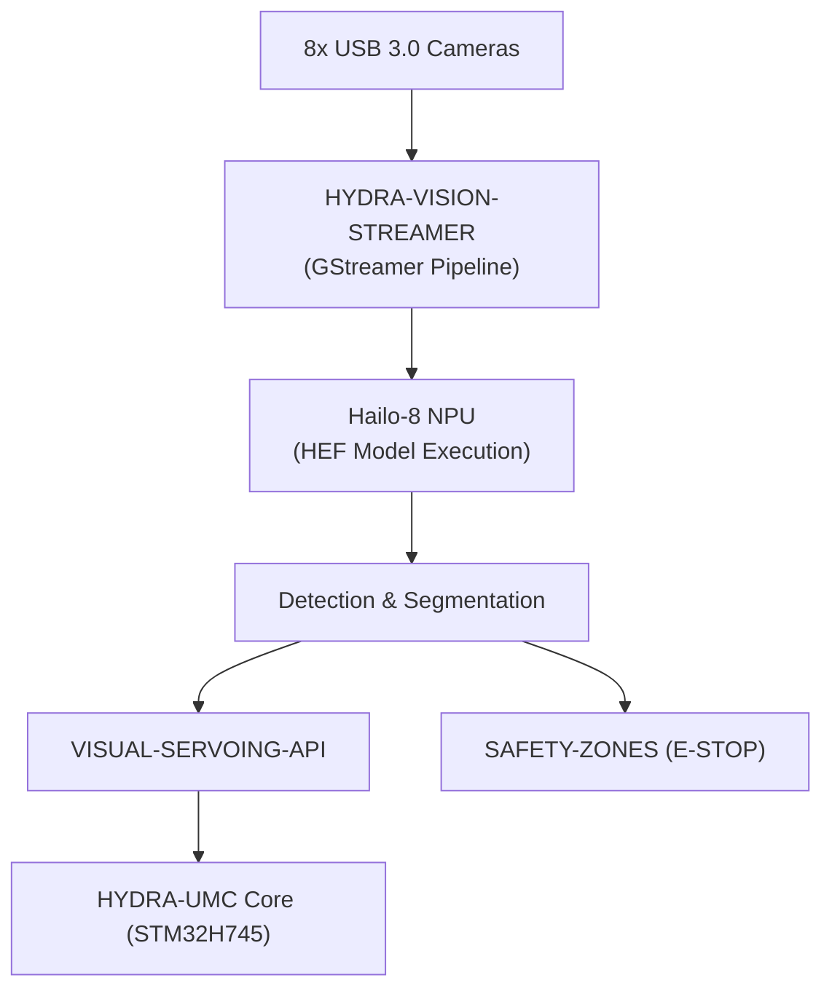

<p align="center">
  
</p>

# 👁️ HYDRA-UMC-VISION-NODE

<p align="center"><a href="README.md">🇺🇸 English</a> | <a href="README_spa.md">🇪🇸 Español</a> | <a href="README_fra.md">🇫🇷 Français</a> | <a href="README_ita.md">🇮🇹 Italiano</a> | <a href="README_deu.md">🇩🇪 Deutsch</a> | 🇨🇳 <b>简体中文</b> | <a href="README_jpn.md">🇯🇵 日本語</a></p>

### 🧠 高速感知边缘 AI 节点（Hailo-8 + Raspberry Pi CM5）

<p align="left">
  
  
  
  
  
</p>

---

## 1. 🛠️ 技术概述

**HYDRA-UMC-VISION-NODE** 是 HYDRA-UMC 生态系统的专用感知引擎。设计为运行在
Raspberry Pi Compute Module 5 上，并搭配 Hailo-8 M.2 AI 加速器，其预期任务是
同时处理最多 8 路 USB 3.0 摄像头的海量视频流。

它的定位是系统的"反射神经"，执行亚毫米级物体跟踪、缺陷检测和实时安全监控，
而不会使中央编排器过载。

本项目是 Vision AI Node 系列的**集成父项目**：它本身并不完成所有这些工作，
而是下方 4 个专项子项目所接入的节点，每个子项目各自负责一项职责：

* **[HYDRA-UMC-VISION-STREAMER](https://github.com/JuanenRac/HYDRA-UMC-VISION-STREAMER)** —— 捕获并预处理本节点所消费的摄像头画面。
* **[HYDRA-UMC-DETECTION-HEF](https://github.com/JuanenRac/HYDRA-UMC-DETECTION-HEF)** —— 编译并管理本节点在其 Hailo-8 NPU 上加载的 `.hef` 模型版本。
* **[HYDRA-UMC-SAFETY-ZONES](https://github.com/JuanenRac/HYDRA-UMC-SAFETY-ZONES)** —— 将本节点的感知结果转化为入侵检测和 E-STOP 触发。
* **[HYDRA-UMC-VISUAL-SERVOING-API](https://github.com/JuanenRac/HYDRA-UMC-VISUAL-SERVOING-API)** —— 将本节点的感知结果转化为运动学位姿修正。

### 关键要点

* 🚀 **硬件加速（计划中）：** 设计目标是在 Hailo-8（26 TOPS）上原生执行 HEF 模型——编译这些模型的工具链是一个独立项目（[HYDRA-UMC-DETECTION-HEF](https://github.com/JuanenRac/HYDRA-UMC-DETECTION-HEF)），并非本节点自身构建。
* 📷 **多路流处理（计划中）：** 同时分析最多 8 路高分辨率摄像头画面，由 [HYDRA-UMC-VISION-STREAMER](https://github.com/JuanenRac/HYDRA-UMC-VISION-STREAMER) 在上游捕获。
* 🎯 **精准感知（计划中）：** 围绕 YOLO 系列架构设计，用于工业组件检测。
* 🛡️ **主动安全（计划中）：** 实时占用地图输入至 [HYDRA-UMC-SAFETY-ZONES](https://github.com/JuanenRac/HYDRA-UMC-SAFETY-ZONES) 以进行人员入侵检测。
* 🧩 **存在的意义：** 若没有专用节点，感知工作要么会使 [HYDRA-UMC](https://github.com/JuanenRac/HYDRA-UMC) 内部的 STM32H745 实时核心过载（该核心没有多余算力承担此任务），要么必须将每一帧摄像头画面通过网络传输到远程 GPU，从而增加安全回路无法承受的延迟。将其运行在紧邻机器人本体的 CM5 + Hailo-8 上，可使检测 → 修正 →（必要时）E-STOP 的回路保持本地化和快速。

**诚实说明——今天实际运行的内容：** 本仓库目前处于骨架阶段。真正的入口点
（`src/hydra_umc_vision_node/main.py`）会打印项目名称、已安装的版本号，以及
一行角色说明，然后以退出码 0 结束。上文描述的 Hailo-8 运行时、gRPC 控制
API 或子节点监督逻辑目前均尚未在代码中实现——它们是本项目存在的原因，而非
当前已完成的工作。具体已交付内容请参见 [`CHANGELOG.md`](CHANGELOG.md)，
尚待完成的内容请参见下方"当前状态与后续步骤"章节。

---

## 2. 🔄 目标系统流程

下图是本骨架项目正朝其构建的目标数据流——它记录的是架构决策，而非当前已
运行的流水线。



---

## 3. 🧠 高级技术信息

### 为什么本项目是集成父项目（以及这具体意味着什么）

在 Vision AI Node 系列的 5 个项目中，只有本项目：

* 拥有 **`os/`** 文件夹——CM5 主机共享的 HydraOS 系统镜像配置。4 个子项目作为进程/容器运行在这一份共享 OS 镜像*之上*；没有理由让每个子项目各自携带一份副本。
* 拥有 **`models/`** 文件夹——实际加载到 Hailo-8 NPU 上运行的已编译 `.hef` 模型。[HYDRA-UMC-DETECTION-HEF](https://github.com/JuanenRac/HYDRA-UMC-DETECTION-HEF) 是这些模型*被编译和管理版本*的地方；本节点则是*实际提供服务、正在运行的副本*所在之处，因为它是持有 Hailo-8 设备句柄的进程。
* 拥有 **`docker-compose.yml`**——见下文。

5 个项目中没有一个携带 `hardware/` 或 `firmware/` 文件夹：CM5 + Hailo-8 是现
成硬件，没有需要自行设计的板卡，这与（例如）[HYDRA-UMC](https://github.com/JuanenRac/HYDRA-UMC) 内部定制的 STM32H745/STM32G474 板卡不同。

### `docker-compose.yml`：一份已记录的集成蓝图，而非（目前）一个可运行的栈

项目根目录下的 `docker-compose.yml` 定义了本节点自身的服务以及全部 4 个子
项目，并将它们各自预期所需的设备/卷/端口（Hailo-8 设备节点、每个摄像头的
V4L2 设备、通往 HYDRA-UMC 核心的 gRPC 端口）连接在一起。文件中有大量注释
解释*为什么*每个部分存在。它**目前并不可运行**——4 个子项目均尚未提供
`Dockerfile`，因此 `docker compose up` 会失败。它先于代码存在，是为了让
集成方案先被决定和记录一次，而不是由每个子项目日后各自零散地摸索。

### 本骨架中已做出的设计决策

* **版本从已安装的包元数据读取，而非硬编码。** `main.py` 调用 `importlib.metadata.version("hydra-umc-vision-node")`，而不是在包内某处再保留一个 `__version__` 字符串。这意味着 `bump_version.py` 永远只有一处需要修改（`pyproject.toml`），打印出的版本号永远不会与之悄然失步。
* **里程表式递增只自动触及 `PATCH`/`MINOR`。** `bump_version.py` 在每次真实构建时递增 `PATCH`，超过 9 时进位到 `MINOR`，`MINOR` 超过 9 时进位到 `MAJOR`——但它从不自行递增 `MAJOR`。`MAJOR` 是一个刻意的、人为的语义决策（一个真正的架构里程碑），而非构建脚本应自行决定的事。这与生态系统中已使用的惯例相同（参见 `HYDRA-UMC-EDITOR-URDF/bump_version.py` 和 `HYDRA-UMC-SUITE/bump_version.py`）。
* **计划中的控制 API 使用 gRPC/Protobuf，而非 REST**（见上方徽章）——之所以如此选择，是因为本节点所处的感知 → 修正 → 固件回路对延迟敏感，且在同一局域网内与其他 Python/嵌入式服务通信，gRPC 的二进制帧格式和流式支持比 JSON-over-HTTP 更合适。尚未实现；在此记录以便在代码落地前方向已经明确。

---

## 📂 目录结构

```text
HYDRA-UMC-VISION-NODE/
├── src/                 # 源代码（hydra_umc_vision_node 包）
├── docs/                # 文档与 API 参考
├── os/                  # HydraOS 系统镜像配置（CM5）——仅父项目拥有
├── models/               # 提供给 Hailo-8 NPU 的已编译 .hef 模型——仅父项目拥有
├── build/               # 构建输出（本地 .venv 也存放于此）
├── images/              # 媒体与图表
├── scripts/             # 实用脚本（部署、设置）
├── pyproject.toml       # 包元数据、依赖项、里程表版本号
├── bump_version.py      # 里程表式版本递增（由 build.sh/.bat 运行）
├── build.sh / build.bat # venv + 可编辑安装 + 编译检查
├── run.sh / run.bat     # 从本地 venv 运行入口点
├── docker-compose.yml   # Vision AI Node 4 个子项目的集成蓝图（尚未可运行）
└── CHANGELOG.md         # 逐版本历史（里程表方案，无日期）
```

本仓库中不存在 `hardware/` 和 `firmware/`（原因见上方"高级技术信息"）。
`os/` 和 `models/` 仅存在于本项目中——5 个项目中，4 个子项目并不携带各自
的副本。

---

## 🏗️ 构建与运行

### 前提条件

* `PATH` 中存在 **Python 3.10 或更新版本**（通过 `python3`/`python` 检查——脚本会依次尝试两者）。
* 目前不需要任何系统级 Hailo SDK、GStreamer 或其他原生依赖——本骨架**没有任何第三方运行时依赖**（`pyproject.toml` 中 `dependencies = []`）。相应的真实逻辑落地后才会添加这些依赖。
* 有足够的磁盘空间用于本地虚拟环境（在此阶段创建于 `.venv/` 下，仅需数十 MB）。

### 逐步说明——每条命令实际执行的操作

```bash
# Linux / macOS
./build.sh
```

1. **里程表式版本递增** —— 运行 `bump_version.py`，在 `pyproject.toml` 中递增 `PATCH`（按照上述里程表规则进位到 `MINOR`/`MAJOR`）。这在*每次*构建时都会发生，包括你即将运行的这一次，因此版本号预期会上升 1。
2. **虚拟环境** —— 若 `.venv/` 尚不存在则创建它（可安全重复运行；已存在的 `.venv/` 会被复用，而非重新创建）。
3. **可编辑安装** —— `pip install -e .` 以"可编辑"模式将本包安装到 `.venv` 中，因此对 `src/` 下源代码的修改会立即生效而无需重新安装，并注册 `run.sh` 所使用的 `hydra-umc-vision-node` 控制台入口点。
4. **编译检查** —— `python -m compileall -q src` 对 `src/` 下的每个 `.py` 文件进行字节码编译，即使某个文件从未被 `main.py` 实际导入，也能捕获整个包中的语法错误。

脚本使用 `set -euo pipefail`，在第一个失败步骤处停止，只有全部 4 个步骤
均成功时才打印 `== Build OK ==`。

```bash
./run.sh
```

在 `.venv` 内定位 Python 解释器（同时支持 POSIX 的 `.venv/bin/python` 和
Windows 风格的 `.venv/Scripts/python.exe` 目录结构，因为本仓库是跨平台
开发的），并运行 `python -m hydra_umc_vision_node.main`，该命令会打印项目
名称、刚刚递增的版本号，以及一行角色说明。

```bat
:: Windows - 步骤相同，批处理语法
build.bat
run.bat
```

### 故障排查

* **找不到 `python`/`python3`** —— 安装 Python 3.10+ 并确保其在 `PATH` 中；两个脚本都会先尝试 `python3`，再回退到 `python`。
* **`compileall` 失败** —— 意味着 `src/` 下确实引入了语法错误；构建脚本会以非零状态退出，且不会创建/更新安装，这是故意设计的，为的是绝不留下一个"构建成功"却损坏的包。
* **`run.sh`/`run.bat` 提示"未找到 `.venv`"** —— 必须先至少运行一次 `build.sh`/`build.bat`；`run.sh`/`run.bat` 自身从不创建环境，只有构建脚本会。
* **拉取更新后可编辑安装过期** —— 删除 `.venv/` 并重新运行 `build.sh`/`build.bat`；这种情况很少需要，因为 `pip install -e .` 通常无需重新安装即可识别源代码变更。

---

## 🚀 当前状态与后续步骤

**今天已实现的内容：** 一个真实的、可安装的 Python 包，带有已验证的入口点
（具体已捕获的构建/运行输出见 [`CHANGELOG.md`](CHANGELOG.md)），一个已接入
构建流程的里程表式版本递增机制，以及 `docker-compose.yml` 中针对 4 个子
项目的完整（但尚未可运行的）集成蓝图文档。

**仍待完成的内容（顺序不分先后，无既定时间表）：**

* 实际的 Hailo-8 运行时初始化与推理循环。
* 面向 HYDRA-UMC 核心的 gRPC 控制 API。
* 对 4 个子服务的真实监督（目前 `docker-compose.yml` 仅记录了预期形态）。
* 一旦 [HYDRA-UMC-VISION-STREAMER](https://github.com/JuanenRac/HYDRA-UMC-VISION-STREAMER) 拥有真实的采集流水线，即进行多摄像头流水线同步。
* 将 `docker-compose.yml` 转化为真正可运行的技术栈，这取决于 4 个子项目率先各自提供自己的 `Dockerfile`。

---

## 🔗 相关项目

本项目是同一作者（JuanenRac / Electro Hobby 3D）打造的更大规模机器人生态
系统的一部分，涵盖固件、控制软件、AI 节点和车队工具。值得了解，因为某个
需求实际上可能是关于这些项目之一，而非本仓库。

### 项目族

**父项目：** 无——本项目本身就是 Vision AI Node 系列的集成父项目。

**子项目：**
- **[HYDRA-UMC-VISION-STREAMER](https://github.com/JuanenRac/HYDRA-UMC-VISION-STREAMER)** —— 捕获并预处理本节点所消费的摄像头画面。
- **[HYDRA-UMC-DETECTION-HEF](https://github.com/JuanenRac/HYDRA-UMC-DETECTION-HEF)** —— 编译并管理本节点在其 Hailo-8 NPU 上加载的 `.hef` 模型版本。
- **[HYDRA-UMC-SAFETY-ZONES](https://github.com/JuanenRac/HYDRA-UMC-SAFETY-ZONES)** —— 将本节点的感知结果转化为入侵检测和 E-STOP 触发。
- **[HYDRA-UMC-VISUAL-SERVOING-API](https://github.com/JuanenRac/HYDRA-UMC-VISUAL-SERVOING-API)** —— 将本节点的感知结果转化为运动学位姿修正。

### 直接相关（项目族之外）

- **[HYDRA-UMC](https://github.com/JuanenRac/HYDRA-UMC)** —— 在本固件之上闭合感知/E-STOP 回路。
- **[HYDRA-UMC-COGNITIVE-NODE](https://github.com/JuanenRac/HYDRA-UMC-COGNITIVE-NODE)** —— 建立在本感知能力之上的语义层。

### 生态系统的其余部分

**HYDRA-UMC 平台** —— 多机器人微工厂单元
- **[HYDRA-UMC-SERVER](https://github.com/JuanenRac/HYDRA-UMC-SERVER)** —— 每个控制客户端所对接的 Express/WebSocket 后端。
- **[HYDRA-UMC-STUDIO](https://github.com/JuanenRac/HYDRA-UMC-STUDIO)** —— 基于 Web 的控制仪表盘，多机器人 3D 可视化。
- **[HYDRA-UMC-ANDROID-CONTROL](https://github.com/JuanenRac/HYDRA-UMC-ANDROID-CONTROL)** —— 通过 Wi-Fi/蓝牙的 Android 控制应用。
- **[HYDRA-UMC-IOS-CONTROL](https://github.com/JuanenRac/HYDRA-UMC-IOS-CONTROL)** —— 基于 Flutter 构建的 iOS/iPadOS 控制应用。
- **[HYDRA-UMC-SUITE](https://github.com/JuanenRac/HYDRA-UMC-SUITE)** —— 桌面端集群指挥中心（Python/PySide6）。
- **[HYDRA-UMC-EDITOR-URDF](https://github.com/JuanenRac/HYDRA-UMC-EDITOR-URDF)** —— 用于机器人目录的桌面端 URDF 模型编辑器。
- **[HYDRA-UMC-DSI](https://github.com/JuanenRac/HYDRA-UMC-DSI)** —— 机载 DSI 触摸屏的原生触控 UI。

**URTC 平台** —— 每台 HYDRA-UMC 机械臂搭载的工具头控制器
- **[URTC](https://github.com/JuanenRac/URTC)** —— CAN 总线工具头控制器，25 种工具配置。
- **[URTC-FLASHER](https://github.com/JuanenRac/URTC-FLASHER)** —— 桌面端 CAN-OTA + SWD/JTAG 刷写工具。
- **[URTC-TESTER](https://github.com/JuanenRac/URTC-TESTER)** —— 桌面端实时 CAN 总线诊断工具。
- **[URTC-WEB-STUDIO](https://github.com/JuanenRac/URTC-WEB-STUDIO)** —— 通过 Web Serial API 的浏览器端替代方案。

**🧠 认知 AI 节点（Hailo-10）**
- [HYDRA-UMC-VLA-ENGINE](https://github.com/JuanenRac/HYDRA-UMC-VLA-ENGINE)
- [HYDRA-UMC-VOICE-UI](https://github.com/JuanenRac/HYDRA-UMC-VOICE-UI)
- [HYDRA-UMC-SEMANTIC-PLANNER](https://github.com/JuanenRac/HYDRA-UMC-SEMANTIC-PLANNER)
- [HYDRA-UMC-DOCS-QA](https://github.com/JuanenRac/HYDRA-UMC-DOCS-QA)

**🐝 编排与集群**
- [HYDRA-UMC-ORCHESTRATOR](https://github.com/JuanenRac/HYDRA-UMC-ORCHESTRATOR)
- [HYDRA-UMC-SWARM-SYNC](https://github.com/JuanenRac/HYDRA-UMC-SWARM-SYNC)
- [HYDRA-UMC-PATH-PLANNER-3D](https://github.com/JuanenRac/HYDRA-UMC-PATH-PLANNER-3D)
- [HYDRA-UMC-JOB-DISPATCHER](https://github.com/JuanenRac/HYDRA-UMC-JOB-DISPATCHER)
- [HYDRA-UMC-NODE-HEALING](https://github.com/JuanenRac/HYDRA-UMC-NODE-HEALING)

**🎮 数字孪生与仿真**
- [HYDRA-UMC-TWIN](https://github.com/JuanenRac/HYDRA-UMC-TWIN)
- [HYDRA-UMC-PHYSICS-REPLICA](https://github.com/JuanenRac/HYDRA-UMC-PHYSICS-REPLICA)
- [HYDRA-UMC-HIL-BRIDGE](https://github.com/JuanenRac/HYDRA-UMC-HIL-BRIDGE)
- [HYDRA-UMC-SYNTHETIC-DATA-GEN](https://github.com/JuanenRac/HYDRA-UMC-SYNTHETIC-DATA-GEN)

**📊 数据与分析**
- [HYDRA-UMC-DATALAKE](https://github.com/JuanenRac/HYDRA-UMC-DATALAKE)
- [HYDRA-UMC-TELEMETRY-COLLECTOR](https://github.com/JuanenRac/HYDRA-UMC-TELEMETRY-COLLECTOR)
- [HYDRA-UMC-ANOMALY-DETECTOR](https://github.com/JuanenRac/HYDRA-UMC-ANOMALY-DETECTOR)
- [HYDRA-UMC-PRODUCTION-REPORTS](https://github.com/JuanenRac/HYDRA-UMC-PRODUCTION-REPORTS)

**🏭 工业网关**
- [HYDRA-UMC-GATEWAY-INDUSTRIAL](https://github.com/JuanenRac/HYDRA-UMC-GATEWAY-INDUSTRIAL)
- [HYDRA-UMC-OPCUA-SERVER](https://github.com/JuanenRac/HYDRA-UMC-OPCUA-SERVER)
- [HYDRA-UMC-MQTT-BROKER](https://github.com/JuanenRac/HYDRA-UMC-MQTT-BROKER)
- [HYDRA-UMC-MTCONNECT-ADAPTER](https://github.com/JuanenRac/HYDRA-UMC-MTCONNECT-ADAPTER)

**🛠️ 配套工具**
- [URTC-SMART-RACK](https://github.com/JuanenRac/URTC-SMART-RACK)
- [URTC-VISION-TOOL](https://github.com/JuanenRac/URTC-VISION-TOOL)
- [HYDRA-UMC-WATCH](https://github.com/JuanenRac/HYDRA-UMC-WATCH)
- [HYDRA-UMC-TOOL-CLI](https://github.com/JuanenRac/HYDRA-UMC-TOOL-CLI)
- [HYDRA-UMC-DASHBOARD-AI](https://github.com/JuanenRac/HYDRA-UMC-DASHBOARD-AI)

---

## 👤 作者
**JuanenRac**（Electro Hobby 3D）
📧 electrohobby3d@gmail.com

## 📜 许可证
GPL-3.0 —— 详见 LICENSE。

## 关联项目

> Canonical public ecosystem relationship map.

**Direct integrations:**
[HYDRA-UMC-OS](https://github.com/JuanenRac/HYDRA-UMC-OS) · [HYDRA-UMC-SDK](https://github.com/JuanenRac/HYDRA-UMC-SDK) · [HYDRA-UMC-SERVER](https://github.com/JuanenRac/HYDRA-UMC-SERVER) · [URTC](https://github.com/JuanenRac/URTC) · [HYDRA-UMC-VISION-STREAMER](https://github.com/JuanenRac/HYDRA-UMC-VISION-STREAMER) · [HYDRA-UMC-DETECTION-HEF](https://github.com/JuanenRac/HYDRA-UMC-DETECTION-HEF) · [HYDRA-UMC-SAFETY-ZONES](https://github.com/JuanenRac/HYDRA-UMC-SAFETY-ZONES)

**Platform and contracts:**
[HYDRA-UMC-OS](https://github.com/JuanenRac/HYDRA-UMC-OS) · [HYDRA-UMC-SDK](https://github.com/JuanenRac/HYDRA-UMC-SDK)

**Rest of the ecosystem:**
All remaining public repositories are grouped by the seven ecosystem layers in the [JuanenRac ecosystem dashboard](https://juanenrac.github.io/JuanenRac/).
